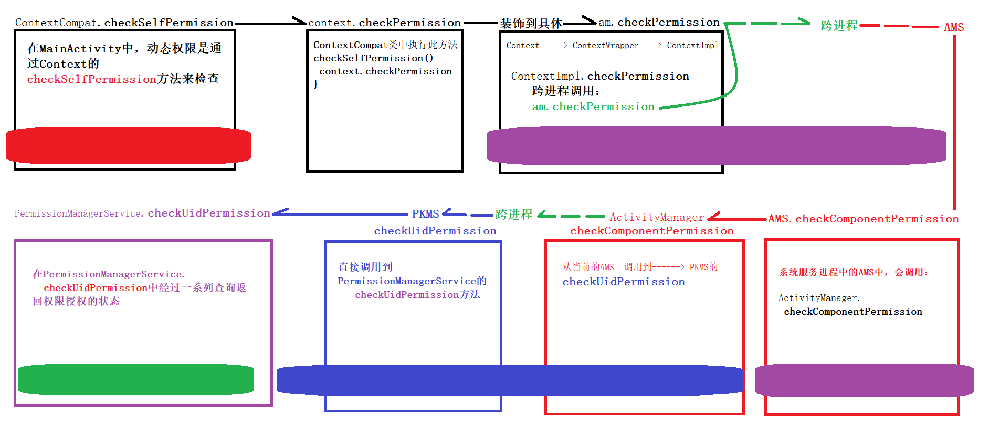

- # 一、整体流程
	- {:height 328, :width 749}
- # 二、详细流程
	- ## 1、MainActivity：
		- 简单来说：动态权限是通过Context的checkSelfPermission方法来检查的，其实现是在ContextImpl中，直接跳转到相应的方法
	- ## 2、ContextCompat.checkSelfPermission
		- 代码
			- ```java
			  public static int checkSelfPermission(@NonNull Context context, @NonNull
			  															String permission) {
			      if (permission == null) {
			          throw new IllegalArgumentException("permission is null");
			      }
			      return context.checkPermission(permission, android.os.Process.myPid(),
			                                                              Process.myUid());
			  }
			  ```
	- ## 3、ContextImpl
		- Context（抽象） ----------> **ContextImpl**（实现）.**checkPermission**
		- 位置：frameworks/base/core/java/android/app/ContextImpl.java
			- ```java
			  @Override
			  public int checkPermission(String permission, int pid, int uid) {
			      if (permission == null) {
			      		throw new IllegalArgumentException("permission is null");
			      }
			      final IActivityManager am = ActivityManager.getService();
			      ...
			      try {
			          // 【同学们注意】 这里要开始跨进程通信啦，从应用进程 ---- Binder ----->系统服
			          // 务进程AMS
			          // 从ContextImpl.checkPermission方法源码中，我们很快找到了老熟人
			          ActivityManager的身影，还是老规矩直接跳转到 提供对应服务的
			          ActivityManagerService.checkPermission方法中
			          return am.checkPermission(permission, pid, uid);
			      } catch (RemoteException e) {
			      	throw e.rethrowFromSystemServer();
			      }
			  }
			  ```
	- ## 4、跨进程到AMS checkPermission
		- 位置：frameworks/base/services/core/java/com/android/server/am/ActivityManagerService.java
		- 代码
			- ```java
			  @Override
			  public int checkPermission(String permission, int pid, int uid) {
			      if (permission == null) {
			          return PackageManager.PERMISSION_DENIED;
			      }
			  	return checkComponentPermission(permission, pid, uid, -1, true);
			  }
			  
			  
			  int checkComponentPermission(String permission, int pid, int uid,
			                               int owningUid, boolean exported) {
			      if (pid == MY_PID) {
			          return PackageManager.PERMISSION_GRANTED;
			      }
			      // 【同学们注意】下面会重点分析这个方法
			      // ActivityManager中的checkComponentPermission方法。
			      // checkComponentPermission方法中先是对一些固定case作了判 断，如果都不满足，最后
			      // 会调用PackageManager的checkUidPermission方法来查询授权状态
			      return ActivityManager.checkComponentPermission(permission, uid,
			                                          owningUid, exported);
			  }
			  ```
	- ## 5、ActivityManager.**checkComponentPermission**：
		- frameworks/base/core/java/android/app/ActivityManager.java
			- ```java
			  public static int checkComponentPermission(String permission, int uid,
			  												int owningUid, boolean exported) {
			      // Root, system server get to do everything.
			      final int appId = UserHandle.getAppId(uid);
			      if (appId == Process.ROOT_UID || appId == Process.SYSTEM_UID) {
			      	return PackageManager.PERMISSION_GRANTED;
			      }
			      // Isolated processes don't get any permissions.
			      if (UserHandle.isIsolated(uid)) {
			      	return PackageManager.PERMISSION_DENIED;
			      }
			      // If there is a uid that owns whatever is being accessed, it has
			      // blanket access to it regardless of the permissions it requires.
			      if (owningUid >= 0 && UserHandle.isSameApp(uid, owningUid)) {
			      	return PackageManager.PERMISSION_GRANTED;
			      }
			      // If the target is not exported, then nobody else can get to it.
			      if (!exported) {
			          /*
			          RuntimeException here = new RuntimeException("here");
			          here.fillInStackTrace();
			          Slog.w(TAG, "Permission denied: checkComponentPermission()
			          owningUid=" + owningUid,
			          here);
			          */
			          return PackageManager.PERMISSION_DENIED;
			      }
			      if (permission == null) {
			      	return PackageManager.PERMISSION_GRANTED;
			      }
			      try {
			          // 【同学们注意】从这里开始就要， 从当前的AMS 调用到------> PKMS的
			          // checkUidPermission
			          return AppGlobals.getPackageManager()
			          .checkUidPermission(permission, uid);
			      } catch (RemoteException e) {
			      	throw e.rethrowFromSystemServer();
			      }
			  }
			  ```
	- ## 6、PKMS.checkUidPermission
	  collapsed:: true
		- frameworks/base/services/core/java/com/android/server/pm/PackageManagerService.java
			- ```java
			  @Override
			  public int checkUidPermission(String permName, int uid) {
			  	synchronized (mPackages) {
			          final String[] packageNames = getPackagesForUid(uid);
			          final PackageParser.Package pkg = (packageNames != null &&
			          packageNames.length > 0) ? mPackages.get(packageNames[0])  : null;
			          // 【同学们注意】 这里会调用到
			          // PermissionManagerService.checkUidPermission 下面会分析
			          // PackageManagerService中的checkUidPermission似乎也没干什么，直接跳转到
			          // PermissionManagerService的 checkUidPermission方法
			          return mPermissionManager.checkUidPermission(permName, pkg, uid,
			          getCallingUid());
			      }
			  }
			  ```
	- ## 7、PermissionManagerService.**checkUidPermission**
	  collapsed:: true
		- PermissionManagerService.**checkUidPermission **最终在这个方法中会根据各种条件判断返回授权状态。
		- frameworks/base/services/core/java/com/android/server/pm/permission/PermissionManagerervice.java
			- ```java
			  private int checkUidPermission(String permName, PackageParser.Package pkg,
			                                                                int uid,
			                                                                int callingUid) {
			      final int callingUserId = UserHandle.getUserId(callingUid);
			      final boolean isCallerInstantApp =
			      			mPackageManagerInt.getInstantAppPackageName(callingUid) != null;
			      final boolean isUidInstantApp =
			      			mPackageManagerInt.getInstantAppPackageName(uid) != null;
			      final int userId = UserHandle.getUserId(uid);
			      if (!mUserManagerInt.exists(userId)) {
			      	return PackageManager.PERMISSION_DENIED;
			      }
			      if (pkg != null) {
			          if (pkg.mSharedUserId != null) {
			              if (isCallerInstantApp) {
			                  return PackageManager.PERMISSION_DENIED;
			              }
			          } else if (mPackageManagerInt.filterAppAccess(pkg, callingUid,  callingUserId)) {
			              return PackageManager.PERMISSION_DENIED;
			          }
			     		 final PermissionsState permissionsState =
			      					((PackageSetting) pkg.mExtras).getPermissionsState();
			          if (permissionsState.hasPermission(permName, userId)) {
			              if (isUidInstantApp) {
			                    if (mSettings.isPermissionInstant(permName)) {
			                        return PackageManager.PERMISSION_GRANTED;
			                    }
			               } else {
			                    return PackageManager.PERMISSION_GRANTED;
			               }
			          }
			          // Special case: ACCESS_FINE_LOCATION permission includes ACCESS_COARSE_LOCATION
			          if (Manifest.permission.ACCESS_COARSE_LOCATION.equals(permName) &&
			                  permissionsState.hasPermission(Manifest.permission.ACCESS_FINE_LOCATION,
			                  userId)) {
			              return PackageManager.PERMISSION_GRANTED;
			          }
			      } else {
			          ArraySet<String> perms = mSystemPermissions.get(uid);
			          if (perms != null) {
			              if (perms.contains(permName)) {
			                  return PackageManager.PERMISSION_GRANTED;
			              }
			              if (Manifest.permission.ACCESS_COARSE_LOCATION.equals(permName)
			                          && perms.contains(Manifest.permission.ACCESS_FINE_LOCATION)) {
			                  return PackageManager.PERMISSION_GRANTED;
			              }
			          }
			      }
			      return PackageManager.PERMISSION_DENIED;
			  }
			  ```
- # [[checkPermission权限检测流程]]总结
	- 第一步：MainActivity会调用checkSelfPermission方法检测是否具有权限（红色区域）
	- 第二步：通过实现类ContextImpl的checkPermission方法经由ActivityManager和ActivityManagerService处理（紫色区域）
	- 第三步：经过ActivityManager处理后会调用PKMS的checkUidPermission方法把数据传递给PermissionManagerService处理（蓝色）
	- 第四步：在PermissionManagerService.checkUidPermission中经过一系列查询返回权限授权的状态（绿色区域）
-