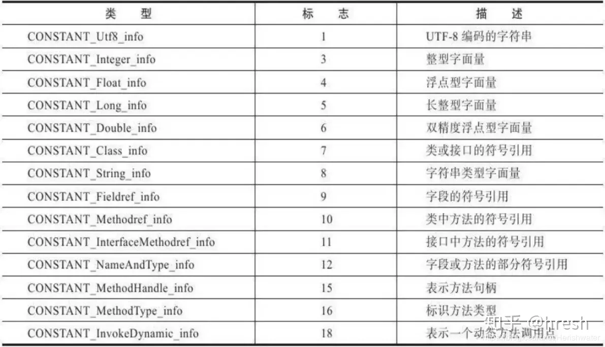

- 
- # 一、简介
	- [[#red]]==每个class的字节码文件中都有一个常量池==，里面是编译后即知的[[#red]]==该class会用到的字面量与符号引用==，这就是`class文件常量池`。
	- JVM加载class，会将其类信息，包括class文件常量池置于[[#red]]==**方法区**==中。
	- 所以class 文件常量池(非运行时常量池)，其在**编译阶段**就已经确定
	- java的源代码`.java`文件在编译之后会生成`.class`文件，class文件需要严格遵循JVM规范才能被JVM正常加载，字节码class它是一个**二进制字节流文件，里面包含了class文件常量池的内容**。
- # 二、查看一个class文件中的class文件常量池
	- [[java编译命令行]]
	- 举例：
		- Student.java
		  collapsed:: true
			- ```java
			  public class Student {
			      private final String name = "张三";
			      private final int entranceAge = 18;
			      private String evaluate = "优秀";
			      private int scores = 95;
			      private Integer level = 5;
			  
			      public String getEvaluate() {
			          return evaluate;
			      }
			  
			      public void setEvaluate(String evaluate) {
			          String tmp = "+";
			          this.evaluate = evaluate + tmp;
			      }
			  
			      public int getScores() {
			          return scores;
			      }
			  
			      public void setScores(int scores) {
			          final int base = 10;
			          System.out.println("base:" + base);
			          this.scores = scores + base;
			      }
			  
			      public Integer getLevel() {
			          return level;
			      }
			  
			      public void setLevel(Integer level) {
			          this.level = level;
			      }
			  }
			  ```
		- 编译和反汇编查看字节码
		  collapsed:: true
			- ```
			  javac Student.java
			  
			  javap -v Student.class
			  ```
		- Student.class
		  collapsed:: true
			- ```java
			  Classfile /home/work/sources/open_projects/lib-zc-crypto/src/test/java/Student.class
			    Last modified 2021-1-4; size 1299 bytes
			    MD5 checksum 06dfdad9da59e2a64d62061637380969
			    Compiled from "Student.java"
			  public class Student
			    minor version: 0
			    major version: 52
			    flags: ACC_PUBLIC, ACC_SUPER
			  Constant pool:
			     #1 = Methodref          #19.#48        // java/lang/Object."<init>":()V
			     #2 = String             #49            // 张三
			     #3 = Fieldref           #18.#50        // Student.name:Ljava/lang/String;
			     #4 = Fieldref           #18.#51        // Student.entranceAge:I
			     #5 = String             #52            // 优秀
			     #6 = Fieldref           #18.#53        // Student.evaluate:Ljava/lang/String;
			     #7 = Fieldref           #18.#54        // Student.scores:I
			     #8 = Methodref          #55.#56        // java/lang/Integer.valueOf:(I)Ljava/lang/Integer;
			     #9 = Fieldref           #18.#57        // Student.level:Ljava/lang/Integer;
			    #10 = String             #58            // +
			    #11 = Class              #59            // java/lang/StringBuilder
			    #12 = Methodref          #11.#48        // java/lang/StringBuilder."<init>":()V
			    #13 = Methodref          #11.#60        // java/lang/StringBuilder.append:(Ljava/lang/String;)Ljava/lang/StringBuilder;
			    #14 = Methodref          #11.#61        // java/lang/StringBuilder.toString:()Ljava/lang/String;
			    #15 = Fieldref           #62.#63        // java/lang/System.out:Ljava/io/PrintStream;
			    #16 = String             #64            // base:10
			    #17 = Methodref          #65.#66        // java/io/PrintStream.println:(Ljava/lang/String;)V
			    #18 = Class              #67            // Student
			    #19 = Class              #68            // java/lang/Object
			    #20 = Utf8               name
			    #21 = Utf8               Ljava/lang/String;
			    #22 = Utf8               ConstantValue
			    #23 = Utf8               entranceAge
			    #24 = Utf8               I
			    #25 = Integer            18
			    #26 = Utf8               evaluate
			    #27 = Utf8               scores
			    #28 = Utf8               level
			    #29 = Utf8               Ljava/lang/Integer;
			    #30 = Utf8               <init>
			    #31 = Utf8               ()V
			    #32 = Utf8               Code
			    #33 = Utf8               LineNumberTable
			    #34 = Utf8               getEvaluate
			    #35 = Utf8               ()Ljava/lang/String;
			    #36 = Utf8               setEvaluate
			    #37 = Utf8               (Ljava/lang/String;)V
			    #38 = Utf8               getScores
			    #39 = Utf8               ()I
			    #40 = Utf8               setScores
			    #41 = Utf8               (I)V
			    #42 = Utf8               getLevel
			    #43 = Utf8               ()Ljava/lang/Integer;
			    #44 = Utf8               setLevel
			    #45 = Utf8               (Ljava/lang/Integer;)V
			    #46 = Utf8               SourceFile
			    #47 = Utf8               Student.java
			    #48 = NameAndType        #30:#31        // "<init>":()V
			    #49 = Utf8               张三
			    #50 = NameAndType        #20:#21        // name:Ljava/lang/String;
			    #51 = NameAndType        #23:#24        // entranceAge:I
			    #52 = Utf8               优秀
			    #53 = NameAndType        #26:#21        // evaluate:Ljava/lang/String;
			    #54 = NameAndType        #27:#24        // scores:I
			    #55 = Class              #69            // java/lang/Integer
			    #56 = NameAndType        #70:#71        // valueOf:(I)Ljava/lang/Integer;
			    #57 = NameAndType        #28:#29        // level:Ljava/lang/Integer;
			    #58 = Utf8               +
			    #59 = Utf8               java/lang/StringBuilder
			    #60 = NameAndType        #72:#73        // append:(Ljava/lang/String;)Ljava/lang/StringBuilder;
			    #61 = NameAndType        #74:#35        // toString:()Ljava/lang/String;
			    #62 = Class              #75            // java/lang/System
			    #63 = NameAndType        #76:#77        // out:Ljava/io/PrintStream;
			    #64 = Utf8               base:10
			    #65 = Class              #78            // java/io/PrintStream
			    #66 = NameAndType        #79:#37        // println:(Ljava/lang/String;)V
			    #67 = Utf8               Student
			    #68 = Utf8               java/lang/Object
			    #69 = Utf8               java/lang/Integer
			    #70 = Utf8               valueOf
			    #71 = Utf8               (I)Ljava/lang/Integer;
			    #72 = Utf8               append
			    #73 = Utf8               (Ljava/lang/String;)Ljava/lang/StringBuilder;
			    #74 = Utf8               toString
			    #75 = Utf8               java/lang/System
			    #76 = Utf8               out
			    #77 = Utf8               Ljava/io/PrintStream;
			    #78 = Utf8               java/io/PrintStream
			    #79 = Utf8               println
			  {
			    方法信息，此处省略...
			  }
			  SourceFile: "Student.java"
			  
			  ```
		- 其中的[[#red]]==**Constant pool**==就是[[#red]]==**class文件常量池**==，使用`#`加数字标记每个“常量”。
- # 三、class文件常量池的内容
  collapsed:: true
	- class文件常量池存放的
		- 是该class编译后即知的，在运行时将会用到的各个“常量”。
		- 注意这个常量不是编程中所说的`final`修饰的变量，而是`字面量`和`符号引用`，如下图所示：
	- 图
	  collapsed:: true
		- 
	- ## 3-1 字面量
	  collapsed:: true
		- 字面量大约相当于Java代码中的双引号字符串和常量的实际的值，包括：
		- ### 1、文本字符串
			- 即代码中用双引号包裹的字符串部分的值。例如刚刚的例子中，有三个字符串：`"张三"`，`"优秀"`，`"+"`，它们在class文件常量池中分别对应：
				- ```java
				  #49 = Utf8               张三
				  #52 = Utf8               优秀
				  #58 = Utf8               +
				  ```
			- 这里的`#49`就是`"张三"`的字面量，它不是一个String对象，只是一个使用utf8编码的文本字符串而已。
		- ### 2、用final修饰的成员变量
			- 注意，[[#red]]==只有final修饰的成员变量==如`entranceAge`，才会在常量池中存在对应的字面量。而[[#red]]==非final的成员变量`scores`，以及局部变量`base`(即使使用final修饰了)==，它们的字面量[[#red]]==都不会在常量池中定义==。
			- 用final修饰的成员变量，例如，`private static final int entranceAge = 18;`这条语句定义了一个final常量`entranceAge`，它的值是`18`，对应在class文件常量池中就有：
				- ```java
				  #25 = Integer            18
				  ```
	- ## 3-2 符号引用
		- ### 1、代码中用到的类和接口的全限定名
		  collapsed:: true
			- ```
			  #11 = Class              #59            // java/lang/StringBuilder
			  #59 = Utf8               java/lang/StringBuilder
			  ```
		- ### 2、方法的名称和描述符，例如：
		  collapsed:: true
			- ```java
			  #38 = Utf8               getScores
			  #39 = Utf8               ()I
			  
			  #40 = Utf8               setScores
			  #41 = Utf8               (I)V
			  ```
			- 以及这种对其他类的方法的引用：
			  collapsed:: true
				- ```
				  #8 = Methodref          #55.#56        // java/lang/Integer.valueOf:(I)Ljava/lang/Integer;
				  
				  #55 = Class              #69            // java/lang/Integer
				  #69 = Utf8               java/lang/Integer
				  
				  #56 = NameAndType        #70:#71        // valueOf:(I)Ljava/lang/Integer;
				  #70 = Utf8               valueOf
				  #71 = Utf8               (I)Ljava/lang/Integer;
				  ```
		- ### 3、字段的名称和描述符，例如：
		  collapsed:: true
			- ```
			  #3 = Fieldref           #18.#50        // Student.name:Ljava/lang/String;
			  
			  #18 = Class              #67            // Student
			  #67 = Utf8               Student
			  
			  #50 = NameAndType        #20:#21        // name:Ljava/lang/String;
			  #20 = Utf8               name
			  #21 = Utf8               Ljava/lang/String;
			  ```
			- 以及这种局部变量：
			  collapsed:: true
				- ```
				  #64 = Utf8               base:10
				  ```
- # 四、常量池的每一项常量都是一个表，
  collapsed:: true
	- 一共有如下表所示的11种各不相同的表结构数据，这每个表开始的第一位都是一个字节的标志位（取值1-12），代表当前这个常量属于哪种常量类型。
	- 