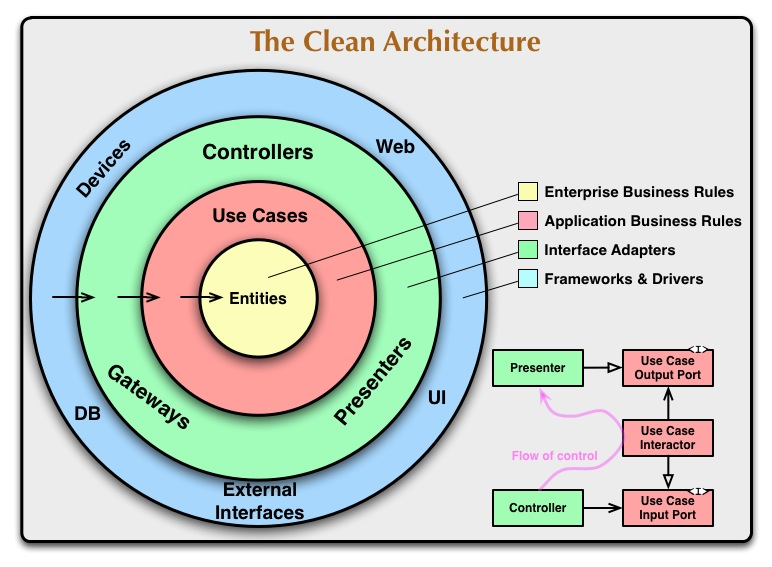

- # 背景
  collapsed:: true
	- Clean Architecture是由 Uncle Bob 在2012年提出的一种架构模式。
	- 
	- Clean 架构的目标是关注点分离，实现解耦。上面的洋葱图中，将软件分为了很多层，层层包裹，其中有一个重要的依赖规则：源码依赖方向只能由外向内。内圈不能依赖外圈，即内圈相对来是业务核心，中间层是业务转换模块，外部则是可以替换的部分。
	- 同时 Uncle Bob 在提出架构体系中也归纳了一个架构应该满足的一些条件：
	- 独立框架。架构不依赖于一些满载功能的软件库。这可以让你像使用工具一样使用这样的框架，而不是把系统塞到他们有限的约束之中。
	- 可测试性。可以在没有UI，数据库，Web服务器或任何其他外部元素的情况下测试业务规则。
	- UI独立。UI可以轻松更改，而无需更改系统的其余部分。例如，可以在不更改业务规则的情况下用控制台UI替换Web UI。
	- 独立于数据库。您的业​​务规则未绑定到数据库，这样就可以将 Oracle 或 SQL Server 换成MongoDb，My SQL或其他数据库。
	- 外部机制独立。事实上业务规则根本不知道外层的事情。
- # 洋葱图层级
	- 我们再仔细看一下这个洋葱图右上角，对软件的四个层由外向内进行的简述
	- ## 框架和驱动（Frameworks and Drivers）
	- ## 接口适配器（Interface Adapter）
		- 这一层是软件的一系列的适配器，主要作用是将用例和实体使用的数据格式方便的转化为数据库或者Web等外层方便的数据格式。
		- 这里的实现可以是 Controller 、 Presenter 和 ViewModel 等我们常说的 MVC ， MVP 和 MVVM 等 MVX 中 X 实现的地方
	- ## 应用业务规则（Application Business Rules）
		- 这一层又可以称为 Use Case 。他包含了特定的业务规则，整合并实现了系统中所需要的所有用例。这些用例协调者通向内层实体间的数据流，并且使用当前的业务规则来实现业务逻辑。
		- 由依赖原则来说，不希望这层的改动，而影响到内层，同样的不希望外层 Interface Adapter 改动后影响到该层。这一层应该是独立，但对于一个软件来说业务逻辑有可能是会改变的，那如果发生了改变的话，这层代码当然也要改变。
	- ## 实体（Entities）
		- 实体层封装了业务范围的规则。这层不仅仅是我们在数据库中映射的对象，还可以是有方法的对象，或者一系列数据结构和方法。
	- ## 一定是4层吗
		- Bob在文章中也提到了，这4层只是一个简述，实际可能要比四层多，但依赖原则是一定要从外向内的。越往内层移动抽象的等级越高。最外层环是低抽象等级的具体细节，也封装了更高等级的策略，最内层是最通用的策略。
-
-
-
-
-
-
-
-
- # 参考:
  collapsed:: true
	- 参考文章
	- https://blog.cleancoder.com/uncle-bob/2012/08/13/the-clean-architecture.html
	- https://github.com/android10/Android-CleanArchitecture/
	- https://fernandocejas.com/blog/engineering/2014-09-03-architecting-android-the-clean-way/
	- https://www.jianshu.com/p/66e749e19f0d
	- https://www.jianshu.com/p/f97466245ed8
	- https://www.jianshu.com/p/cba6663435c7