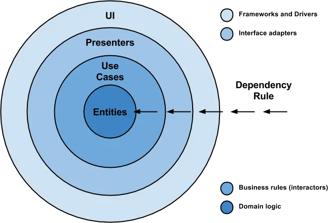
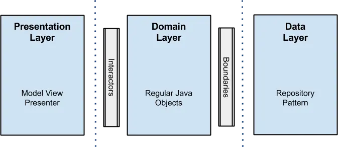
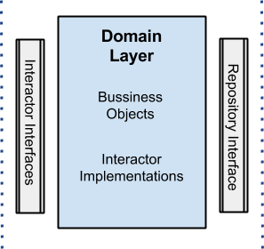
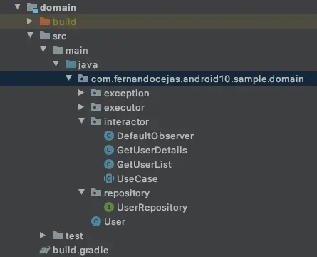
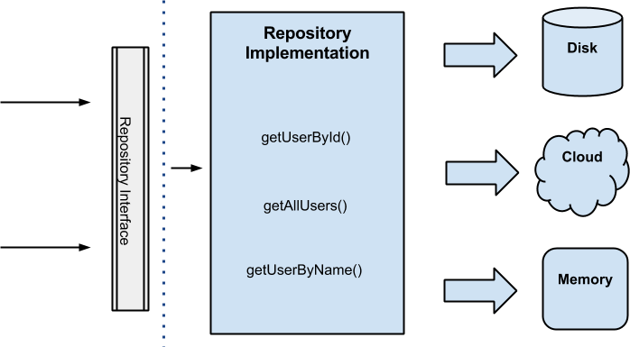
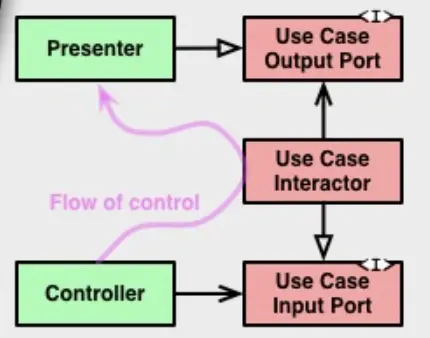

- # 背景
  collapsed:: true
	- Clean Architecture是由 Uncle Bob 在2012年提出的一种架构模式。
	- 
	- Clean 架构的目标是关注点分离，实现解耦。上面的洋葱图中，将软件分为了很多层，层层包裹，其中有一个重要的依赖规则：源码依赖方向只能由外向内。内圈不能依赖外圈，即内圈相对来是业务核心，中间层是业务转换模块，外部则是可以替换的部分。
	- 同时 Uncle Bob 在提出架构体系中也归纳了一个架构应该满足的一些条件：
	- 独立框架。架构不依赖于一些满载功能的软件库。这可以让你像使用工具一样使用这样的框架，而不是把系统塞到他们有限的约束之中。
	- 可测试性。可以在没有UI，数据库，Web服务器或任何其他外部元素的情况下测试业务规则。
	- UI独立。UI可以轻松更改，而无需更改系统的其余部分。例如，可以在不更改业务规则的情况下用控制台UI替换Web UI。
	- 独立于数据库。您的业​​务规则未绑定到数据库，这样就可以将 Oracle 或 SQL Server 换成MongoDb，My SQL或其他数据库。
	- 外部机制独立。事实上业务规则根本不知道外层的事情。
- # 洋葱图层级
  collapsed:: true
	- 我们再仔细看一下这个洋葱图右上角，对软件的四个层由外向内进行的简述
	- ## 框架和驱动（Frameworks and Drivers）
	- ## 接口适配器（Interface Adapter）
		- 这一层是软件的一系列的适配器，主要作用是将用例和实体使用的数据格式方便的转化为数据库或者Web等外层方便的数据格式。
		- 这里的实现可以是 Controller 、 Presenter 和 ViewModel 等我们常说的 MVC ， MVP 和 MVVM 等 MVX 中 X 实现的地方
	- ## 应用业务规则（Application Business Rules）
		- 这一层又可以称为 Use Case 。他包含了特定的业务规则，整合并实现了系统中所需要的所有用例。这些用例协调者通向内层实体间的数据流，并且使用当前的业务规则来实现业务逻辑。
		- 由依赖原则来说，不希望这层的改动，而影响到内层，同样的不希望外层 Interface Adapter 改动后影响到该层。这一层应该是独立，但对于一个软件来说业务逻辑有可能是会改变的，那如果发生了改变的话，这层代码当然也要改变。
	- ## 实体（Entities）
		- 实体层封装了业务范围的规则。这层不仅仅是我们在数据库中映射的对象，还可以是有方法的对象，或者一系列数据结构和方法。
	- ## 一定是4层吗
		- Bob在文章中也提到了，这4层只是一个简述，实际可能要比四层多，但依赖原则是一定要从外向内的。越往内层移动抽象的等级越高。最外层环是低抽象等级的具体细节，也封装了更高等级的策略，最内层是最通用的策略。
- # Android 中的使用 Clean
	- 对于 Android 来说使用 Clean 框架，有一个重要的开源项目[Android-CleanArchitecture](https://github.com/android10/Android-CleanArchitecture/)
	- 这个工程中将洋葱图简化为以下图：
	  collapsed:: true
		- 
	- 同时项目作者 Fernando大神也将洋葱图在 Android 上的使用抽取简化为以下三层结构
	  collapsed:: true
	  Presentation Layer、Domain Layer和Data Layer。这三层都有各自的属性，并且相对独立。
		- 
	- Presentation Layer
	  collapsed:: true
	  这里是 MVX 中 X （Presenter、ViewModel）所在的地方，这里持有了View，是操作UI该如何渲染的地方。
		- 
	- 所有的业务逻辑和Use Case 应该在这一层被实现。在这里包含了use case(用例)以及Bussiness Objects(业务对象),按照洋葱图的依赖规则，这层属于最内层，也就是完全不依赖于外层。Fernando大神建议这一层应该是一个纯java模块
	  collapsed:: true
		- 
	- ### Use Case
	  collapsed:: true
		- Use Case 描述了业务逻辑，是整个App中最核心的元素。举个例子，假如说我对你的app一无所知，我只需要看你的domain层的描述，就能完全知道你的app能做什么，完全不需要看其他层次，它规定了要做什么，至于怎么做怎么实现，这些具体的实现逻辑就是外层的事情了，因为按照Uncle bob的说法，越往内层抽象的等级越高，最外层通常是具体的实现细节。
		- 你完全可以在app中建立多个Use Case，即使是一些很小看起来很简单的逻辑，Domain层的大部分业务逻辑都是在 Use Case 中实现的。这里是一个纯java模块，不包含任何的 Android 依赖。
	- ## Data Layer
	  collapsed:: true
		- 数据层主要作用是提供应用中所有的数据需求。该层实现可以使用 Repository Pattern方式。
		- 什么是 Respository ?
		- Repository是不同的域(domain)中数据和操作之间的桥梁。
		  使用 Respository 将检索数据和实体模型的映射与作用于实体的的业务逻辑分离。业务逻辑应该与包含此数据的数据层实现无关，比如说，数据层可以是数据库，一个网络服务等。
		- 程序中的 Repository 应该是在数据层和业务逻辑层中间，它从数据层查询数据，将数据从数据源映射到业务实体，并将业务实体的更改保留到数据源。存储库将业务逻辑与与底层数据源或Web服务的交互分离。
		- 一个比较简单的理解方式就是 上层Domain 层提供了业务接口，传递给 Data 层但不关心数据层是如何实现的。 Data 层的 Respository 只需要实现相关接口提供服务就可以。
			- 
	- ## 数据跨越
	  collapsed:: true
		- 
		- 洋葱图的右下方是一个表示如何跨越环形界限的列子。它展现了 Controllers 和 Presenters 进行的一次的用户交互情形。看一下 Flow of control 这条线，它开始于Controller ，并引用到了穿越 Use Case 层，然后在 Persenter 层执行。简单点来说为了规避这样可能出现违反Clean向内层依赖原则，从而创建出了 Output Port 和 Input Port接口。这样以抽象接口的方式解决内层依赖外层模块的方式叫做 依赖倒置
		- 依赖倒置 DIP: Dependence Inversion Principle
		  依赖倒置原则指代了一种特定的解耦形式，使得高层次的模块不依赖于低层次的模块的实现细节的目的，依赖模块被颠倒了.
		- 在 Java 语言中，抽象就是指接口或抽象类，两者都是不能直接被实例化的；细节就是实现类，实现接口或继承抽象类而产生的类就是细节，其特点就是，可以直接被实例化，也就是可以加上一个关键字 new 产生一个对象。高层模块就是调用端，低层模块就是具体实现类。依赖倒置原则在 Java 语言中的表现就是：模块间的依赖通过抽象发生，实现类之间不发生直接的依赖关系，其依赖关系是通过接口或抽象类产生的。其实简单来说就是：面向接口编程，或者说是面向抽象编程。
		- 本段节选自《Android 源码设计模式解析与实战》
	- ## 数据流动
		- 在分析了架构的各层依赖关系以后，我们通过具体的例子来分析数据是怎么流动的，这能更好的帮助我们理解整个机制。
		- 举个例子，比如说从Presenter层传递一个对象UserModel给Data层进行存储：
		- ## Presenter层：
	- 用户输入数据，并点击OK按钮(View)
	- Presenter(ViewModel,Controller等同样)获取到数据，并构造一个UserModel
	- 使用UserModelMapper（Presenter层的数据Mapper对象）将UserModel转换成User对象
	- 调用UseCase.store(user)
	- Domain层(唯一的目的就是执行上面的业务逻辑:存储对象)：
	- StoreUseCase接受到User对象
	- 这里可以先做额外的逻辑
	- 调用UserRepository接口的方法，传入User
	- Data层：
	- UserDataRepository(UserRepository接口的实现类)，接受到User对象
	- 调用Mapper方法(Data层)将User对象转换成UserEntity
	- 存储UserEntity对象
- # 参考:
  collapsed:: true
	- 参考文章
	- https://blog.cleancoder.com/uncle-bob/2012/08/13/the-clean-architecture.html
	- https://github.com/android10/Android-CleanArchitecture/
	- https://fernandocejas.com/blog/engineering/2014-09-03-architecting-android-the-clean-way/
	- https://www.jianshu.com/p/66e749e19f0d
	- https://www.jianshu.com/p/f97466245ed8
	- https://www.jianshu.com/p/cba6663435c7