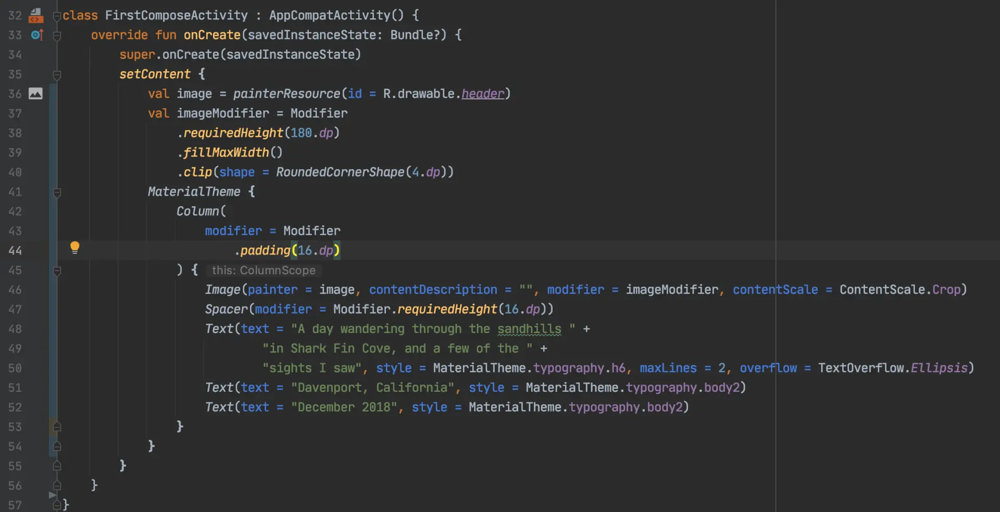
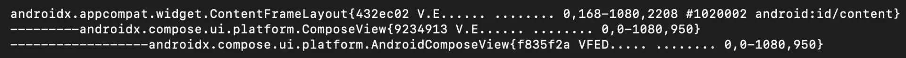
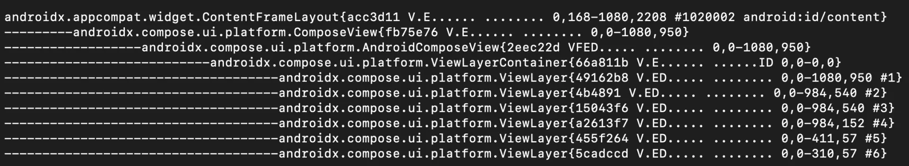
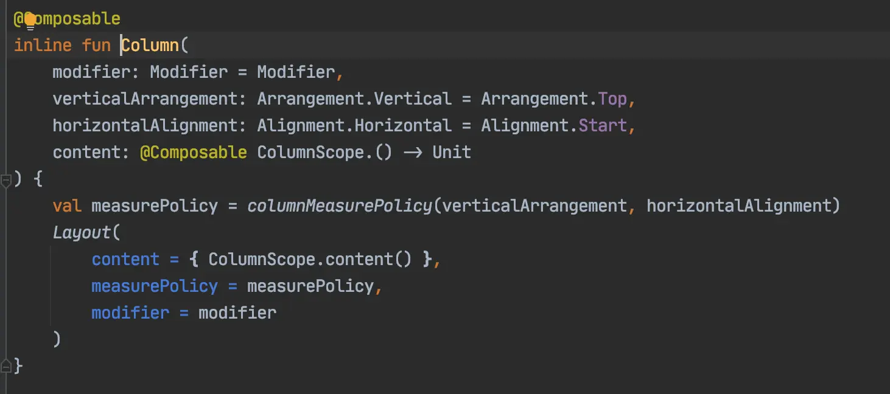
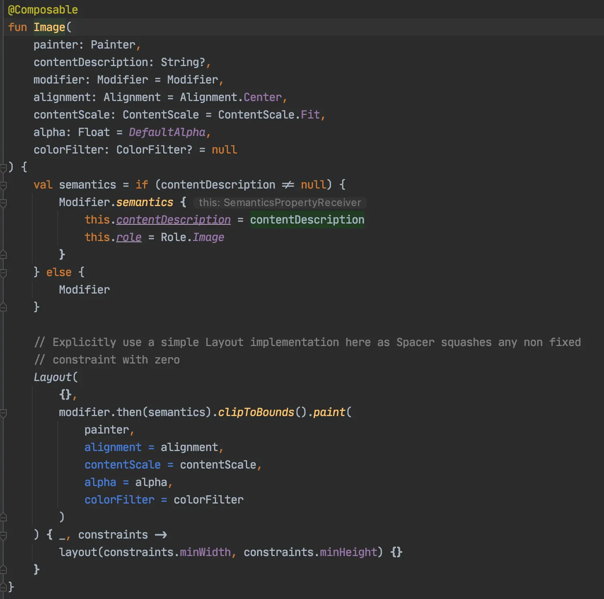
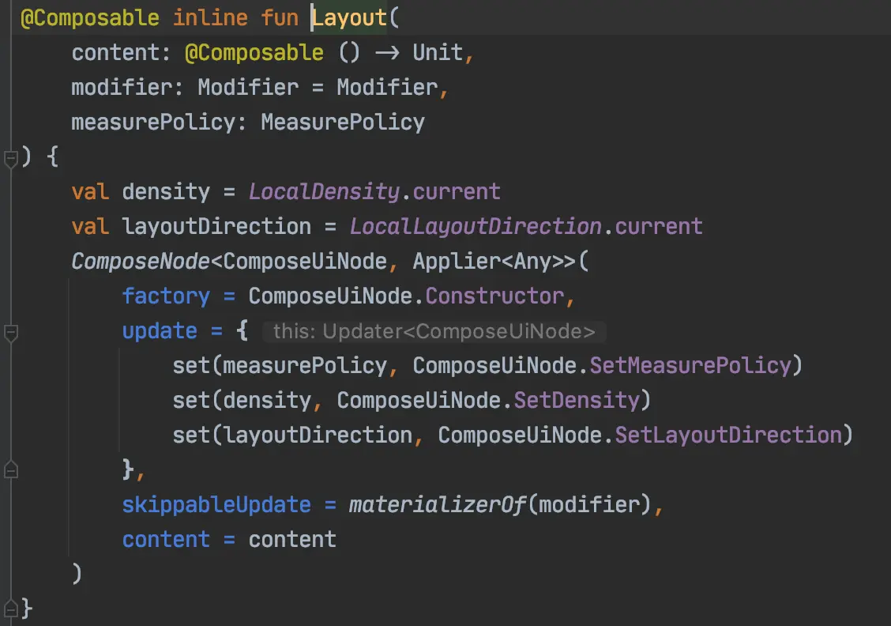
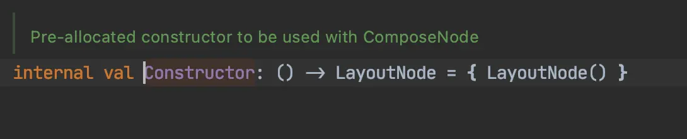
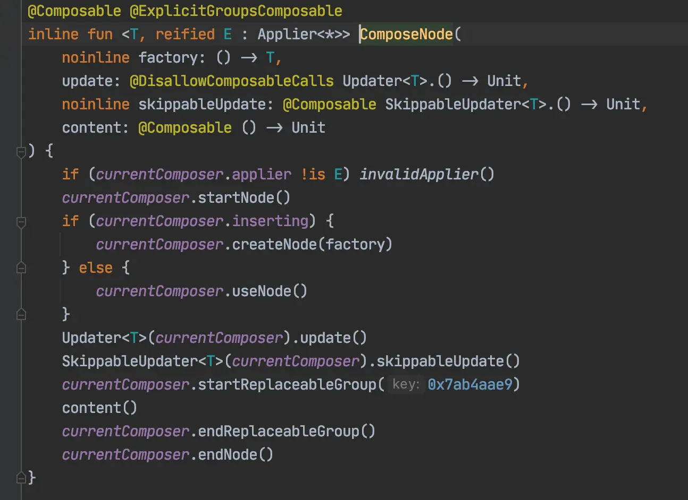

- ## 使用Compose写UI
  collapsed:: true
	- compose是android新推出的UI工具包，使用可组合函数以声明式来构建UI，不再使用xml布局文件
	- 使用compose构建ui的例子：
	  collapsed:: true
		- 
		-
	- 运行效果图
	  collapsed:: true
		- 
	- 既然Compose是全新的一套UI工具包，那么它是如何构建UI的，是否用到了诸如LinearLayout、RelativeLayout、Button、Text这些android view呢？
	- 让我们来分析上图的布局
	- 遍历view，输入如下：
	  collapsed:: true
		- 
	- 没有ImageView、TextView等android view，看来compose是完全自己实现了一套布局和绘制流程。
	- 虽说compose没有使用android的ui组件，但是如果没有硬件加速，还是会有很多子view，例如关闭compose的一个标志位，会出现很多view。如反射设置androidx.compose.ui.platform.AndroidComposeView.isRenderNodeCompatible为false，再打印view树如图：
	  collapsed:: true
		- 
	- 多出了ViewLayerContainer，它包含了很多ViewLayer。后面再分析为什么会出现这么多ViewLayer。
- ## 可重组方法执行流程
  collapsed:: true
	- Column方法，最后执行Layout方法
	  collapsed:: true
		- 
	- Image方法，最后执行Layout方法
	  collapsed:: true
		- 
	- Text方法一样最后执行Layout方法：Layout方法
	  collapsed:: true
		- 
	- 执行ComposeUiNode.Constructor会创建一个LayoutNode
	  collapsed:: true
		- 
		- 
	- 最后所有的方法都执行到了ComposeNode方法，这里边进行创建LayoutNode并创建子LayoutNode。基本上可以确定compose ui由LayoutNode来组成
- ## compose ui 和android ui嵌套用法
	-