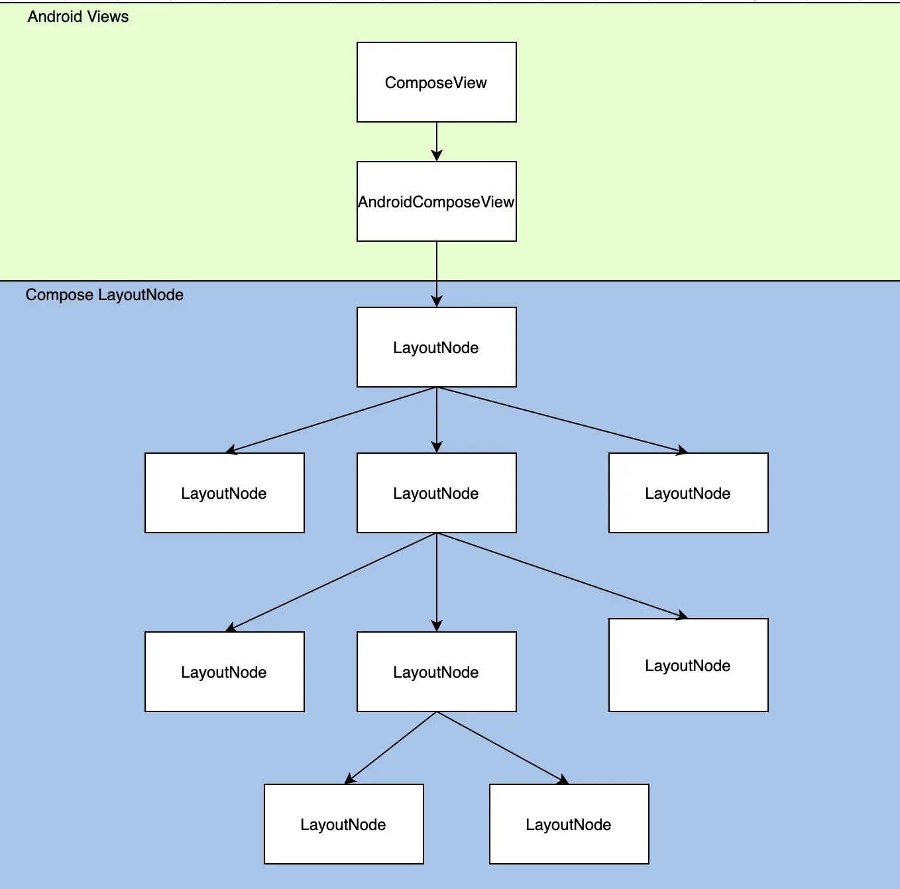
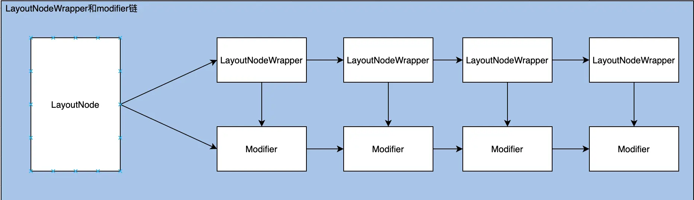
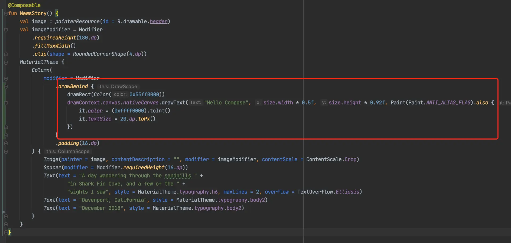
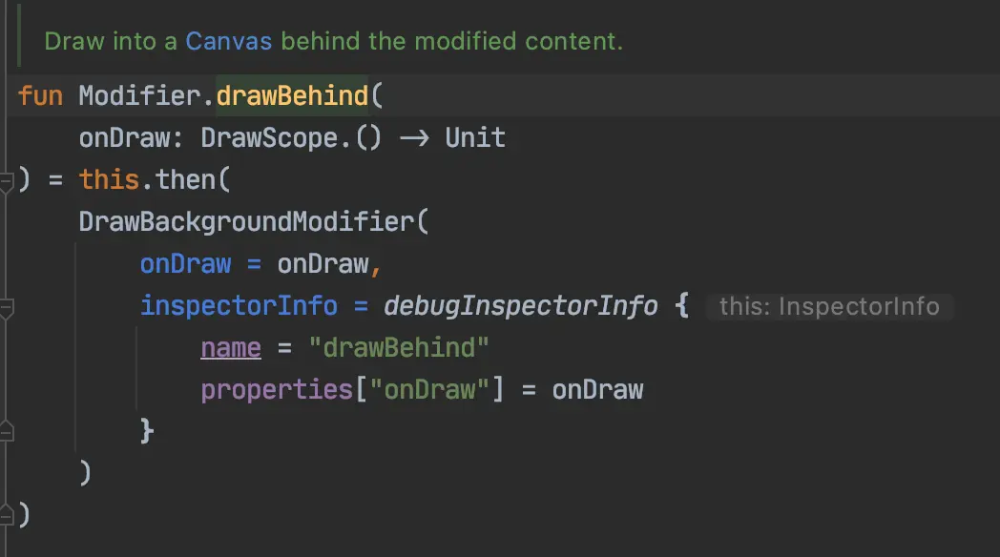
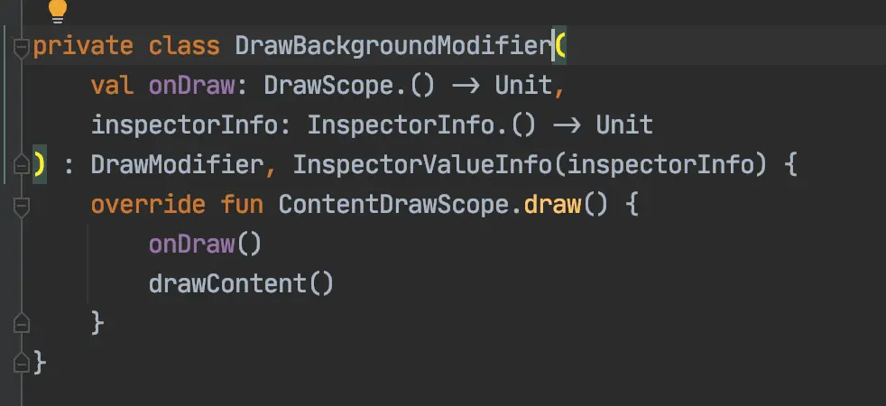
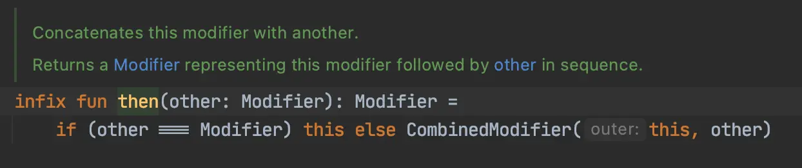

- ## 使用Compose写UI
  collapsed:: true
	- compose是android新推出的UI工具包，使用可组合函数以声明式来构建UI，不再使用xml布局文件
	- 使用compose构建ui的例子：
	  collapsed:: true
		- 
		-
	- 运行效果图
	  collapsed:: true
		- 
	- 既然Compose是全新的一套UI工具包，那么它是如何构建UI的，是否用到了诸如LinearLayout、RelativeLayout、Button、Text这些android view呢？
	- 让我们来分析上图的布局
	- 遍历view，输入如下：
	  collapsed:: true
		- 
	- 没有ImageView、TextView等android view，看来compose是完全自己实现了一套布局和绘制流程。
	- 虽说compose没有使用android的ui组件，但是如果没有硬件加速，还是会有很多子view，例如关闭compose的一个标志位，会出现很多view。如反射设置androidx.compose.ui.platform.AndroidComposeView.isRenderNodeCompatible为false，再打印view树如图：
	  collapsed:: true
		- 
	- 多出了ViewLayerContainer，它包含了很多ViewLayer。后面再分析为什么会出现这么多ViewLayer。
- ## 可重组方法执行流程
  collapsed:: true
	- Column方法，最后执行Layout方法
	  collapsed:: true
		- 
	- Image方法，最后执行Layout方法
	  collapsed:: true
		- 
	- Text方法一样最后执行Layout方法：Layout方法
	  collapsed:: true
		- 
	- 执行ComposeUiNode.Constructor会创建一个LayoutNode
	  collapsed:: true
		- 
		- 
	- 最后所有的方法都执行到了ComposeNode方法，这里边进行创建LayoutNode并创建子LayoutNode。基本上可以确定compose ui由LayoutNode来组成
- ## compose ui 和android ui嵌套用法
  collapsed:: true
	- 在androidview嵌入compose ui
		- Actvity根布局：在activity调用setContent {}方法
		- 其他：在其他view嵌入ComposeView，然后调用ComposeView的setContent{}方法
	- 在compose ui嵌入android view
		- 在可重组函数内部调用AndroidView可重组函数来嵌入android view
- ## compose ui结构图
  collapsed:: true
	- 1、android ui和compose ui结构图
	  collapsed:: true
		- {:height 716, :width 716}
	- 2、LayoutNode的LayoutNodeWrapper和Modifer链
	  collapsed:: true
		- 
- ## 绘制流程
	- compose的ui绘制不依赖android ui控件，是完全实现了一套绘制流程。通过LayoutNode树完成绘制，LayoutNode内部通过LayoutNodeWrapper来层层绘制，每层最终由DrawModifier(Modifier子类）来进行绘制
		- 1、绘制方法传递：从android层传递到LayoutNode，LayoutNode内部绘制结束之后继续绘制子LayoutNode
		  collapsed:: true
			- compose从AndroidComposeView的dispatchDraw开始绘制，调用root: LayoutNode的draw方法
			- LayoutNode的draw方法调用outerLayoutNodeWrapper: LayoutWrapper的draw方法
			- LayoutNodeWrapper依次向后调用，LayoutNodeWrapper绘制结束后，再依次调用LayoutNode的子节点的draw方法
		- 2、LayoutNode内部是分层绘制，每层最终由DrawModifier(Modifier子类）来进行绘制
		- 3、以上面的Demo为例，给Column底部添加颜色和文字
		  collapsed:: true
			- 1添加红色部分代码：
			  collapsed:: true
				- 
			- 2、效果
			  collapsed:: true
				- 
			- 3、跟踪drawBehind方法
			  collapsed:: true
				- 
				- 
			-
		- 4、drawBehind方法最终创建了一个DrawBackgroundModifer(集成自DrawModifer)，并把DrawBackgroundModifer通过CombinedModifier连接在modifier链上
		  collapsed:: true
			- 
		- 5、之后在给LayoutNode的modifer赋值的时候，判断如果modifier是DrawModifer就用ModifiedDrawNode包装到LayoutNodeWrapper链
			-
-