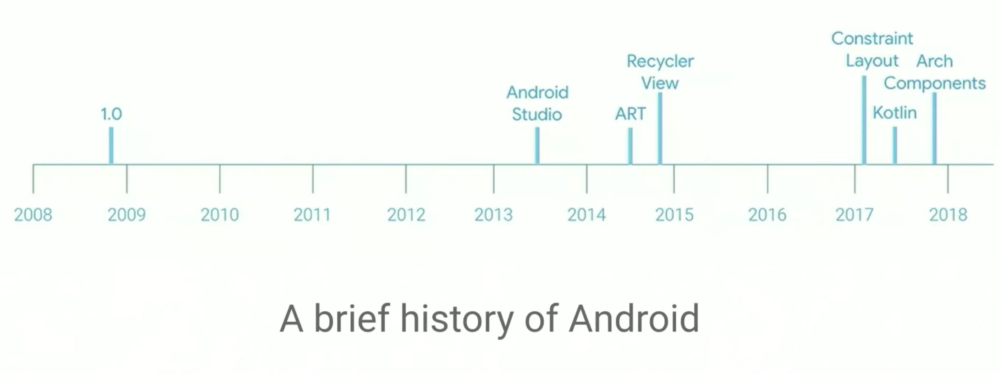
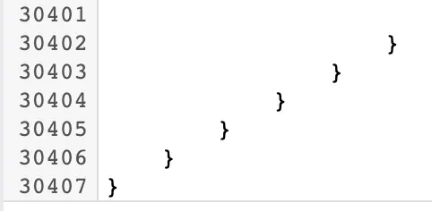
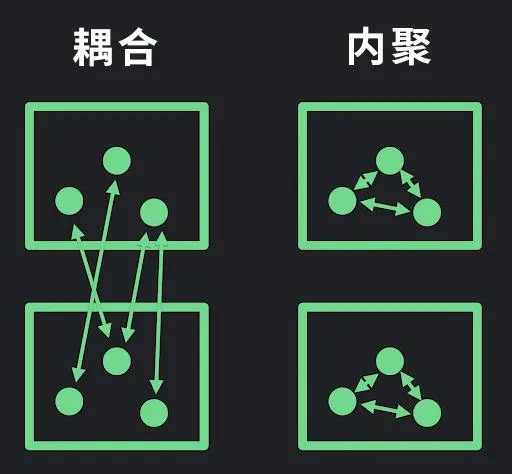
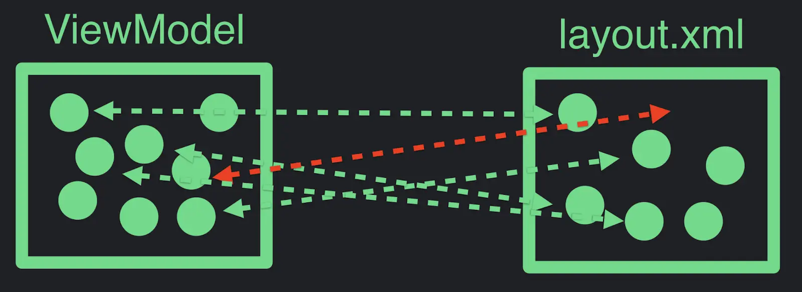
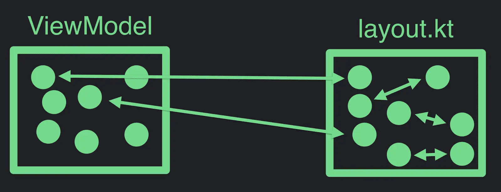
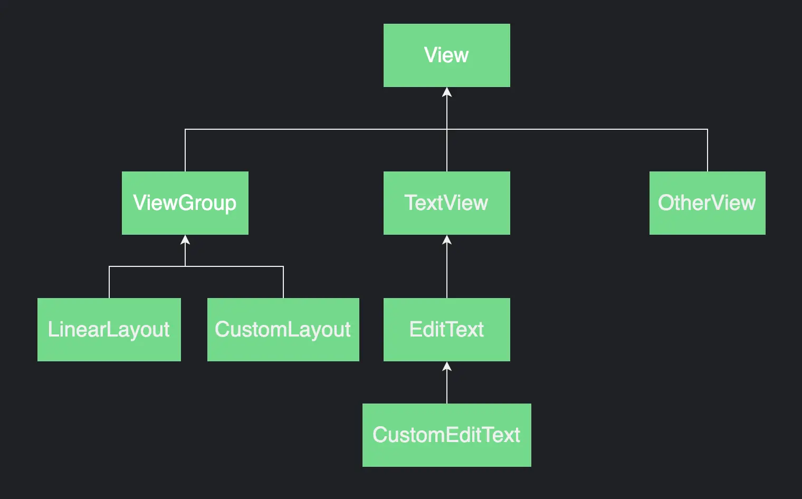
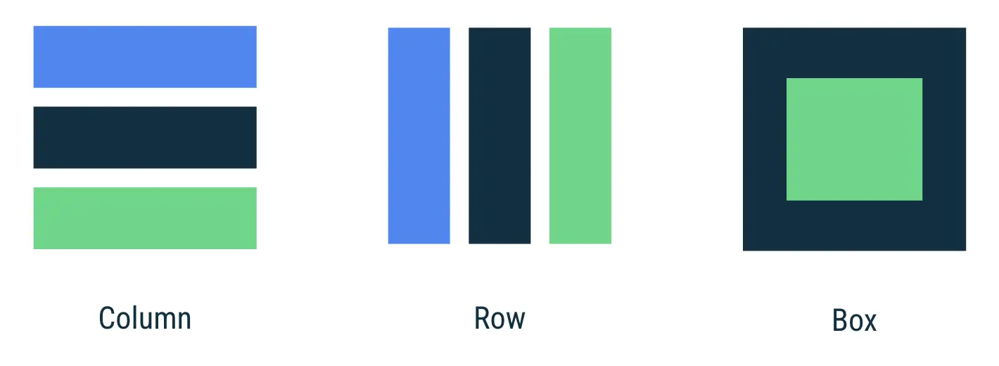

- ## Jetpack Compose是什么？
  collapsed:: true
	- Jetpack Compose是Google在2019年5月的I/O大会上公布的Android最新的UI框架，官网上介绍它可以简化并加快 Android 上的界面开发，使用更少的代码、强大的工具和直观的 Kotlin API，快速让应用生动而精彩。经过两年多的开发，Jetpack Compose目前是Beta版本。
	- 
	- 从2008年谷歌正式发布Android系统后，一直到2019年推出Jetpack Compose，Android系统在长达10多年的发展过程中，谷歌针对不同的问题都做过了很多调整，但是在UI构建方面，除了陆续推出RecyclerView、CardView、ConstraintLayout等高级UI控件外，Android系统最初的那一套View System一直沿用到今天，UI构建体系几乎没有做任何改变，View.java 文件已经有超过30000行代码了。谷歌官方也清楚View系统越来越庞大，并且有一些问题，但很为难的是不能轻易修改现有的View类，因为有很多应用可能依赖了这些API。
	- 
	- Jetpack Compose直接抛弃了View和ViewGroup那一套东西，从渲染机制、布局机制、触摸算法到 UI 的具体写法都是全新的方式，它受到React、Litho、Vue.js 和 Flutter的启发，完全采用Kotlin开发，实现声明式UI。
	-
- ## Compose解决什么问题？
  collapsed:: true
	- 我们知道软件工程中有个原则是高内聚低耦合，高内聚是指一个软件模块由相关性很强的代码组成，只负责一项任务，即遵循单一职责原则；低耦合指一个完整的系统中模块与模块之间尽可能相互独立，每个模块独立完成特定的子功能，模块间通信的接口尽可能少而简单。编写代码时我们会创建包含多个单元的模块，“耦合” 便是不同模块中单元之间的依赖关系，它反映了一个模块中的各部分是如何影响另一个模块的各个部分的；“内聚” 则表示的是一个模块中各个单元之间的关系，它指示了模块中各个单元相互组合的合理程度。
	- 
	- 当我们用Android View框架实现app的UI时我们需要 view model + 布局 共同完成，view model提供数据给布局，布局文件渲染出UI效果。通常view model会使用像 Kotlin或Java 这样的编程语言实现，而布局则使用 XML，由于两种实现语言的差异，即使view model与xml布局联系紧密，它们之前也有明显的分隔线，它们的联系属于模块间的耦合关系。
	- 实际上这里隐藏了很多依赖关系，我们通过使用一些API访问布局中的UI控件，比如findViewById(ResId)、button.setText(String)、container.addChild(View)、img.setImageBitmap(Bitmap)等，使用这些API需要了解xml布局如何定义并创建view model和布局的关联，由于xml布局文件通常没有很好的可复用性，随着app的规模逐渐增长，这些依赖关系将越积越多。
	- 当我们处理紧耦合的模块时，对一个地方的代码改动，便意味对其他的模块作出许多其他的改动，手动地修改代码增加了犯错的可能性。更糟的是有些耦合常常是隐式的，以至于看起来毫无关联的修改，却会造成了意料之外的错误发生。大多数现代应用会动态展示 UI，并且会在执行过程中不断演变。结果导致应用不仅要验证布局 XML 是否静态地满足了这些依赖关系，而且还需要保证在应用的生命周期内满足这些依赖。如果一个元素在运行时离开了视图层级，一些依赖关系可能会被破坏，并导致NullPointerException等问题。
	- 
	- 这就引出了一个问题: 如果我们用和实现view model相同的语言定义布局与UI结构会怎样？如果我们选用 Kotlin 来做这件事会怎样？
	- Jetpack Compose完全采用Kotlin语言开发，你可以运用底层语言的全部灵活特性。由于我们可以使用相同的实现语言，一些隐式的依赖关系可能会变得更加明显，我们也可以重构代码并将其移动至那些可以使它们减少耦合和增加内聚的位置
	- 
	- 你可能会以为这是建议将逻辑与 UI 混合起来，实际上无论如何组织架构，你的应用中都将出现与 UI 相关联的逻辑。Compose 框架本身并不会改变这一点，不过框架可以为你提供一些工具，从而帮你更简单地实现关注点分离: 这一工具便是 Composable 函数。它就像你已经很熟悉的普通函数一样，你在使用普通函数时所掌握的重构和编写可靠、可维护、干净代码的技能都可以运用到 Composable 函数上。
	- Android View 框架的耦合性还体现在 View 组件的继承实现方式上，前文已说明 View 类拥有将近3万行代码，而所有 UI 控件都继承自该类，导致一些本身功能很简单的控件通过继承获得了很多不需要的属性和行为，所以在软件设计原则中有组合优于继承的说法。Compose 框架使用一组接受数据并生成 UI 元素的 Composable 函数来构建 UI，后文将详细说明 Compose 的使用组合的优势。
	-
- ## Compose相比XML布局有啥优势？
	- Jetpack Compose库除了解决构建UI时的代码耦合问题，借助统一的Kotlin语言，用更少的代码、强大的工具和直观的API快速构建Android app，Compose相比XML布局还有什么优势呢？
	- ### 声明式UI vs 命令式UI
	  collapsed:: true
		- 传统的 Android View 框架是面向对象的命令式UI工具，它通过加载xml布局文件，实例化一棵View控件树来初始化UI，每个控件都维护了自己的内部状态，并提供 getter/setter 方法，app逻辑层代码通过调用View控件暴露的方法来获取View的状态或者更新View状态。UI的更新依赖于逻辑层调用控件对象的 API，像是接受命令一样。
		- Jetpack Compose是声明式的UI框架，UI控件是相对无状态的，不对外提供 getter/setter 方法，实际上声明式UI控件不是对象，通过更新参数调用同一个 Composable 函数来更新 UI。在 Compose 框架中一切都是函数，并且都是顶层函数，Composable 函数响应快速，具有幂等性且没有副作用，幂等性是指使用同一参数多次调用此函数时它的行为方式相同。用一组函数来声明 UI，一个 Composable 函数可以嵌套另一个 Composable 函数，并且只能被 Composable 函数调用。
		- 这里用一个例子说明命令式 UI 和声明式 UI 代码的区别。假设有一个带有未读消息图标的电子邮件应用。如果没有消息，应用会绘制一个空信封；如果有一些消息，我们会在信封中绘制一些纸张；而如果有 100 条消息，我们就把图标绘制成好像在着火的样子…
		- 
		- 使用命令式实现，我们可能会写出下面这样更新消息数量的逻辑函数：
		  collapsed:: true
			- ```kotlin
			  fun updateCount(count: Int) {
			    if (count > 0 && !hasBadge()) {
			      addBadge()
			    } else if (count == 0 && hasBadge()) {
			      removeBadge()
			    }
			    if (count > 99 && !hasFire()) {
			      addFire()
			      setBadgeText("99+")
			    } else if (count <= 99 && hasFire()) {
			      removeFire()
			    }
			    if (count > 0 && !hasPaper()) {
			     addPaper()
			    } else if (count == 0 && hasPaper()) {
			     removePaper()
			    }
			    if (count <= 99) {
			      setBadgeText("$count")
			    }
			  }
			  ```
		- 如果用声明式来实现这一逻辑和UI则会像下面这样：
		  collapsed:: true
			- ```
			  @Composable
			  fun BadgedEnvelope(count: Int) {
			    Envelope(fire=count > 99, paper=count > 0) {
			      if (count > 0) {
			        Badge(text="$count")
			      }
			    }
			  }
			  ```
		- 这里我们定义集中状态：
			- 当数量大于99时，显示火焰；
			- 当数量大于0时，显示纸张；
			- 当数量大于0时，绘制数量气泡。
		- 这便是声明式 API 的含义。我们编写代码来按我们的想法描述 UI，而不是如何转换到对应的状态。这里的关键是，编写像这样的声明式代码时，您不需要关注您的 UI 在先前是什么状态，而只需要指定当前应当处于的状态。框架控制着如何从一个状态转到其他状态，所以我们不再需要考虑它。
	- ### 组合 vs 继承
		- Android View 系统中的 UI 都是用 View 和 ViewGroup 对象的层级结构进行构建的，View 对象用于绘制用户可见的具体 UI 元素，ViewGroup 则是不可见的容器，用于布局 View 对象的排列方式；所有的 UI 元素都直接或间接地继承自 View 类，比如 EditText 继承自 TextView，而 TextView 又继承于 View，ViewGroup 类也继承于 View，自定义的容器类继承于 ViewGroup。
		- 
		- Jetpack Compose 使用组合而不是继承的方式构建 UI 元素，由于 Composable 函数都是顶层函数，Text、Image、CustomComposables 和所有 UI 组件都是 Composable 函数，它们通过组合其他函数一起构建 UI，Compose 还提供了一系列现成可用的布局来帮助排列 UI 元素，类似 View 框架中的 ViewGroup 容器。
		- 
		- 我们知道软件设计中有一条原则是“多用组合，少用继承”，在《阿里巴巴Java开发手册》中也推荐谨慎使用继承的方式进行扩展，优先使用组合的方式实现。继承层次过深、继承关系过于复杂时会影响到代码的可读性和可维护性。