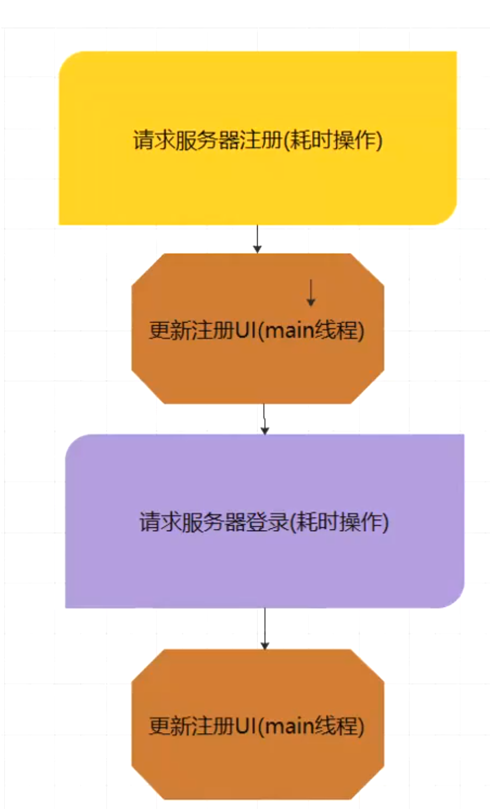

- # 背景：ui和io线程频繁切换多次
  collapsed:: true
	- 
- 代码
	- ```java
	  /**
	       * TODO ================= 下面是一行代码完成整个需求
	       */
	  
	      private ProgressDialog progressDialog;
	      Disposable disposable;
	  
	      public void request2(View view) {
	  
	          /**
	           * 一行代码 实现需求
	           * 需求：
	           *   还有弹出加载
	           *  * 1.请求服务器注册操作
	           *  * 2.注册完成之后，更新注册UI
	           *  * 3.马上去登录服务器操作
	           *  * 4.登录完成之后，更新登录的UI
	           */
	          MyRetrofit.createRetrofit().create(IReqeustNetwor.class)
	                  .registerAction(new RegisterRequest()) // todo 1.请求服务器注册操作   // todo 2
	                  .subscribeOn(Schedulers.io()) // 给上面 异步
	                  .observeOn(AndroidSchedulers.mainThread()) // 给下面分配主线程
	                  .doOnNext(new Consumer<RegisterResponse>() { // todo 3
	                      @Override
	                      public void accept(RegisterResponse registerResponse) throws Exception {
	                          // todo 2.注册完成之后，更新注册UI
	                      }
	                  })
	                  // todo 3.马上去登录服务器操作
	                  .observeOn(Schedulers.io()) // 给下面分配了异步线程
	                  .flatMap(new Function<RegisterResponse, ObservableSource<LoginResponse>>() { // todo 4
	                      @Override
	                      public ObservableSource<LoginResponse> apply(RegisterResponse registerResponse) throws Exception {
	                          Observable<LoginResponse> loginResponseObservable = MyRetrofit.createRetrofit().create(IReqeustNetwor.class)
	                                  .loginAction(new LoginReqeust());
	                          return loginResponseObservable;
	                      }
	                  })
	                  .observeOn(AndroidSchedulers.mainThread()) // 给下面 执行主线程
	                  .subscribe(new Observer<LoginResponse>() {
	  
	                      // 一定是主线程，为什么，因为 subscribe 马上调用onSubscribe
	                      @Override
	                      public void onSubscribe(Disposable d) {
	                          // TODO 1
	                          progressDialog = new ProgressDialog(RequestActivity.this);
	                          progressDialog.show();
	  
	                          // UI 操作
	  
	                          disposable = d;
	                      }
	  
	                      @Override
	                      public void onNext(LoginResponse loginResponse) { // todo 5
	                          // TODO 4.登录完成之后，更新登录的UI
	                      }
	  
	                      @Override
	                      public void onError(Throwable e) {
	  
	                      }
	  
	                      // todo 6
	                      @Override
	                      public void onComplete() {
	                          // 杀青了
	                          if (progressDialog != null) {
	                              progressDialog.dismiss();
	                          }
	                      }
	                  });
	  
	      }
	  
	      @Override
	      protected void onDestroy() {
	          super.onDestroy();
	          // 必须这样写，最起码的标准
	          if (disposable != null)
	              if (!disposable.isDisposed())
	                  disposable.dispose();
	      }
	  ```