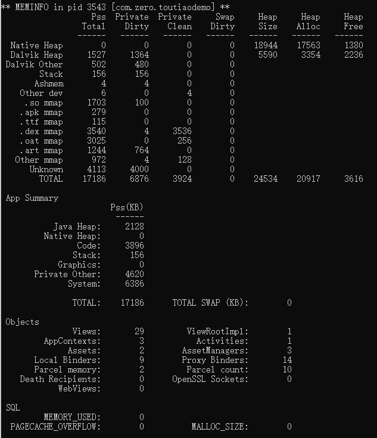

- 命令
  collapsed:: true
	- 
- 相关参数的说明：
	- Pss Total：
		- 是一个进程实际使用的内存，该统计方法包括比例分配共享库占用的内存，即如果有三个进
		  程共享了一个共享库，则平摊分配该共享库占用的内存。Pss Total统计方法的一个需要注意的地方是如果使用共享库的一个进程被杀死，则共享库的内存占用按比例分配到其他共享该库的进程中，而不是将内存资源返回给系统，这种情况下PssTotal不能够准确代表内存返回给系统的情况。
	- Private Dirty：
		- 进程私有的脏页内存大小，该统计方法只包括进程私有的被修改的内存。
	- Private Clear：
		- 进程私有的干净页内存大小，该统计方法只包括进程私有的没有被修改的内存。
	- Swapped Dirty：
		- 被交换的脏页内存大小，该内存与其他进程共享。
	- 其中private Dirty + private Clean = Uss，该值是一个进程的使用的私有内存大小，即这些内存唯一被该进程所有。该统计方法真正描述了运行一个进程需要的内存和杀死一个进程释放的内存情况，是怀疑内存泄露最好的统计方法。
	- 共享比例：sharing_proportion = (Pss Total - private_clean - private_dirty) / (shared_clean +
	  shared_dirty)
	- 能够被共享的内存：swappable_pss = (sharing_proportion * shared_clean) + private_clean
	- Native Heap：本地堆使用的内存，包括C/C++在堆上分配的内存
	  Dalvik Heap：dalvik虚拟机使用的内存
	  Dalvik other：除Dalvik和Native之外分配的内存，包括C/C++分配的非堆内存
	  Cursor：数据库游标文件占用的内存
	  Ashmem：匿名共享内存
	  Stack：Dalvik栈占用的内存
	  Other dev：其他的dev占用的内存
	  .so mmap：so库占用的内存
	  .jar mmap：.jar文件占用的内存
	  .apk mmap：.apk文件占用的内存
	  .ttf mmap：.ttf文件占用的内存
	  .dex mmap：.dex文件占用的内存
	  image mmap：图像文件占用的内存
	  code mmap：代码文件占用的内存
	  Other mmap：其他文件占用的内存
	  Graphics：GPU使用图像时使用的内存
	  GL：GPU使用GL绘制时使用的内存
	  Memtrack：GPU使用多媒体、照相机时使用的内存
	  Unknown：不知道的内存消耗
	  Heap Size：堆的总内存大小
	  Heap Alloc：堆分配的内存大小
	  Heap Free：堆待分配的内存大小
	  Native Heap | Heap Size : 从mallinfo usmblks获的，当前进程Native堆的最大总共分配内存
	  Native Heap | Heap Alloc : 从mallinfo uorblks获的，当前进程navtive堆的总共分配内存
	  Native Heap | Heap Free : 从mallinfo fordblks获的，当前进程Native堆的剩余内存
	  Native Heap Size ≈ Native Heap Alloc + Native Heap Free
	  mallinfo是一个C库，mallinfo()函数提供了各种各样通过malloc()函数分配的内存的统计信息。
	  Dalvik Heap | Heap Size : 从Runtime totalMemory()获得，Dalvik Heap总共的内存大小
	  Dalvik Heap | Heap Alloc : 从Runtime totalMemory() - freeMemory()获得，Dalvik Heap分配的内存
	  大小
	  Dalvik Heap | Heap Free : 从Runtime freeMemory()获得，Dalvik Heap剩余的内存大小
	  Dalvik Heap Size = Dalvik Heap Alloc + Dalvik Heap Free
	  Obejcts当前进程中的对象个数
	  Views:当前进程中实例化的视图View对象数量
	  ViewRootImpl:当前进程中实例化的视图根ViewRootImpl对象数量
	  AppContexts:当前进程中实例化的应用上下文ContextImpl对象数量
	  Activities:当前进程中实例化的Activity对象数量
	  Assets:当前进程的全局资产数量
	  AssetManagers:当前进程的全局资产管理数量
	  Local Binders:当前进程有效的本地binder对象数量
	  Proxy Binders:当前进程中引用的远程binder对象数量
	  Death Recipients:当前进程到binder的无效链接数量
	  OpenSSL Sockets:安全套接字对象数量
	  SQL
	  MEMORY_USED:当前进程中数据库使用的内存数量，kb
	  PAGECACHE_OVERFLOW:页面缓存的配置不能够满足的数量，kb
	  MALLOC_SIZE: 向sqlite3请求的最大内存分配数量，kb
	  DATABASES
	  pgsz:数据库的页面大小
	  dbsz:数据库大小
	  Lookaside(b):后备使用的内存大小
	  cache:数据缓存状态
	  Dbname:数据库表名
	  Asset Allocations
	  资源路径和资源大小