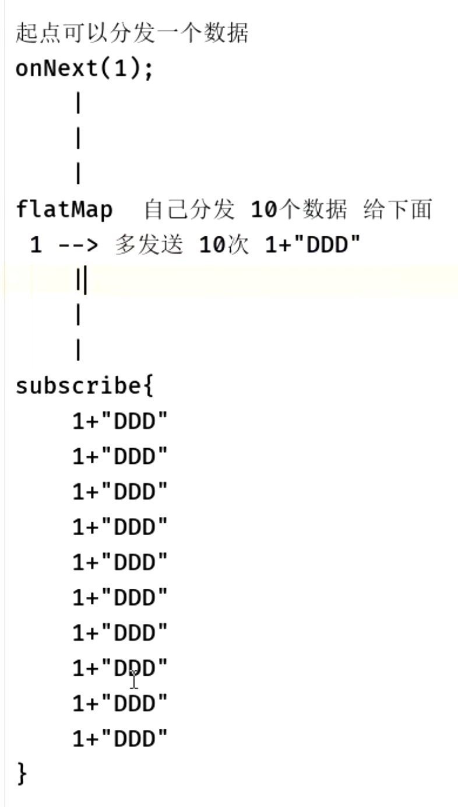

- # [官网介绍-flatMap](https://mcxiaoke.gitbooks.io/rxdocs/content/operators/FlatMap.html)
	- `FlatMap`将一个发射数据的Observable变换为多个Observables，然后将它们发射的数据合并后放进一个单独的Observable
- # 一、示意图
  collapsed:: true
	- 起点：发送一个数据
	- flatMap：分发多个数据
	- 