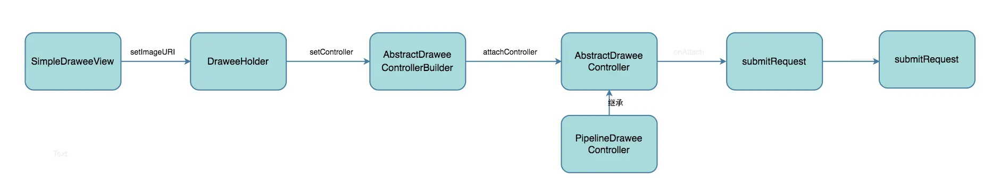
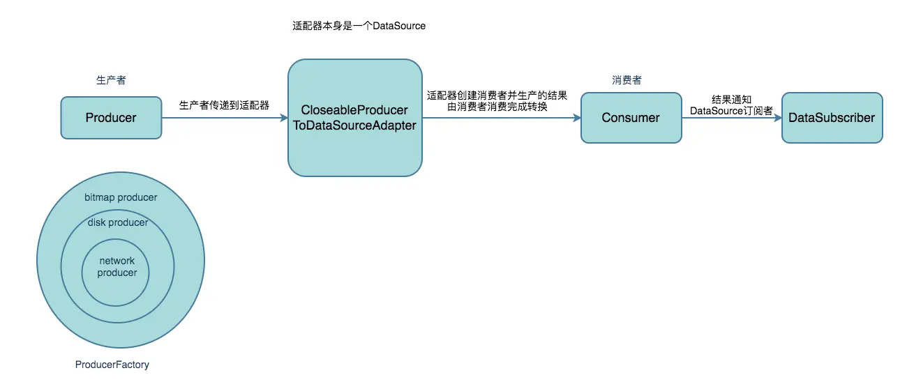

- # Fresco全流程
	- fresco图层
	  collapsed:: true
		- ```
		  o RootDrawable (top level drawable)
		  |
		  +--o FadeDrawable
		     |
		     +--o ScaleTypeDrawable (placeholder branch, optional)
		     |  |
		     |  +--o Drawable (placeholder image)
		     |
		     +--o ScaleTypeDrawable (actual image branch)
		     |  |
		     |  +--o ForwardingDrawable (actual image wrapper)
		     |     |
		     |     +--o Drawable (actual image)
		     |
		     +--o null (progress bar branch, optional)
		     |
		     +--o Drawable (retry image branch, optional)
		     |
		     +--o ScaleTypeDrawable (failure image branch, optional)
		        |
		        +--o Drawable (failure image)
		  ```
	- 以下流程图分别从UI到网络请求层
	  collapsed:: true
		- 
	- 获得dataSource，该dataSource是通过网络、内存、磁盘返回的数据
	  collapsed:: true
		- 
	- dataSource是一个数据观察模式，用于将请求到的数据分发给订阅者
	  collapsed:: true
		- 
	- dataSource创建一个Consumer，通过传入的producer进行转换数据
	  collapsed:: true
		- 