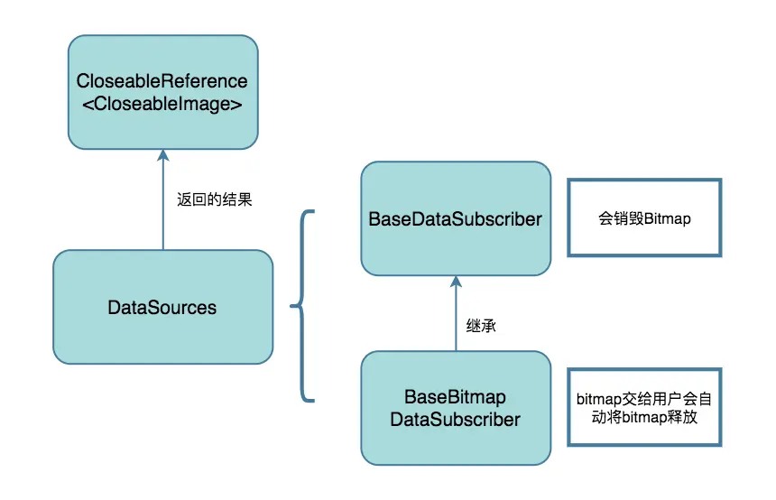

- # Fresco全流程
  collapsed:: true
	- fresco图层
	  collapsed:: true
		- ```
		  o RootDrawable (top level drawable)
		  |
		  +--o FadeDrawable
		     |
		     +--o ScaleTypeDrawable (placeholder branch, optional)
		     |  |
		     |  +--o Drawable (placeholder image)
		     |
		     +--o ScaleTypeDrawable (actual image branch)
		     |  |
		     |  +--o ForwardingDrawable (actual image wrapper)
		     |     |
		     |     +--o Drawable (actual image)
		     |
		     +--o null (progress bar branch, optional)
		     |
		     +--o Drawable (retry image branch, optional)
		     |
		     +--o ScaleTypeDrawable (failure image branch, optional)
		        |
		        +--o Drawable (failure image)
		  ```
	- 以下流程图分别从UI到网络请求层
	  collapsed:: true
		- 
	- 获得dataSource，该dataSource是通过网络、内存、磁盘返回的数据
	  collapsed:: true
		- 
	- dataSource是一个数据观察模式，用于将请求到的数据分发给订阅者
	  collapsed:: true
		- 
	- dataSource创建一个Consumer，通过传入的producer进行转换数据
	  collapsed:: true
		- 
	- 网络请求fresco提供了两个，默认的是UrlConnection,还提供了一个okhttp的。
	  producer内部通过设置的数据请求级别，依次判断用哪个级别的数据请求，内存-磁盘-网络
	- 最后就是请求数据源的流程
		- 
- # Fresco缓存
	- {:height 157, :width 746}
	- ```
	  /**
	     * Caches the given key-value pair.
	     *
	     * <p> Important: the client should use the returned reference instead of the original one.
	     * It is the caller's responsibility to close the returned reference once not needed anymore.
	     *
	     * @return the new reference to be used, null if the value cannot be cached
	     */
	    public CloseableReference<V> cache(
	        final K key,
	        final CloseableReference<V> valueRef,
	        final EntryStateObserver<K> observer) {
	      Preconditions.checkNotNull(key);
	      Preconditions.checkNotNull(valueRef);
	  
	      maybeUpdateCacheParams();
	  
	      Entry<K, V> oldExclusive;
	      CloseableReference<V> oldRefToClose = null;
	      CloseableReference<V> clientRef = null;
	      synchronized (this) {
	        // remove the old item (if any) as it is stale now
	  		// mExclusiveEntries是待删除的目标，存放着引用计数为0，entry.isOrphan= false的目标。没弄明白mExclusiveEntries为什么要多一步缓存，而不是直接释放
	        oldExclusive = mExclusiveEntries.remove(key);
	        Entry<K, V> oldEntry = mCachedEntries.remove(key);
	        if (oldEntry != null) {
	          makeOrphan(oldEntry);
	   // 只有entry.isOrphan == true && entry.clientCount == 0才会被释放
	          oldRefToClose = referenceToClose(oldEntry);
	        }
	  // 判断当前缓存内存大小、缓存entry数量等是否满足缓存条件
	        if (canCacheNewValue(valueRef.get())) {
	          Entry<K, V> newEntry = Entry.of(key, valueRef, observer);
	          mCachedEntries.put(key, newEntry);
	  		  // 引用+1
	          clientRef = newClientReference(newEntry);
	        }
	      }
	      CloseableReference.closeSafely(oldRefToClose);
	      maybeNotifyExclusiveEntryRemoval(oldExclusive);
	  
	      maybeEvictEntries();
	      return clientRef;
	    }
	  ```
	- ```
	  /** Returns the value reference of the entry if it should be closed, null otherwise. */
	    @Nullable
	    private synchronized CloseableReference<V> referenceToClose(Entry<K, V> entry) {
	      Preconditions.checkNotNull(entry);
	      return (entry.isOrphan && entry.clientCount == 0) ? entry.valueRef : null;
	    }
	  ```
	- ```
	  ```