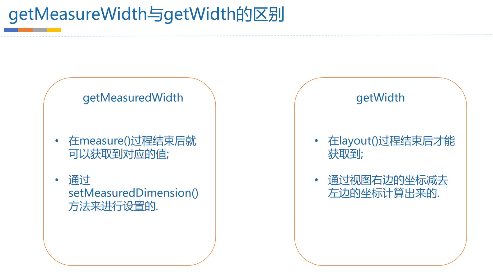

# 面试
	- 
- # 区别
	- ## 1、设置值时机不同
		- getMeasuredWidth()  getMeasuredHeight()是在==**Measure**==结束后可以获取到
		- getWidth()  getHeight()：[[#red]]==**layout**==过程结束才能获取到
	- ## 2、值的计算方式不一样
		- getMeasuredWidth() 父view测量出来，通过setMeasuredDimension()设置的。可能被父view修改
		- getWidth() 是实际尺寸，right - left计算出来的
- # 使用场景
	- 在一般情况下  二者 是相等的，防止特殊情况
	- Measure里 使用getMeasuredWidth，其他使用getWidth
-
-
-
-
- #### 之前总结
  collapsed:: true
	- # 1、getMeasuredWidth()  getMeasuredHeight()
		- 含义：measure()过程结束后，父view测量出的值。测量尺寸，可能被父view修正
		  collapsed:: true
			- 不一定是真实的    有可能被父view 修改掉
		- 使用场景  在onMeasure()方法里用    (因为布局layout()没完成  拿不到 二里的方法)
	- # 2、getWidth()  getHeight()
		- 含义：layout（）布局完成之后才能获取到的值,实际尺寸
			- ​​​​1  getWidth这两个是实际尺寸
			  collapsed:: true
				- ```java
				  public final int getWidth() {
				        return mRight - mLeft;
				    }
				  ```
			- 2 就是在 自定义 view 里的   layout()
			  collapsed:: true
				- ```kotlin
				  override fun layout(l: Int, t: Int, r: Int, b: Int) {
				        super.layout(l, t, r, b)
				    }
				  ```
				- super.layout(l, t, r, b)  这里实际存的尺寸的 右- 左
			- 3 也就是 父view告诉你的尺寸  和 本view 一致认为的该view的尺寸
		- 使用场景：除了测量过程中 都用
	- # 3、对比
		- 3-1在一般情况下  一 和 二是相等的
		- 3-2 所以防止被父view 修改的情况 （就是 子view不听父view的尺寸   可能被强行 矫正） 二 比一 更精准
		- 注意： 有些情况 拿不到 二   比如在测量过程中 布局没完成呢   拿不到 二 只能拿一