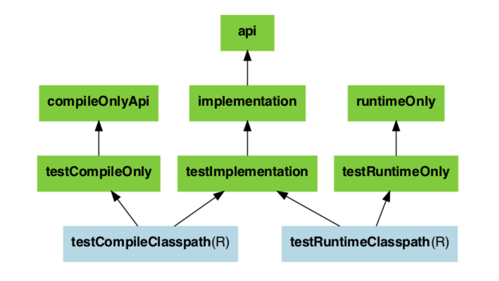

- ## 一、configurations分组
	- api、implementation、testRuntime
	- [官方依赖分组介绍](https://docs.gradle.org/current/userguide/java_plugin.html#sec:java_plugin_and_dependency_management)
- ## 二、作用
  collapsed:: true
	- 将本项目需要的相关依赖资源进行分组，A组你可以提供在运行时使用，B组你提供在测试运行时使用，C组编译时使用，D组xxxx？
	- 举例：implementation和testRuntime就是Gradle帮我们提供的configuration，configurations{} 记录着项目中各个分组（implementation ，runtime）的依赖信息。
		- ```groovy
		  dependencies {
		      implementation "org.springframework.boot:spring-boot-starter-web"
		      testRuntime "junit:junit:4.13"
		  }
		  ```
		- 
- ## 三、configuration有多少个分组
  collapsed:: true
	- 一共有无数个分组，因为configuration支持继承进行扩展，子配置会集成所有父配置的依赖，testImplementation extends implementation ，如下图
	  collapsed:: true
		- 
	- 那implementation、testImplementation是谁帮我们提供的呢？当然是java的插件啦，插件声明如下
	  collapsed:: true
		- ```groovy
		  apply plugin: 'java'
		  
		  //或者如下定义
		  
		  plugins{
		  	id 'java-library'
		  }
		  
		  ```
	- 下图是java插件提供的测试相关的configuration
	  collapsed:: true
		- 
- ## 四、自定义configurations
  collapsed:: true
	- ```groovy
	  // 依赖配置
	  configurations {
	      //声明一个具备加载测试依赖的configuration
	      smokeTest.extendsFrom testImplementation
	      
	      //声明一个具备类编译和运行的configuration
	      compileClasspath.extendsFrom(someConfiguration)
	      runtimeClasspath.extendsFrom(someConfiguration)
	      
	      //全局排除log4j依赖
	      implementation.exclude group:'org.apache.logging.log4j'
	      implementation.exclude module:'spring-boot-starter-log4j2'
	      
	      //声明一个具备类运行的configuration
	      developmentOnly
	      runtimeClasspath {
	          extendsFrom developmentOnly
	      }
	  }
	  
	  dependencies {
	      testImplementation 'junit:junit:4.13'
	      
	      //读取根目录下的lib目录
	      smokeTest fileTree('lib')
	      smokeTest 'org.apache.httpcomponents:httpclient:4.5.5'
	      
	      //使用someConfiguration将lib模块添加到本项目依赖
	      someConfiguration project(":lib")
	      
	      
	      developmentOnly("org.springframework.boot:spring-boot-devtools")
	  }
	  
	  //将文件拷贝到另外一个目录
	  afterEvaluate{
	      //configurations属性可以在任意一个task中读取
	      println configurations.smokeTest.files.first()
	  	println configurations.smokeTest.asPath
	      
	  	def libPath = projectDir.absolutePath + "/src/main/lib2"
	  	copy {
	  		from configurations.smokeTest.files.first()
	  		into libPath
	  	}
	  }
	  
	  ```
-
-