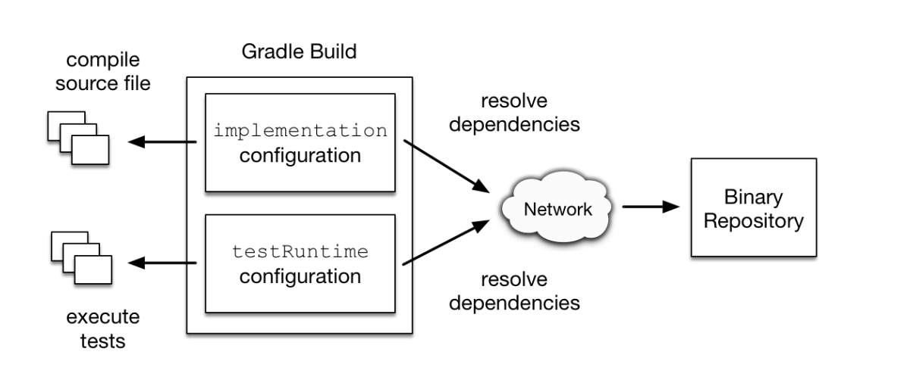

- ## 一、configurations分组
	- api、implementation、testRuntime
- ## 二、作用
	- 将本项目需要的相关依赖资源进行分组，A组你可以提供在运行时使用，B组你提供在测试运行时使用，C组编译时使用，D组xxxx？
	- 举例：implementation和testRuntime就是Gradle帮我们提供的configuration，configurations{} 记录着项目中各个分组（implementation ，runtime）的依赖信息。
		- ```groovy
		  dependencies {
		      implementation "org.springframework.boot:spring-boot-starter-web"
		      testRuntime "junit:junit:4.13"
		  }
		  ```
		- 
- ## 三、configuration有多少个分组
	- 一共有无数个分组，因为configuration支持继承进行扩展，子配置会集成所有父配置的依赖，testImplementation extends implementation ，如下图
	- 
	- 那implementation、testImplementation是谁帮我们提供的呢？当然是java的插件啦，插件声明如下
	- ```groovy
	  apply plugin: 'java'
	  
	  //或者如下定义
	  
	  plugins{
	  	id 'java-library'
	  }
	  
	  ```
	-
- ## 三、自定义configurations
-
-
-