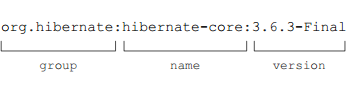

- ## 一、简介
	- 它描述了configurations{}中分组依赖的第三方资源。
- ## 二、依赖分类
	- 2-1、gradle依赖：主要是gradle运行的时候，需要加载一些插件，如android等，此时需要配置它。
	- 2-2、项目编译/运行依赖：编译一个项目，通常需要依赖其他项目或者JAR。
- ## 三、依赖的常规写法（与maven一致）
	- {:height 97, :width 355}
	- ```groovy
	  //配置依赖
	  dependencies {
	      //compile已过时，推荐使用implementation
	  	//按照maven名称加载jar
	  	implementation 'com.google.guava:guava:11.0.2'
	      //排除部分依赖
	      implementation('org.slf4j:slf4j-simple:1.6.4') {
	  		exclude 'org.slf4j:slf4j-api'
	  	}
	      //测试模块
	      testImplementation 'org.junit.jupiter:junit-jupiter-api:5.4.2'
	      testRuntimeOnly 'org.junit.jupiter:junit-jupiter-engine:5.4.2'
	      
	      //依赖其他子项目
	      implementation project(':projectA')
	  	//加载目录下所有的jar
	  	implementation fileTree(dir: 'libs', include: ['*.jar'])  //多个文件
	      
	      implementation ('com.google.guava:guava:11.0.2'){
	          //在版本冲突的情况下优先使用该版本
	          isForce = true
	          //禁用依赖传递
	          transitive = false
	      }
	  }
	  //使用dependencis任务可以查看当前依赖树，*表示被忽略的
	  
	  ```