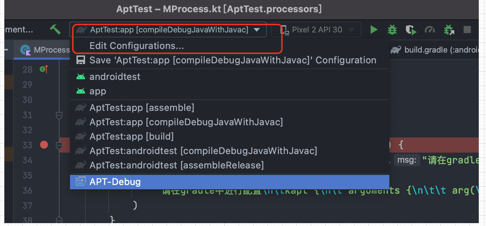
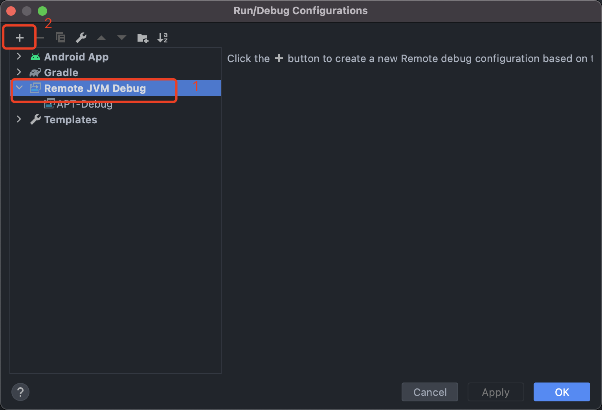
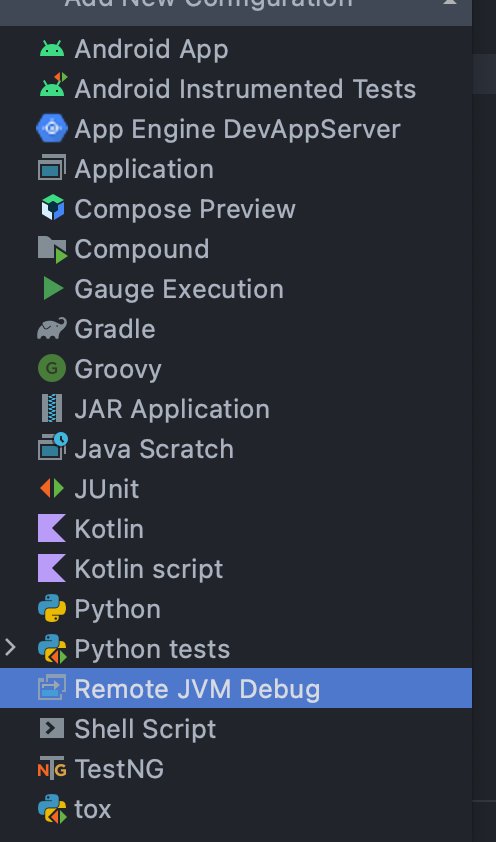
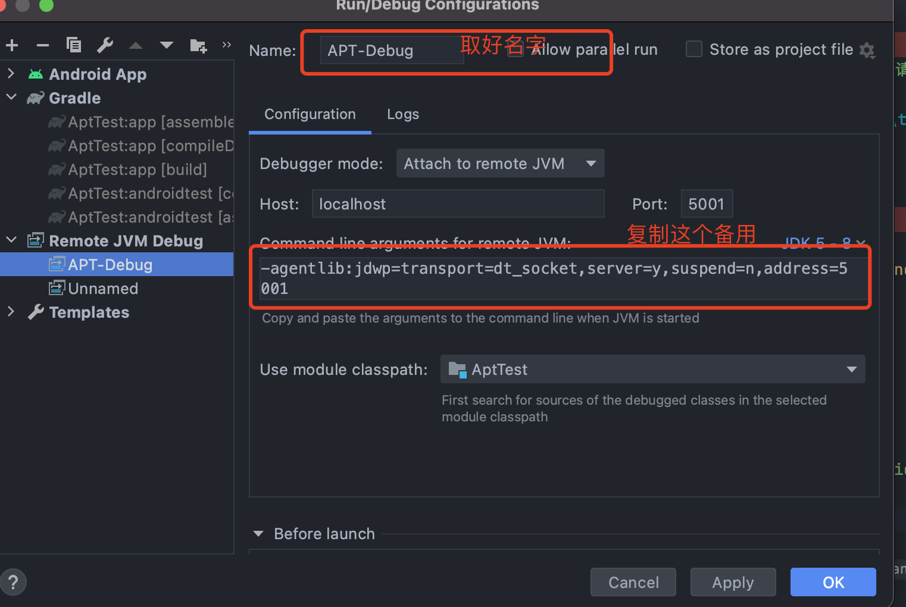
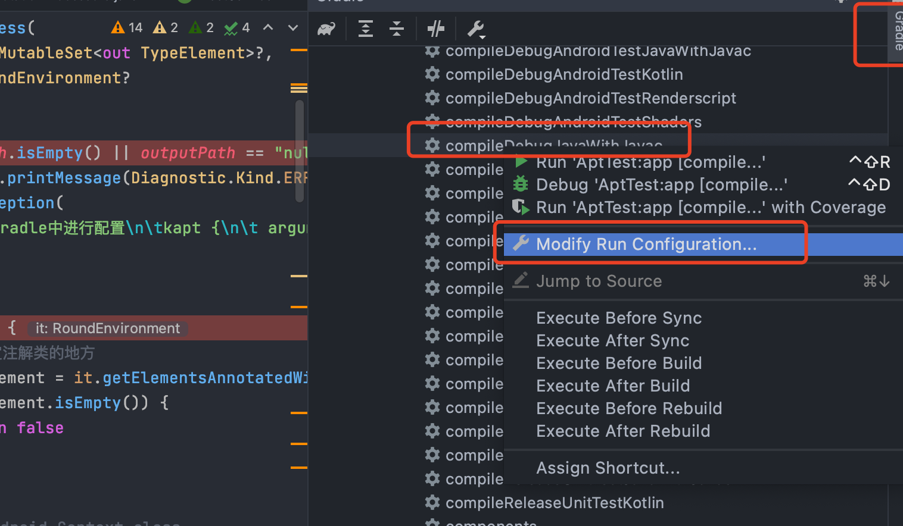
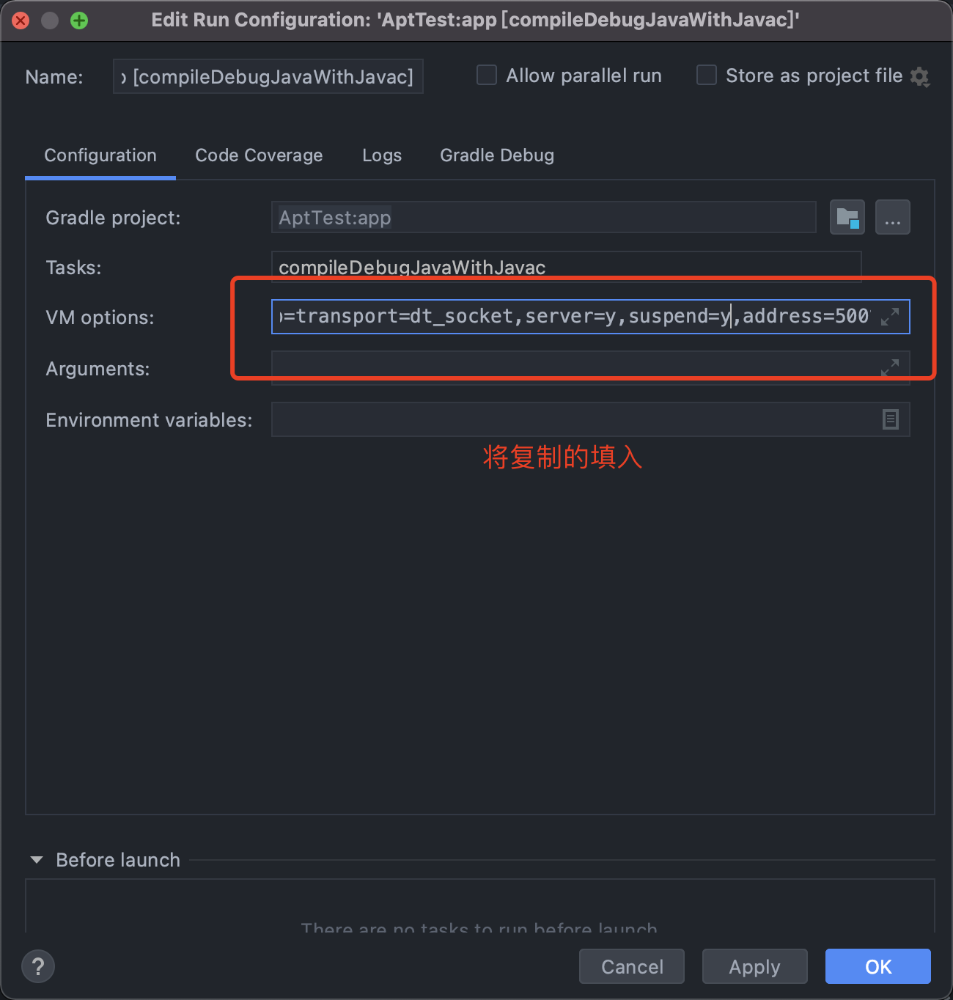
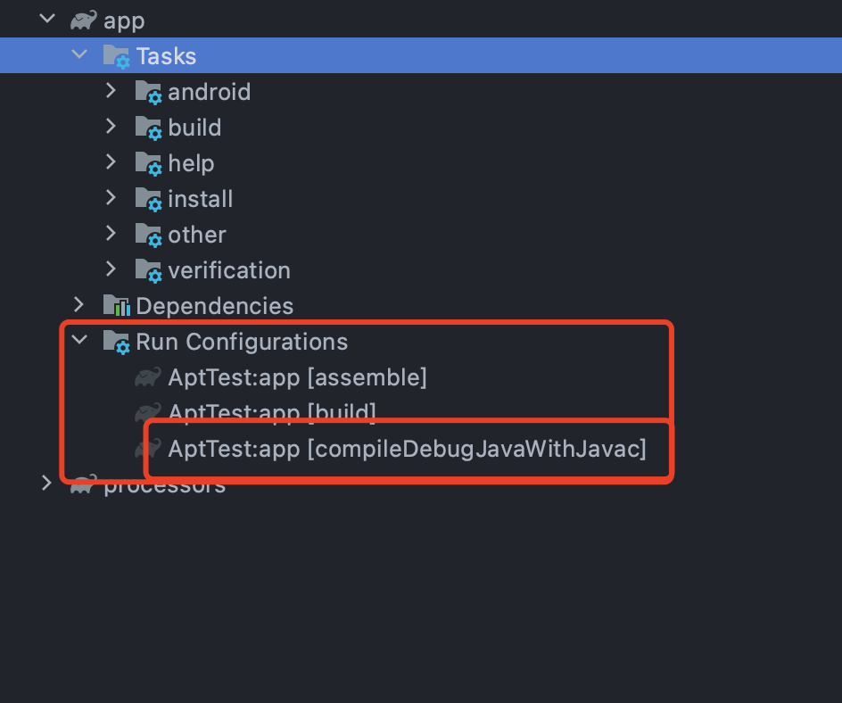

- 方法一：借助buildSrc
- 方法二：启动远程调用
	- 1、Run-> Edit Configuration
	  collapsed:: true
		- 
	- 2、新建远程调试器
	  collapsed:: true
		- {:height 454, :width 655}
		- {:height 850, :width 496}
	- 3、配置
	  collapsed:: true
		- {:height 447, :width 655}
	- 4、修改task
	  collapsed:: true
		- 
		- 将 suspend = n改为y
		- 
	- 5、会生成如下配置，点击运行
		- {:height 555, :width 655}
-