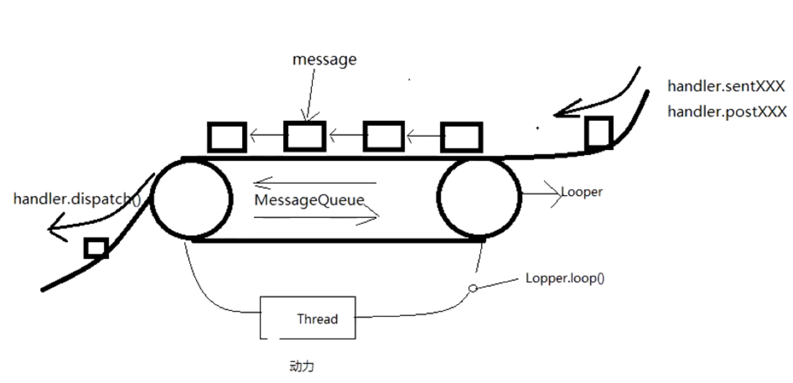

# [[Handler]]
- # [handler相关面试题](https://blog.csdn.net/xuwb123xuwb/article/details/115918849?spm=1001.2014.3001.5502)
- #   [handler  消息机制 原理](https://blog.csdn.net/xuwb123xuwb/article/details/115377306)
- # 1、简单介绍下Handler消息机制
	- {:height 370, :width 749}
	- ## 1、各个部分作用
		- ### Handler: 发送消息和处理消息
		- ###  Looper: 不断轮询从MessageQueue中获取Message，然后交给Handler处理
			- Looper.loop()死循环
		- ### MessageQueue：优先级消息队列，按时间when来存放Handler发送过来的消息（这个应该是发送消息的时间）
		- ### Message: 消息的载体
	- ## 2、机制流程
		- ### 1、发送消息
			- handler.sendMsg->MessageQueue.enqueueMessage，加入到消息队列
		- ### 2、取消息
			- Looper.loop中不断循环，调用MessageQueue.next（）方法取消息，取到再进行分发
		- ### 3、分发消息
			- msg.target.dispatchMessage->msg.target 就是发送该消息的 Handler，这样消息最终会回调到**Handler的`dispatchMessage`**方法
		- ### 4、处理消息
			- Handler的dispatchMessage 里会判断  首先msg.callback是否为空 这个是个runnable  如果不为空就会执行这个runnable   否则 ,回调mCallback.[[#red]]==**handleMessage**==方法   就可以处理消息了
- # 2、各个地方创建时机
	- 1、Handler->直接new的
	- 2、Looper->
		- ==**主线程的Looper**==是ActivityThread中Looper.==**prepareMainLooper**==（）
		- ==**子线程的Looper**==需要Looper.==**prepare**==（）
	- 3、MessageQueue-> Looper 构造函数创建的
	- 4、Message-> 可以直接new 也可以Message.obtain()。享元模式获取
- # 2、Handler中SendMessage 和 Post区别
	- ## SendMessage:
		- 1、发送消息对象
	- ## post() 它不叫异步消息
		- 1、发送的可执行代码（runnable）
- ## 3、[[Handler中的如何保证一个线程只有一个Looper]]
- ## 4、[[MessageQueue，属于哪个线程？问队列创建流程]]
- ## 5、一个线程有几个Handler？
  collapsed:: true
	- 可以有任意多个 ，因为在每个activity 里都可以new  而 他们都是在主线程的 ；所以就创建了多个
- ## 6、Handler内存泄漏的原因？为什么其他的内部类没有说过这个问题？
  collapsed:: true
	- 1、因为 使用Handler 时 是[[匿名内部类]]， 内部类持有外部类的引用
	- Handler 持有 activity的引用，而 Message 持有target(handler)的引用
		- msg.target = this;  msg 持有了handler
		- ```java
		  Handler.java
		  
		      private boolean enqueueMessage(@NonNull MessageQueue queue, @NonNull Message msg,
		              long uptimeMillis) {
		          msg.target = this;
		          msg.workSourceUid = ThreadLocalWorkSource.getUid();
		  
		          if (mAsynchronous) {
		              msg.setAsynchronous(true);
		          }
		          return queue.enqueueMessage(msg, uptimeMillis);
		      }
		  ```
	- MessageQueue是按时间优先级队列，当有耗时任务的时候，有消息未处理的话  message持有 handler  handler 持有activity  那么 关闭activity的时候，就不会被回收；
	- 导致Handler 和 Activity生命周期不同步，导致内存泄漏
	- （RecyclerView adapter ViewHolder 也是匿名内部类，生命周期同步，不会泄漏）
	- # [[Handler怎么避免内存泄漏]]
- ## 7、为何 主线程可以new handler?  如果想要在子线程中new Handler() 要做哪些准备？
  collapsed:: true
	- ## 问题一、主线程的looper已经在ActivityThread的 main函数中创建了
	  collapsed:: true
		- Looper.prepareMainLooper();
		- Looper.loop();
		- ```java
		      public static void main(String[] args) {
		          Trace.traceBegin(Trace.TRACE_TAG_ACTIVITY_MANAGER, "ActivityThreadMain");
		  
		          // Install selective syscall interception
		          AndroidOs.install();
		  
		          // CloseGuard defaults to true and can be quite spammy.  We
		          // disable it here, but selectively enable it later (via
		          // StrictMode) on debug builds, but using DropBox, not logs.
		          CloseGuard.setEnabled(false);
		  
		          Environment.initForCurrentUser();
		  
		          // Make sure TrustedCertificateStore looks in the right place for CA certificates
		          final File configDir = Environment.getUserConfigDirectory(UserHandle.myUserId());
		          TrustedCertificateStore.setDefaultUserDirectory(configDir);
		  
		          Process.setArgV0("<pre-initialized>");
		  
		          Looper.prepareMainLooper();
		  
		          // Find the value for {@link #PROC_START_SEQ_IDENT} if provided on the command line.
		          // It will be in the format "seq=114"
		          long startSeq = 0;
		          if (args != null) {
		              for (int i = args.length - 1; i >= 0; --i) {
		                  if (args[i] != null && args[i].startsWith(PROC_START_SEQ_IDENT)) {
		                      startSeq = Long.parseLong(
		                              args[i].substring(PROC_START_SEQ_IDENT.length()));
		                  }
		              }
		          }
		          ActivityThread thread = new ActivityThread();
		          thread.attach(false, startSeq);
		  
		          if (sMainThreadHandler == null) {
		              sMainThreadHandler = thread.getHandler();
		          }
		  
		          if (false) {
		              Looper.myLooper().setMessageLogging(new
		                      LogPrinter(Log.DEBUG, "ActivityThread"));
		          }
		  
		          // End of event ActivityThreadMain.
		          Trace.traceEnd(Trace.TRACE_TAG_ACTIVITY_MANAGER);
		          Looper.loop();
		  
		          throw new RuntimeException("Main thread loop unexpectedly exited");
		      }
		  ```
	- ## 问题二、在子线程中 new Handler()要做的准备？
		- ```kotlin
		          object : Thread() {
		              override fun run() {
		                  Looper.prepare()
		                  object : Handler() {
		                      override fun handleMessage(msg: Message) {
		  
		                      }
		                  }
		                  Looper.loop()
		                  // 用完 looper 为了性能 调用关闭方法 他会让messagequeue清空内部消息，停止轮训
		                  Looper.myLooper()?.quit()
		              }
		          }
		  ```
		- 1、Looper.prepare()
			- 这里根据当前线程 创建了Looper()  添加到了 Thread里的ThreadLocalMap里了，同时也创建了MessageQueue
		- 2、new  Handler（）// 创建使用Handler（）
		- 3、Looper.loop();  // 开启无线循环
		- 4、用完 looper 为了性能 调用关闭方法 他会让messagequeue清空内部消息，停止轮训
			- Looper.myLooper()?.quit()
- ## 8、子线程中维护的Looper,消息队列无消息的时候的处理方案是什么？ 有什么作用？
  collapsed:: true
	- ### 前言背景
		- 1、[[Looper]].loop()函数，调用 [[MessageQueue.next()]]取消息
		  collapsed:: true
			- ```java
			   public static void loop() {
			           xxx
			           for (;;) {
			              Message msg = queue.next(); // might block 可能阻塞
			           }  
			           xxx
			   }
			  ```
		- 2、当消息队列为空的时候，会进入阻塞状态【主线程需要一直存活这样可以，子线程就不同了】
			- 当消息队列为空时，Looper 的默认行为是进入==休眠状态==，等待新的消息到达。这种机制的作用是减少线程的空闲等待时间，避免不断地进行轮询操作。当有新的消息到达时，Looper 会被唤醒并将消息分发给相应的 Handler 进行处理
	- ### 正文
		- 解决方案：子线程无消息，应该释放掉资源，调用
			- ```java
			  Looper.myLooper().quitSafety()   
			  ```
		- 原因：
			- 因为Looper.loop()会启动死循环，直到msg=null【在 [[Looper]] 的quit函数调用[[MessageQueue终止循环quit]],使得msgQueue.next()返回null】
			  collapsed:: true
				- quit具体做的事情见 [[MessageQueue终止循环quit]]
			- 为了不影响性能，会调用quit终止loop()
		- MessageQueue.Quit作用：
			- 1、设置标记mQuitting = true
				- （标记作用后期循环醒了可以让 next()方法返回null，终止loop循环）
			- 2、移除所有消息【释放内存】
			- 3、唤醒当前线程nativeWake(mPtr);    通知messageQueue里的next()里的  nativePollOnce  唤醒  继续取数据，判断mQuitting：true,next（） 返回msg为null。从而终止Loop()
			  collapsed:: true
				- Looper.java的 loop函数
					- ```java
					      for (;;) {
					              Message msg = queue.next(); // might block
					              if (msg == null) {
					                  // No message indicates that the message queue is quitting.
					                  return;
					              }
					              。。。。。。
					           }
					  ```
- ## 9、Looper死循环 为什么不会导致 应用卡死ANR？
  collapsed:: true
	- 由第8题可知，消息队列无消息默认进入休眠（无论子主线程），为啥不会卡死app呢
	- ## 1、ANR发生的原因
		- 1：   5s内没有响应输入 事件  【触摸啊什么的】
		- 2 ： broadcastReciver   10s没有执行完毕
	- ## 2、队列无消息，虽然主线程Loop休眠是没事做了，但是
		- 唤醒主线程方式
		- 1  触摸事件会变成msg， 同时唤醒looper循环
		- 2  往looper里添加消息 也会唤醒
		- 产生Anr是因为 输入事件没有响应，，但是 输入事件 会唤醒 looper循环；  所以两个概念
- ## 10、既然可以存在多个Handler往==**MessageQueue中添加数据**==（发送消息时各个Handler可能处于不同线程），那么==**内部怎么保证线程安全的？**==
	- MessageQueue.enqueueMessage()添加消息方法和取消息里添加了同步代码块
	- [[#red]]==**synchronized (this) {}锁是这个messageQueue对象**==，一个线程中looper是唯一的那么就导致messageQueue唯一的
	- 同一个messageQueue对象中，被同一个锁，锁住的所有函数和方法，同一个时刻只能执行一个
	- 所以一个线程，只有一个可以操作MessageQueue的地方
- ## 11、[[Message怎么获取？享元设计模式]]
	- 使用Message应该使用obtain  方法  因为里边维护了一个消息复用的池子,避免内存抖动，频繁创建销毁对象
- ## 12、[[Message怎么实现从子线程到主线程的切换]]
- # 13、[[同步消息屏障]]
- # 14、怎么发送异步消息？
	- 详见[[设置异步消息]]
	- ```java
	  Message msg = mHandler.obtainMessage(MSG_DO_SCHEDULE_CALLBACK, action);
	  msg.arg1 = callbackType;
	  msg.setAsynchronous(true); //异步消息
	  mHandler.sendMessageAtTime(msg, dueTime);
	  ```
- # 15、同步消息和异步消息的区别
	- 同步消息：
		- sendmsg发送的
		- 按时间顺序排队执行
	- 异步消息：
		- 设置标记setAsynchronous
		- 绕过同步消息，执行
	-
- # 16、Handler+Thread 和 HandlerThread的区别
	- Handler+Thread是消息机制
	- HandlerThread是线程，他帮我们创建好了looper，提供创建Handler的方法，保证创建loop的线程安全
- # 17、HandlerThread 能更新ui吗
	- 不可以，
	- 它是一个==**子线程具有了 looper和handler这样的机制**==
	- 当这个子线程创建了handler的时候，[[#red]]==**别的线程可以通过handler来发送信息**==，
	- 并且可以[[#red]]==**在这个handler里面执行耗时的操作**==
- # 17、handler.post()消息执行之后，回调回来再继续往下执行，同步等待的效果？
	- getHandler().runWithScissors 同步等待
- # Android中的多线程
	- ## 1、[[HandlerThread]]
		- 继承自thread ， 是一个Android的线程类  作用： 主线程发送消息到子线程来处理【给handlerThread 创建一个handler 【构造里传入handlerThread的looper 】  在主线程 使用子线程创建的handler 发送消息 就行了   就是主线程给子线程发消息】
	- ## 2、AsyncTask
		- 有内存泄漏问题，静态内部类 + 外部类的弱引用的方式 解决
	- ## 3、IntentService ：执⾏单个任务后⾃动关闭的 Service
	- ## 4、Executor线程池
- # Android多线程的应用场景
	- 4-1 能⽤ Executor 就⽤ Executor【多线程】
	- 4-2 需要⽤到「后台线程推送任务到 UI 线程」时，再考虑 AsyncTask 或者 Handler
	- 4-3 HandlerThread 的使⽤场景很少基本可以用 Executor 替代 【单线程的】：
	- 4-4 IntentService ：⾸先，它是⼀个 Service ；另外，它在处理线程本身，没有⽐ Executor 有任何优势
	- 注意：  关于 Executor 和 HandlerThread 的关闭
	  如果在界⾯组件⾥创建 Executor 或者 HandlerThread ，记得要在关闭的时候（例如 Activity.onDestroy() ）关闭 Executor【executor.shutdown();】 和 HandlerThread【handlerThread.quit(); // 这个其实就是停⽌ Looper 的循环】 。