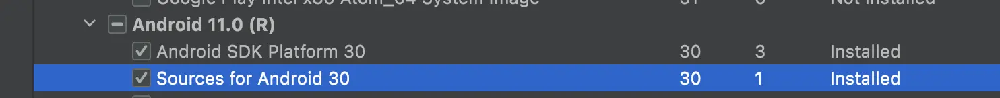

title:: hook-合规隐私/权限方法调用检测与替换

- # 1、插件功能结构
  collapsed:: true
	- 框架
	  collapsed:: true
		- 
	- 支持扫描隐私权限方法，替换隐私权限方法等功能。
	- ## 1. 在跟项目的build.gradle文件中添加插件
	  collapsed:: true
		- ```
		  buildscript {
		      repositories {
		         maven { url "http://artifactory.58corp.com:8081/artifactory/android-public" }
		          maven { url "http://artifactory.58corp.com:8081/artifactory/android-local/" }
		        
		      }
		  
		      dependencies {
		          classpath 'com.coofee.rewrite:rewrite:1.0.3'
		      }
		  }
		  ```
	- ## 2. 在Application项目中添加配置
	  collapsed:: true
		- ```
		  apply plugin: 'com.coofee.rewrite'
		  
		  rewrite {
		  
		      scanPermissionMethodCaller {
		         // ...
		      }
		  
		      replaceMethod {
		          // ...
		      }
		  }
		  ```
	- ## 3.执行
	  collapsed:: true
		- 注意执行插件前，需要先clean，否会因为缓存使用旧结果。
		- ```
		  $ ./gradlew clean
		  $ ./gradlew :app:assembleDebug
		  ```
- # 2、例子
	- ## 1、获取android framework方法权限集
	  collapsed:: true
		- 首先需要保证已通过sdk manager安装对应compileSdkVersion版本的android源代码**，如下图所示：
		  collapsed:: true
			- 
		- 然后通过执行collectAndroidPermissionMethod任务获取android framework中需要权限的方法集：
		  collapsed:: true
			- ```
			  
			  ```
		- 查看android_framework_class_method_permission.json文件的内容格式大致如下：
		  collapsed:: true
			- ```
			  {
			    "android.telephony.TelephonyManager#getDeviceId": [
			      "android.Manifest.permission.READ_PRIVILEGED_PHONE_STATE"
			    ],
			    "android.telephony.TelephonyManager#getImei": [
			      "android.Manifest.permission.READ_PRIVILEGED_PHONE_STATE"
			    ],
			    "android.telephony.TelephonyManager#getMeid": [
			      "android.Manifest.permission.READ_PRIVILEGED_PHONE_STATE"
			    ]
			  }
			  ```
		-
	- ## 2. scanPermissionMethodCaller（扫描隐私API方法调用）
	  collapsed:: true
		- 配置scanPermissionMethodCaller如下所示:
		  collapsed:: true
			- 注意：对于使用ContentResolver的获取联系人/短信等需要权限的行为，暂时不支持通过scanPermissionMethodCaller统计。
			  可以参考ShadowContentResolver.java和replace_method的配置，
			  使用replaceMethod进行运行时拦截，统计权限获取情况。
			- ```
			  scanPermissionMethodCaller {
			      // 会在 replaceMethod 之后执行，所以在 replaceMethod 中配置的方法不会被统计到。
			      enable = true
			  
			      // 配置未添加权限的方法，比如隐私方法等。
			      configPermissionMethods = [
			              "android.content.pm.PackageManager#getInstalledPackages"         : [
			                      "获取应用列表"
			              ] as Set,
			              "android.content.pm.PackageManager#getInstalledApplications"     : [
			                      "获取应用列表"
			              ] as Set,
			  
			              // 高德地图
			              "com.amap.api.location.AMapLocationClient#startLocation"         : [
			                      "android.Manifest.permission.ACCESS_FINE_LOCATION",
			              ] as Set,
			              "com.amap.api.location.AMapLocationClient#startAssistantLocation": [
			                      "android.Manifest.permission.ACCESS_FINE_LOCATION",
			              ] as Set,
			  
			              // 百度地图
			              "com.baidu.location.LocationClient#start"                        : [
			                      "android.Manifest.permission.ACCESS_FINE_LOCATION",
			              ] as Set,
			  
			              "android.net.wifi.WifiInfo#getMacAddress"                        : [
			                      "Mac地址"
			              ] as Set,
			              "java.net.NetworkInterface#getHardwareAddress"                   : [
			                      "Mac地址"
			              ] as Set,
			      ]
			  
			      // 当执行 `collectAndroidPermissionMethod` 任务成功后，
			      // 会生成 android_framework_class_method_permission.json 到当前project目录中.
			      configFile = file("android_framework_class_method_permission.json")
			  
			      // 输出扫描结果
			      outputFile = file("scan_permission_method_caller.json")
			  
			      // 忽略android系统库
			      excludes = [
			              "android/", "java/", "javax/", 'com/coofee/rewrite/hook/'
			      ]
			  }
			  ```
		- 然后通过如下命令编译应用：
		  collapsed:: true
			- ```
			  $ ./gradlew :app:assembleDebug
			  [RewritePlugin] scan permission method caller result success write to file app/scan_permission_method_caller_result.json
			  [RewritePlugin] scan permission method caller result success write to file app/scan_permission_method_caller_result_by_module.json
			  ```
		- scan_permission_method_caller_result.json扫描结果文件是按照权限进行分组，样例如下：
		  collapsed:: true
			- ```
			  
			  ```
		- scan_permission_method_caller_result_by_module.json扫描结果文件则是按照模块名进行分组，样例如下：
		  collapsed:: true
			- ```
			  {
			    "androidx.appcompat:appcompat:1.1.0": [
			      {
			        "className": "androidx.appcompat.app.TwilightManager",
			        "methodName": "getLastKnownLocationForProvider",
			        "lineNo": 135,
			        "permissionMethod": "android.location.LocationManager#getLastKnownLocation",
			        "permissions": [
			          "android.Manifest.permission.ACCESS_FINE_LOCATION",
			          "android.Manifest.permission.ACCESS_COARSE_LOCATION"
			        ]
			      }
			    ],
			    "8f0a287af65fe4840370804c25783e3d59e2e135": [
			      {
			        "className": "com.coofee.rewrite.MainActivity",
			        "methodName": "testGetDeviceId",
			        "lineNo": 113,
			        "permissionMethod": "android.telephony.TelephonyManager#getDeviceId",
			        "permissions": [
			          "android.Manifest.permission.READ_PRIVILEGED_PHONE_STATE"
			        ]
			      },
			      {
			        "className": "com.coofee.rewrite.MainActivity",
			        "methodName": "testGetMacAddress",
			        "lineNo": 122,
			        "permissionMethod": "android.net.wifi.WifiInfo#getMacAddress",
			        "permissions": [
			          "Mac地址"
			        ]
			      },
			      {
			        "className": "com.coofee.rewrite.MainActivity",
			        "methodName": "testGetMacAddress",
			        "lineNo": 126,
			        "permissionMethod": "java.net.NetworkInterface#getHardwareAddress",
			        "permissions": [
			          "Mac地址"
			        ]
			      }
			    ]
			  }
			  
			  ```
	- ## 3. replaceMethod（替换方法）
-