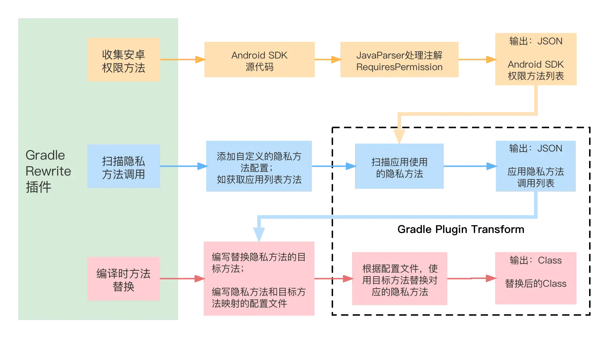

title:: hook-合规隐私/权限方法调用检测与替换

- # 1、插件功能结构
	- 框架
	  collapsed:: true
		- 
	- 支持扫描隐私权限方法，替换隐私权限方法等功能。
	- ## 1. 在跟项目的build.gradle文件中添加插件
	  collapsed:: true
		- ```
		  buildscript {
		      repositories {
		         maven { url "http://artifactory.58corp.com:8081/artifactory/android-public" }
		          maven { url "http://artifactory.58corp.com:8081/artifactory/android-local/" }
		        
		      }
		  
		      dependencies {
		          classpath 'com.coofee.rewrite:rewrite:1.0.3'
		      }
		  }
		  ```
	- ## 2. 在Application项目中添加配置
	  collapsed:: true
		- ```
		  apply plugin: 'com.coofee.rewrite'
		  
		  rewrite {
		  
		      scanPermissionMethodCaller {
		         // ...
		      }
		  
		      replaceMethod {
		          // ...
		      }
		  }
		  ```
	- ## 3.执行
		-