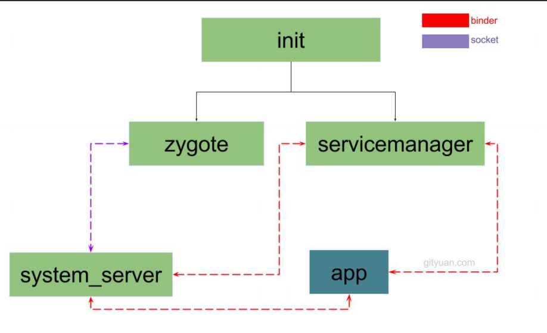

- # 一、简介
	- Init进程是Android系统中用户空间的第一个进程，进程号为1，是 Android 系统启动流程中一个关键的步骤，
- # 二、职责：
	- 创建和挂载启动所 的文件目录。
	- 初始化和启动属性服务。
		- 什么是属性服务？
			- Windows平台上有一个注册表管理器，注册表的内容采用键值对的形式来记录用户、软件的一些使用信息。即使系统或者软件重启，其还是能够根据之前注册表中的记录，进行相应的初始化工作。 Android 也提供了一个类似的机制，叫作属性服务。
	- [[#red]]==**解析 init.rc 配置文件并启动 Zygote 进程。**==
- # 三、僵尸进程与危害
	- ## 简介
		- 在UNIX/Linux 中，父进程使用 fork 创建子进程，在子进程终止之后，如果父进程并不知道子进程已经终止了，这时子进程虽然已经退出了，但是在系统进程表中还为它保留了一定的信息（比如进程号、退出状态、运行时间等），这个子进程就被称作僵尸进程。系统进程表是一项有限资惊，如果系统进程表被僵尸进程耗尽的话，系统就可能无怯创建新的进程了。
	- ## init进程防止僵尸进程 设置了signal_ handler_init 子进程信号处理函数
		- 系统会在子进程暂停和终止的时候发出 SIGCHLD 号
		- 假设 init 进程的子进程 Zygote 终止了， signal_handler_init 函数内部会调用 handle_signal 
		  函数，经过层层的函数调用和处理，最终会找到 Zygote 进程井移除所有的 Zygote 进程的
		  信息，再重启 Zygote 服务的启动脚本（比如 init.zygote64.rc ）中带有 onrestart 选项的服务，
- # 四、init进程分析
	- 
	- ## \system\core\init\init.cpp main()
		- ```java
		  ```