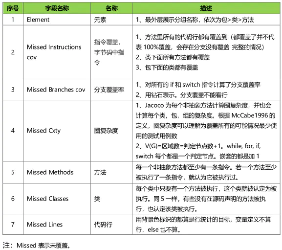

- # 一、AS已经内置了jacoco
  collapsed:: true
	- 只需要开启插件即可
	- ```
	  plugins {
	  	 id 'com.android.application'
	       id 'kotlin-android'
	       id 'jacoco'
	  }
	  
	  jacoco {
	      // 指定版本
	      toolVersion = "0.8.5"
	  }
	  ```
- # 二、开启覆盖率开关
  collapsed:: true
	- ```
	       buildTypes {
	           release {
	               minifyEnabled false
	               // 关闭测试覆盖率
	               testCoverageEnabled = false 
	               proguardFiles getDefaultProguardFile('proguard-android-optimize.txt'), 'proguard-rules.pro'
	           }
	           debug {
	               // 打开测试覆盖率
	               testCoverageEnabled = true
	           }
	      }
	  
	  ```
- # 三、jacoco报告覆盖率为0 问题排查
	- 借助jacococli工具，打印exec里的文件，jacococli.jar 已上传到csdn
		- ```
		  java -jar jacococli.jar execinfo /Users/xuwenbin/AndroidStudioProjects/58ComponentProject2/MetaXUtils/demo-sample/build/jacoco/testDebugUnitTest.exec 
		  ```
	- 最终原因jacoco 0.75以上 需要开启JacocoTaskExtension中的includeNoLocationClasses
- # 四、task配置
  collapsed:: true
	- groovy写法:
	  collapsed:: true
		- ```groovy
		  project.afterEvaluate { project ->
		      setupAndroidReporting()
		  }
		  
		  def setupAndroidReporting() {
		     // 必须开启 要不然 jacoco0.7.5以上生成覆盖率为0
		      tasks.withType(Test) {
		          // Whether or not classes without source location should be instrumented
		          jacoco.includeNoLocationClasses = true
		          jacoco.excludes = ['jdk.internal.*']
		      }
		  
		      // Grab all build types and product flavors
		      def buildTypes = android.buildTypes.collect { type ->
		          type.name
		      }
		      def productFlavors = android.productFlavors.collect { flavor ->
		          flavor.name
		      }
		      // When no product flavors defined, use empty
		      if (!productFlavors) productFlavors.add('')
		      productFlavors.each { productFlavorName ->
		          buildTypes.each { buildTypeName ->
		              def sourceName, sourcePath
		              if (!productFlavorName) {
		                  sourceName = sourcePath = "${buildTypeName}"
		              } else {
		                  sourceName = "${productFlavorName}${buildTypeName.capitalize()}"
		                  sourcePath = "${productFlavorName}/${buildTypeName}"
		              }
		              def testTaskName = "test${sourceName.capitalize()}UnitTest"
		              System.out.println("Task -> $testTaskName")
		  
		              // Create coverage task of form 'testFlavorTypeCoverage' depending on 'testFlavorTypeUnitTest'
		              task "${testTaskName}Coverage"(type: JacocoReport, dependsOn: "$testTaskName") {
		                  group = "Reporting"
		                  description = "Generate Jacoco coverage reports on the ${sourceName.capitalize()} build."
		  
		                  def fileFilter = [
		                          // data binding
		                          'android/databinding/**/*.class',
		                          '**/android/databinding/*Binding.class',
		                          '**/android/databinding/*',
		                          '**/androidx/databinding/*',
		                          '**/BR.*',
		                          // android
		                          '**/R.class',
		                          '**/R$*.class',
		                          '**/BuildConfig.*',
		                          '**/Manifest*.*',
		                          '**/*Test*.*',
		                          'android/**/*.*',
		                          // kotlin
		                          '**/*MapperImpl*.*',
		                          '**/*$ViewInjector*.*',
		                          '**/*$ViewBinder*.*',
		                          '**/BuildConfig.*',
		                          '**/*Component*.*',
		                          '**/*BR*.*',
		                          '**/Manifest*.*',
		                          '**/*$Lambda$*.*',
		                          '**/*Companion*.*',
		                          '**/*Module*.*',
		                          '**/*Dagger*.*',
		                          '**/*Hilt*.*',
		                          '**/*MembersInjector*.*',
		                          '**/*_MembersInjector.class',
		                          '**/*_Factory*.*',
		                          '**/*_Provide*Factory*.*',
		                          '**/*Extensions*.*',
		                          // sealed and data classes
		                          '**/*$Result.*',
		                          '**/*$Result$*.*',
		                          // adapters generated by moshi
		                          '**/*JsonAdapter.*',
		                  ]
		  
		                  def javaTree = fileTree(dir: "${project.buildDir}/intermediates/javac/$sourceName/classes", excludes: fileFilter)
		                  def kotlinTree = fileTree(dir: "${project.buildDir}/tmp/kotlin-classes/$sourceName", excludes: fileFilter)
		                  classDirectories.from = files([javaTree], [kotlinTree])
		                  executionData.from = files("${project.buildDir}/jacoco/${testTaskName}.exec")
		                  def coverageSourceDirs = ["src/main/java",
		                                            "src/$productFlavorName/java",
		                                            "src/$buildTypeName/java"]
		  
		                  sourceDirectories.setFrom(files(coverageSourceDirs))
		                  additionalSourceDirs.setFrom(files(coverageSourceDirs))
		  
		                  reports {
		                      csv.enabled false // change if needed
		                      xml.enabled false // change if needed
		                      html {
		                          enabled true
		                          destination file("${buildDir}/coverage-report")
		                      }
		                  }
		              }
		          }
		      }
		  }
		  
		  android {
		      buildTypes {
		          debug {
		              testCoverageEnabled true
		          }
		      }
		  }
		  ```
	- buildSrc写法：
		- ```kotlin
		  ```
	- 注意点因搭配Robolectric测试 需要开启 JacocoTaskExtension中的includeNoLocationClasses
		- groovy写法
		  collapsed:: true
			- ```
			     tasks.withType(Test) {
			          // Whether or not classes without source location should be instrumented
			          jacoco.includeNoLocationClasses = true
			          jacoco.excludes = ['jdk.internal.*']
			      }
			      
			      或者
			      android {
			        testOptions {
			           unitTests.all {
			               jacoco {
			                  includeNoLocationClasses = true
			                  excludes = ['jdk.internal.*']
			                }
			  
			            }
			         }
			      }
			      
			  ```
		- buildSrc写法：
		  collapsed:: true
			- ```kotlin
			  class MetaXAppPlugin : Plugin<Project> {
			    	 override fun apply(project: Project) {
			         	 project.afterEvaluate { project ->
			             	 afterEvaluateInit(project, android)
			         	 }
			       }
			       
			       private fun afterEvaluateInit(project: Project, android: AppExtension?) {
			         	  android?.applicationVariants?.all { variant ->
			              if (!isIntegratedAppModule) {
			                  try {
			                      val testUnitTask:DefaultTask = AGPCompat.getTestUnitTest(project, variant.name) as DefaultTask
			                      // 必须开启
			                      testUnitTask.apply {
			                          (this.extensions.getByName("jacoco") as JacocoTaskExtension).apply {
			                              this.isIncludeNoLocationClasses = true
			                              this.excludes = mutableListOf("jdk.internal.*")
			                          }
			                      }
			                      val jacocoReportTask = initJacocoReportTask(project, android, variant.name)
			                      jacocoReportTask.dependsOn(testUnitTask)
			                      metaXUnitTest?.dependsOn(jacocoReportTask)
			                      orderAssemble(project, variant)
			                  } catch (e: Exception) {
			                      // ignore.
			                  }
			              }
			          }	
			       }
			       private fun initJacocoReportTask(project: Project, android: AppExtension?,variantName:String) :JacocoReport{
			          android?.buildTypes?.all {
			              it.isTestCoverageEnabled = true
			          }
			          val jacocoOptions: JacocoOptions? = android?.jacoco
			          jacocoOptions?.version = MetaXConstants.JacocoToolVersion
			          // 依据变体创建对应task
			          val jacocoReportTask:JacocoReport = AGPCompat.getJacocoReportTask(project,variantName)
			          jacocoReportTask.group = MetaXConstants.GroupName
			          jacocoReportTask.description = "Generate Jacoco coverage reports"
			          // task基础配置 src/main/java
			          jacocoReportTask.additionalSourceDirs?.setFrom(MetaXInfos.getJacocoCoverageSourceDirs(project))
			          jacocoReportTask.sourceDirectories?.setFrom(MetaXInfos.getJacocoCoverageSourceDirs(project))
			          val patternSet: PatternFilterable = PatternSet()
			          // 过滤文件
			          patternSet.exclude(
			              "**/R\$*.class",
			              "**/*\$ViewInjector*.*",
			              "**/BuildConfig.*",
			              "**/Manifest*.*"
			          )
			          val kotlinTree = project.fileTree("${project.buildDir}/tmp/kotlin-classes/$variantName")
			          val javaTree = project.fileTree("${project.buildDir}/intermediates/javac/$variantName/classes")
			          jacocoReportTask.classDirectories?.setFrom(
			              project.files(javaTree,kotlinTree).asFileTree.matching(patternSet)
			          )
			          // 配置executionData 路径
			          jacocoReportTask.executionData?.setFrom(MetaXInfos.getJacocoExecutionData(project,variantName))
			          // 是否开启报告
			          jacocoReportTask.reports.html?.isEnabled = true
			          jacocoReportTask.reports.xml?.isEnabled = true
			          return jacocoReportTask
			      }
			       
			  }
			  ```
- # 五、忽略单元测试错误，即使出错也生成覆盖率报告
	- (testUnitTask as Test).ignoreFailures = true
- # 原理介绍
  collapsed:: true
	- jacoco即是通过修改class文件的字节码来进行代码覆盖率统计的。即，在原有class字节码中的指定位置插入探针字节码，形成新的字节码指令流。jacoco使用的是ASM字节码框架对字节码进行修改的（关于ASM框架，可以参考这篇文章：https://www.cnblogs.com/liuling/archive/2013/05/25/asm.html）。jacoco的探针实际是一个布尔值，当代码执行到探针位置时，将其置为true，该探针前面的代码会被认为执行过，然后对该部分代码对应的html文件中的css样式进行染色（红色表示未覆盖，绿色表示已覆盖，黄色表示部分覆盖），形成最终的覆盖率报告。
- # 报告分析
  collapsed:: true
	- 
-
- # 参考资料
	- [Android 代码覆盖率如何实现]([125049195](https://blog.csdn.net/m0_71524094/article/details/125049195))
	- [jacoco在android studio 上的配置使用](https://blog.csdn.net/u010663321/article/details/121761825)
	- [Android Jacoco覆盖率统计配置](https://github.com/hanlyjiang/AndroidTestSample/blob/main/docs/Jacoco%E8%A6%86%E7%9B%96%E7%8E%87%E7%BB%9F%E8%AE%A1%E6%96%B9%E6%A1%88.md)
	- [JUnit+Robolectric+JaCoCo实现Android单元测试及覆盖率检查](https://blog.csdn.net/yugong2009/article/details/80462094)
	- [汇总多模块测试结果和多模块jacoco代码覆盖率](https://www.cnblogs.com/xy-ouyang/p/16098978.html)
	- [Android 使用 jacoco 统计代码行覆盖率 无需安装运行]()
-