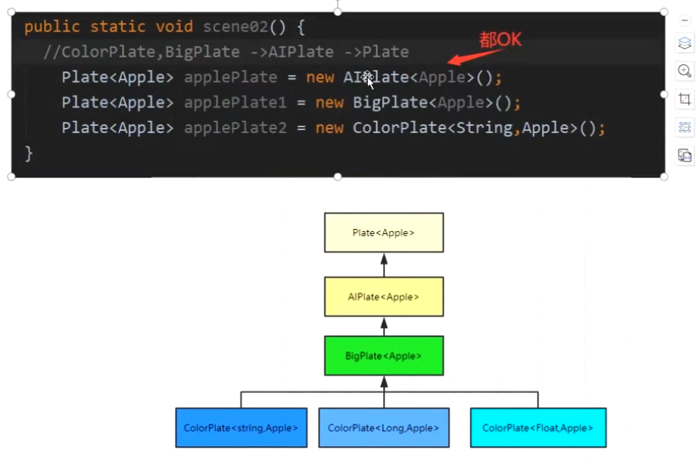
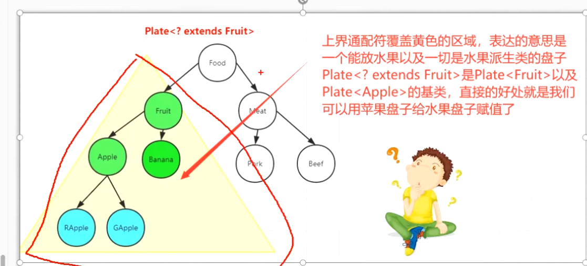

- # 一、泛型的优点
	-
	- 1. 代码更健壮，约束指定的类型，在编译期可以避免类转换异常
	- 2. 代码简洁 (不需要强转)
	- 3. 代码更灵活，复用
- # 二、泛型的类型
  collapsed:: true
	- 1、泛型接口
		- 接口泛型 <T> 定义到接口名字后边
			- ```
			  public interface Plate<T>{
			         public void set(T t);
			  }
			  ```
		-
	- 2、泛型类
		- 类中的泛型<T>定义在类名后
		- ```
		  public class AiPlate<T> implements Plate<T>{
		  	private List<T> items = new ArrayList<T>(10);
		  }
		  ```
		-
	- 3、泛型方法
		- 方法泛型定义在 可见修饰符之后，返回值之前
		- ```
		  public <T> AIPlate<T> getAiPlate(){
		         return new AIPlate<T>();
		  }
		  
		  
		  public interface Plate<T>{
		         // 这种就是泛型接口里的普通方法
		         public void set(T t);
		  }
		  ```
- # 三、什么是泛型
	- JAVA泛型(generics)是JDK5中引入的一种`参数化类型` 特性
- # 四、什么是参数化类型特性？
	- 把类型当参数一样传递
	- ## 例子：
	- Plate<T>中的“T” 称为类型参数
	- Plate<Banana> 中的“Banana”称为实际类型参数
	- “Plate<T>”整个称为泛型类型
	- “Plate<Banana>” 整个称为参数化的类型ParameterizedType
- # 五、泛型的类型擦除
  collapsed:: true
	- ## 5-1、什么是类型擦除？
		- 泛型 ‘T’ 定义在 java 文件中比如 ‘T’ 定义为 ‘Banana’ 实际类型，编译成class字节码后，之前声明的实际类型 ‘Banana’ 被擦除
	- ## 5-2、类型擦除具体做了哪些事情
		- 1. 检测类型  ‘T' 有没有做限制 (比如 'T extends Fruit')
			- 如果没有做限制 定义的’T‘ (假如声明成’Banana‘) 会被擦除成Object
			- 如果有限制比如 'T extends Fruit'  声明的实际类型为 ’Banana‘，则会被擦除成限制的类型 ’Fruit‘
		- 2. 类型擦除后class文件中还会生成Bridge 方法 (否则 直接擦除类型为Object等，那限制的接口有未实现的方法会报错)
			- ```
			  1、java 文件：
			  public interface Plate <T>{
			      void set(T t);
			      T get();
			  }
			  
			  2、类型擦除后的class文件： 
			  public interface Plate{
			      void set(Object t);
			      Object get();
			  }
			  
			  3、Plate子类 AIPlate  
			  public class AIPlate <T extends java.lang.Comparable<T>> implements  Plate<T>{
			       private java.util.List<T> items;
			       public AIPlate(){  }
			       public void set(Comparable t) {   }
			       public T get() {   }
			       public java.lang.String toString(){    }
			  }
			  
			  4、擦除后的 T  为 Comparable   但是implements Plate 如2里(类型擦除后的胃Object) 但是这里擦除后  set get方法里为Comparable，没有Plate中的object的set  get实现方法
			  public class AIPlate  implements  Plate{
			       private java.util.List<Comparable> items;
			       public AIPlate(){  }
			       public void set(Comparable t) {   }
			       public Comparable get() {   }
			       public java.lang.String toString(){    }
			  }
			  
			  5、所以就需要生成桥接方法
			  public class AIPlate  implements  Plate{
			       private java.util.List<Comparable> items;
			       public AIPlate(){  }
			       public void set(Comparable t) {   }
			       public Comparable get() {   }
			       public java.lang.String toString(){    }
			       
			       
			       // 桥方法 兼容AIPlate里未实现object类型的set  get方法
			       @Override
			       public synthetic bridge get(){
			       
			       }
			       @Override
			       public synthetic bridge set(Object t){
			          // 调用上边的set方法
			          set((Comparable)t)
			       }
			  }
			  ```
			- 桥方法的作用？
				- 1、类型擦除后 实现未实现的方法
				- 2、在实现的方法中 将object类型 强制成擦除后的保留类型  如上的Comparable
			-
	- ## 5-3、泛型擦除残留
		- 打开字节码文件发现里边还是含有T的，这是泛型擦除的残留，只是签名而已，还保留了定义的格式，对分析字节码有好处
	- ## 5-4、泛型运行时擦除了，为什么还能在运行时通过反射拿到类型？
		- 泛型擦除后，只是在该类的常量池里面保留了泛型的信息。所以能通过反射拿到信息
- # 六、面试题
	- ## 6-1、java泛型的原理？什么是泛型擦除机制？
		- java 的泛型是JDK5新引入的特性，为了向下兼容，虚拟机其实是不支持泛型，所以java实现的是一种“伪泛型”机制，也就是说Java再编译期擦除了所有的泛型信息，这样java就不需要产生新的类型到字节码，所有的泛型类型最终都是一种原始类型，在java运行时根本就不存在泛型信息。
	- ## 6-2、java编译器具体是如何擦除泛型的？
		- 1、检查泛型类型，获取目标类型
		- 2、擦除类型变量，并替换为限定类型
			- 如果泛型类型的类型变量没有限定(就是这样的<T>),则用Object作为原始类型
			- 如果有限定(<T extends XClass>) 则用XClass 作为原始类型
			- 如果有多个限定(<T extends XClass1&XClass2>) 则使用第一个边界XClass1作为原始类
		- 3、在必要时插入类型转换以保持类型安全
		- 4、生成桥方法以在扩展时保持多态性
	- ## 6-3、使用泛型以及泛型擦除带来的影响(副作用)
	  collapsed:: true
		- A、泛型类型变量不能使用基本数据类型
			- 比如没有ArrayList<int>,只有ArrayList<Integer>,当类型擦除后，ArrayList的原始类中的类型变量(T)替换成Object，但Object类型不能存放int值
			- ```
			  // 报错 因为擦除后变成了Object，而Object是没法存放int类型的
			  ArrayList<int> ints = new ArrayList<>();  
			  // 正确的
			  ArrayList<Integer> ints = new ArrayList<>();  
			  ```
		- B、不能使用instanceof 运算符
		  collapsed:: true
			- 因为擦除后，ArrayList<String> 只剩下原始类型，泛型信息String不存在了，所以没法使用instanceof
				- ```
				  ArrayList<String> strings = new ArrayList<>();
				  // 使用ArrayList<?> 可以
				  if(strings instanceof ArrayList<?>) {} 
				  // 因为擦除ArrayList<String> 后String 丢失了
				  if(strings instanceof ArrayList<String>)
				  ```
			-
		- C、泛型在静态方法和静态类中的问题
			- 因为泛型类中的泛型参数的实例化是在定义泛型类型对象(比如ArrayList<Integer>) 的时候指定的，而静态成员是不需要使用对象来调用的，所有对象都没创建，如何确定这个泛型参数是什么
			- ```
			  class Test2<T> {
			       // 报错，因为泛型参数是要创建对象时确定
			       public static T one;
			       public static T test(T t){}
			  
			  
			       // 静态的 泛型方法是可以的
			       public static <Q> Q test1(Q t) {
			           return t
			       }
			  }
			  ```
		- D、泛型类型中的方法冲突
			- 因为擦除后两个equals 方法变成一样的了
			- ```
			  @Override
			  public boolean equals(T t){
			       return super.equals(t);
			  }
			  
			  @Override
			  public boolean equals(Object obj){
			       return super.equals(obj);
			  }
			  ```
		- E、没办法创建泛型的实例
			- 因为类型不确定
			- ```
			  // 报错 因为无法创建一个不确定类型参数的实例，编译时报错
			  public static <E> void append(List<E> list){
			       E elem = new E(); 
			       list.add(elem);
			  }
			  
			  // 但是可以通过反射创建一个参数化类型的实例
			  public static <E> void append(List<E> list，Class<E> cls) throws Exception{
			       E elem = cls.newInstance(); //ok 
			       list.add(elem);
			  }
			  ```
		- F、java里没有泛型数组
			- 因为数组是 “协变”，擦除后就没法满足数组协变的原则
			- ```
			  
			  public static <T> void scene0(Class<T> tClass){
			      T[] arr = new T[10]; // 不允许
			      
			      Apple[] apples = new Apple[10];
			      Fruit[] fruits = new Fruit[10];
			  }
			  
			  // 因为数组是协变的，就是Apple[] 的父类是 Fruit[]，如果数组可以使用泛型，那么泛型擦除时，都变成Object类型了
			  // A的父类是B 两个数组 A<Apple>[] B<Fruit>[] 泛型擦除后就都是A<Object>[] B<Object>[]则不满足数组的协变，所以不允许泛型数组存在
			  ```
		-
		-
	- ## 6-4、协变和不变中的面试题
		- 数组是协变的，跟随继承关系，A 是 B 的父类  那A[]  是 B[]的父类
		- 重点1：但是List  和 类 是不变的，Apple extends Fruit   List<Fruit>  并不是 List<Apple> 的父类，他们没关系
		- 重点2：Apple extends Fruit    Plate<Fruit>   也不是  Plate<Apple>的父类   没关系，除非是类具有继承关系
		- 重点3：ColorPlate 继承 BigPlate      BigPlate 继承 AIPlate     AIPlate  继承 Plate 那么以下继承关系成立：泛型都是 Apple       Plate<Apple> 是 AIPlate<Apple> 的父类       AIPlate<Apple> 是BigPlate<Apple>的父类  BigPlate<Apple> 是ColorPlate<String,Apple>的父类
		-
		- 
		- ```
		  ```
- # 七、协变，逆变
	- ## 7-1、数组是协变
		- ```
		   // 苹果的父类水果 
		   Apple extends Fruit
		   
		   // 则 苹果数组的父类就是水果数组  这就是协变
		   Apple[] apples = new Apple[10];
		   Fruit[] fruits = new Fruit[10];
		   
		   
		  ```
	-
- # 八、通配符  ？
	- ## 8-1背景： 由于六中的面试题得知，List 和 类是不变的，数组才是协变的，那么怎么让Plate<Apple>  变成 Plate<Fruit>盘子，类没协变非继承关系，不能强转，所以可以借助通配符
		- ```
		  public Plate<? extends Fruit> getSnack(Plate<Apple> applePlate){
		        // applePlate.set(new Banana()); // 想用放苹果的盘子 放香蕉肯定报错
		        // 但是现实中装苹果的盘子也能装香蕉和其他水果，，类没有继承关系强转也不行，就需要借助通配符？
		        // Plate<Fruit> fruitPlate = (Plate<Fruit>)applePlate;
		        
		        Plate<? extends Fruit> fruitPlate = applePlate;
		        return fruitPlate;
		  }
		  ```
	- ## 8-2、上界通配符<? extends T>：生产者只能存，不能取
		- ### 覆盖范围
			- 
		- ### 缺点：
		-
	- ## 8-3、下界通配符<? super T>:
	- ## 8-4、通配符PECS原则