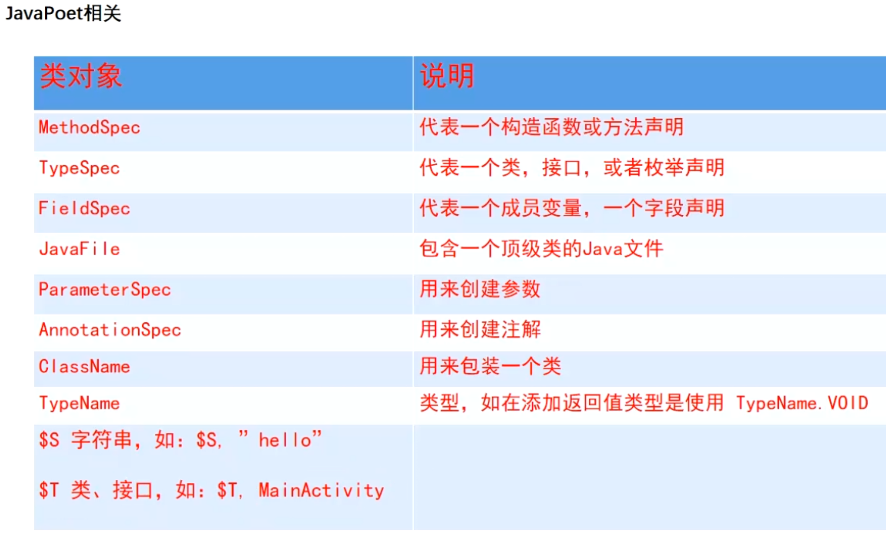
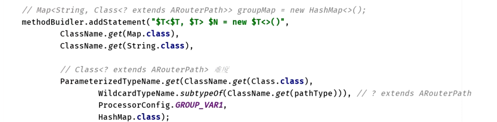

# 一、javapoet使用
	- 
	- 
	- 借助  [AutoService](https://www.jianshu.com/p/14669ded4b8b) 自动处理Processor + javapoet 自动生成java源文件
	- [javapoet api](https://square.github.io/javapoet/1.x/javapoet/)
	- [javapoetgithub](https://github.com/square/javapoet)
	- [自定义注解生成代码（一） —— javaPoetAPI详解](https://blog.csdn.net/bencheng06/article/details/103220774)
	- [（译）JavaPoet 官方教程](https://juejin.cn/post/6844904022600597517)
	- [JavaPoet的使用指南](https://juejin.cn/post/6844903695621029895)
	- [方法体的构建](https://blog.csdn.net/io_field/article/details/89355941)
	- [JavaPoet使用详解](https://blog.csdn.net/io_field/article/details/89355941)
	- [[javaPeot踩坑]]
	-
- # 二、kotlinpoet生成kotlin类
  collapsed:: true
	- [使用kotlinpoet生成kotlin代码数据类型不正确的问题](https://www.jianshu.com/p/f41d21850cb4)
	  collapsed:: true
		- ```
		  package com.wuba.compiler
		  
		  import com.squareup.kotlinpoet.ClassName
		  import com.squareup.kotlinpoet.asTypeName
		  import org.jetbrains.kotlin.builtins.jvm.JavaToKotlinClassMap
		  import org.jetbrains.kotlin.name.FqName
		  import java.util.HashMap
		  import javax.lang.model.element.Element
		  
		  /**
		   * @author:xuwenbin
		   * @time:2022/5/24 10:36 上午
		   * @description: java.util.HashMap<java.lang.String,java.lang.Object>
		   */
		  object KtUtils {
		      fun Element.javaToKotlinType(): ClassName? {
		          JavaToKotlinClassMap
		          val className = JavaToKotlinClassMap.mapJavaToKotlin(FqName(this.asType().asTypeName().toString()))?.asSingleFqName()?.asString()
		          return if (className == null) {
		              null
		          } else {
		              ClassName.bestGuess(className)
		          }
		      }
		  
		      /**
		       * 获取需要把java类型映射成kotlin类型的ClassName  如：java.lang.String 在kotlin中的类型为kotlin.String 如果是空则表示该类型无需进行映射
		       */
		      fun javaToKotlinType(typeName: String): ClassName? {
		          //由于java中的装拆箱机制，所以会出现int等类型无法识别的问题，javatoKotlin可以识别装箱后的类型，无法识别int,short,double这些类型，所以手动做一个装箱
		          var name = javaPacking(typeName)
		          val className = JavaToKotlinClassMap.mapJavaToKotlin(FqName(name))?.asSingleFqName()?.asString()
		          return if (className == null) {
		              null
		          } else {
		              ClassName.bestGuess(className)
		          }
		      }
		  
		      /**
		       * 对java的基本类型进行装箱操作
		       */
		      private fun javaPacking(typeName: String): String {
		          return when (typeName) {
		              "int" -> "java.lang.Integer"
		              "byte" -> "java.lang.Byte"
		              "short" -> "java.lang.Short"
		              "long" -> "java.lang.Long"
		              "double" -> "java.lang.Double"
		              "float" -> "java.lang.Float"
		              "boolean" -> "java.lang.Boolean"
		              "char" -> "java.lang.Character"
		              else -> typeName
		          }
		      }
		  }
		  ```
	- [kotlinpoet 中文api](https://enzowyf.github.io/kotlinpoet.html)
	- [kotlinpoet 源api](https://square.github.io/kotlinpoet/)
	- [APT api具体详解，包括获取方法的入参](https://blog.csdn.net/u014454538/article/details/122531293)
	- ## 写代码
		- 1、生成kotlin单例
		  collapsed:: true
			- ```
			    public companion object {
			    
			      public val instance: UnityLogSDK by lazy(mode = LazyThreadSafetyMode.SYNCHRONIZED){
			          UnityLogSDK() }
			    }
			    
			    
			       val companionObject = TypeSpec.companionObjectBuilder()
			      
			          val instance = PropertySpec.builder("INSTANCE", className)
			              .delegate("lazy(mode = LazyThreadSafetyMode.SYNCHRONIZED){ %T() }",className)
			              .build()
			  
			          companionObject.addProperty(instance)
			    
			  ```
		- 2、生成泛型类
		  collapsed:: true
			- ```
			  kotlinpoet  生成 HashMap<String, UnityLogBean>
			  
			  val mapType = ClassName("java.util", "HashMap")
			  val stringType = ClassName("kotlin", "String")
			  val nameType = ClassName("com.wuba.unitylog.annotation.bean", "UnityLogBean")
			  
			  val mapOfStringToName = mapType.parameterizedBy(stringType,nameType)
			  ```
		- 3、生成常量
			- ```
			        public val Tag_TestModule: String = "testModule"
			        
			      private fun getPropertySpec(tagBean: TagAnnotation):PropertySpec{
			          return PropertySpec.builder("Tag_${tagBean.key.capitalize(Locale.ROOT)}", String::class)
			              .initializer("\"${tagBean.key}\"")
			              .build()
			      }
			  ```