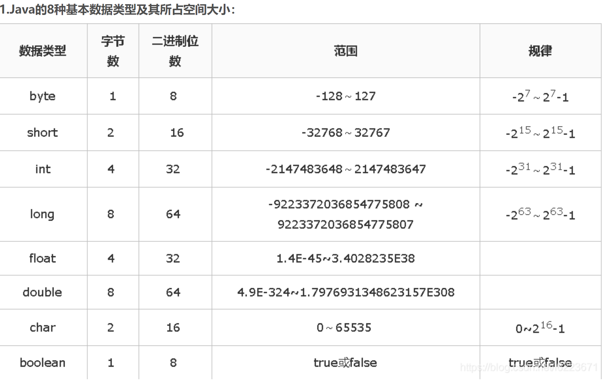

## 1、java为什么具有跨平台性？
	- 1、java程序[[#red]]==**基于JVM虚拟机**==运行的，而不是基于操作系统，JVM虚拟机在不同操作系统上实现了统一接口，负责java字节码的解释执行。
	- {{cloze 2、java会编译成class字节码，与系统平台无关中间代码，可以在任何安装了JVM的平台上运行}}
	  id:: 64f68742-d918-48d4-aee5-69382079ae65
- ## 2、类和对象的关系？#card
  collapsed:: true
	- 类：事物的描述
		- 比如动物类，定义身高颜色
	- 对象：该类事物的实例
		- 大象实体（1.8米。灰色）
- ## 3、[[成员变量和局部变量的区别]]
- ## 4、[[成员变量和静态变量区别]]
- ## 5、this关键字介绍
  collapsed:: true
	- ## this：代表当前对象
	- ## 作用：当成员变量和局部变量重名时，可以用关键字this区分
- ## 6、static关键字
  collapsed:: true
	- ### 1、静态变量存储在JVM方法区（Method Area）或元空间（Metaspace）
	- ### 2、静态变量在类加载时被初始化，优先于对象的存在，并且在整个程序的执行过程中一直存在
	- ### 3、修饰的成员被所有对象所共享，而对象中存储的是特有数据
	- ## 注意事项
		- 静态方法只能访问静态成员。(非静态既可以访问静态，又可以访问非静态)
		- 静态方法中不可以使用this或者super关键字。
	- ## 静态代码块
	  collapsed:: true
		- 随着类的加载而执行，而且只执行一次
		- ## 作用：用于给类进行初始化
- ## 7、面向对象三大特征
	- {{cloze 封装 继承 多态}}
	  id:: 64f68742-e385-4b34-a2df-4f72d4d60bab
- ## 7、重写和重载区别
	- 重载是同一个类方法重载，方法名一样，参数不一样。和返回值没关系吧
	- 重写是子类中重写父类方法·
	- ## 1、重载中，方法名、方法参数一样，算重载吗-2023滴滴国际化
		- 不算，会报错吧
	- ## 2、方法签名包括返回值吗？不包括
- ## 8、继承中面试题
	- 1、父子类成员变量同名，super区别
	- 2、重写父类方法时，重写方法权限必须大于等于父类方法权限
	- 3、子类中所有的构造函数默认都会访问父类中的空参数的构造函数。
- ## 9、内部类面试题
	- ### 特点
		- 1、内部类可以直接访问外部类中的成员，包括私有成员，因为内部类隐式持有this
		- 2、外部类要访问内部类中的成员，必须要建立内部类的对象
		- 3、静态内部类相当于外部类，就不会持有this。可以解决handler内存泄漏问题
	- ### 匿名内部类
		- 当匿名内部类被实例化时，它会持有外部类的引用。
		- 如果匿名内部类的实例在外部类实例被销毁之前仍然存在，它可能会导致外部类实例无法被垃圾回收，从而产生内存泄漏。
		- 为了避免内存泄漏，可以使用弱引用（WeakReference）或者静态内部类，或者在适当的时候解除匿名内部类对外部类的引用。
- ## 10、equals方法
	- 1、属于Object方法 默认内部也是 == 比较地址值的
	- 2、不同子类都会重写equals方法。比如String的equals 比较的内容（1、先==比较地址，相等的话就返回true,2、比较每个字符 字符相等返回true）
- ## 11、final、finally、finallize区别
	- final不可变修饰符
	- finally，try catch finally 异常处理最后执行的方法,用于资源关闭等
	- finalize：
		- 垃圾回收器确定该对象没有更多引用，由对象的垃圾回收器调用此方法
- ## 12、throw和throws区别
	- 1，throws使用在函数上。
	     throw使用在函数内。
	- 2，throws抛出的是异常类，可以抛出多个，用逗号隔开。
	     throw抛出的是异常对象。
- ## 13、if else 和 Switch区别
  collapsed:: true
	- ### 一、if-else
		- 只是单纯地一个接一个比较；[[#red]]==**if...else每个条件都计算一遍；**==
	- ### 二、switch
		- 使用了二叉树算法；[[#red]]==**绝大部分情况下switch会快一点，除非是if-else的第一个条件就为true**==
		- 编译器编译switch与编译if...else...不同。[[#red]]==**不管有多少case，都直接跳转，不需逐个比较查询**==；switch只计算一次值，然后都是test , jmp,
	- 有很多else if的时候，用switch case比较清晰
	-
	- switch使用查找表的方式决定了case的条件必须是一个连续的常量。而if-else则可以灵活的多。
	- ### 三、总结
		- 当只有分支比较少的时候，if效率比switch高（因为switch有跳转表）
		- 分支比较多，那当然是switch
	- ### 四、[[switch case语句]]
	-
- ## 14、[[访问修饰符]]
- ## 15、java的String和android的String有什么区别？
	- android确实是通过native方法对常用的api进行了优化吧
- ## 15、[[整数进制]]
- ## 16、计算机存储单位
	- ## 1、byte和bit区别？
		- byte（字节）：1Byte = 8Bit
			- 是计算机中常用的单位，由8个位组成
		- bit（比特位）：
			- 1、是[[#red]]==**计算机中最小的单位，**==用于表示二进制数据的单个值，可以是0或1
			- 2、比特是数字数据的最基本组成部分，它代表了一个二进制数字的单个状态
	- ## 2、基本数据类型所占空间大小
		- 
	- ## 3、ASCII编码表（二进制和字母对应表）
		- 小写字母a-z对应二进制和十进制(97-122)表格
		  collapsed:: true
			- | 字母 | 二进制 | 十进制 |
			  | ---- | ---- | ---- |
			  | a | 01100001 | 97 |
			  | b | 01100010 | 98 |
			  | c | 01100011 | 99 |
			  | d | 01100100 | 100 |
			  | e | 01100101 | 101 |
			  | f | 01100110 | 102 |
			  | g | 01100111 | 103 |
			  | h | 01101000 | 104 |
			  | i | 01101001 | 105 |
			  | j | 01101010 | 106 |
			  | k | 01101011 | 107 |
			  | l | 01101100 | 108 |
			  | m | 01101101 | 109 |
			  | n | 01101110 | 110 |
			  | o | 01101111 | 111 |
			  | p | 01110000 | 112 |
			  | q | 01110001 | 113 |
			  | r | 01110010 | 114 |
			  | s | 01110011 | 115 |
			  | t | 01110100 | 116 |
			  | u | 01110101 | 117 |
			  | v | 01110110 | 118 |
			  | w | 01110111 | 119 |
			  | x | 01111000 | 120 |
			  | y | 01111001 | 121 |
			  | z | 01111010 | 122 |
		- 大写字母 A-Z 对应的二进制和十进制(65-90)表示的表格：
		  collapsed:: true
			- | 字母 | 二进制 | 十进制 |
			  | ---- | ---- | ---- |
			  | A | 01000001 | 65 |
			  | B | 01000010 | 66 |
			  | C | 01000011 | 67 |
			  | D | 01000100 | 68 |
			  | E | 01000101 | 69 |
			  | F | 01000110 | 70 |
			  | G | 01000111 | 71 |
			  | H | 01001000 | 72 |
			  | I | 01001001 | 73 |
			  | J | 01001010 | 74 |
			  | K | 01001011 | 75 |
			  | L | 01001100 | 76 |
			  | M | 01001101 | 77 |
			  | N | 01001110 | 78 |
			  | O | 01001111 | 79 |
			  | P | 01010000 | 80 |
			  | Q | 01010001 | 81 |
			  | R | 01010010 | 82 |
			  | S | 01010011 | 83 |
			  | T | 01010100 | 84 |
			  | U | 01010101 | 85 |
			  | V | 01010110 | 86 |
			  | W | 01010111 | 87 |
			  | X | 01011000 | 88 |
			  | Y | 01011001 | 89 |
			  | Z | 01011010 | 90 |
		- ## 由编码表可知 字母（换算成对应二进制）可与数字运算
			- ‘a’+1 = 97+1 = 98。对应编码表‘b’
- ## 17、抽象类和接口的区别
	- 1、抽象类单继承，接口多实现
	- 2、抽象类可以定义抽象方法和非抽象方法，子类继承后，可以直接使用非抽象方法
		- 接口中只能定义抽象方法，必须由子类去实现
	- 3、
	- 3、抽象类的继承，是 is a关系【是什么的一种】，在[[#red]]==**定义该体系的基本共性内容**==
		- 接口实现时 like a 关系(像，却不是其中的一种)，在定义体系[[#red]]==**额外功能**==