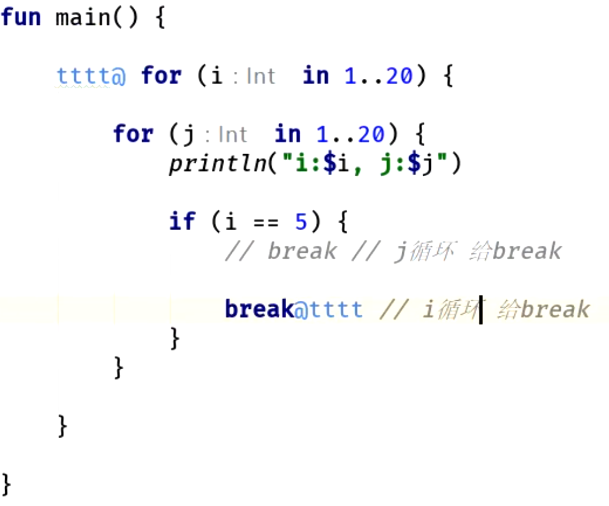

- # 1、foreach
  collapsed:: true
	- ```java
	  // java 是使用： 
	  List<String> stringList = new ArrayList<>();
	  stringList.add("aa");
	  stringList.add("bb");
	  stringList.add("cc");
	  for (String srt : stringList) {
	     Log.e("tag",srt);
	  }
	   
	  // kotlin 这里是使用in   MutableList可编辑的集合
	  val stringList: MutableList<String?> = ArrayList()
	  stringList.add("aa")
	  stringList.add("bb")
	  stringList.add("cc")
	  for (srt in stringList) {
	     Log.e("tag", srt!!)
	  }
	  ```
- # 2、For循环,区间 in
  collapsed:: true
	- ## in+..
	  collapsed:: true
		- index in 0..99   代替 java  fori循环    for(int index = 0 : index<100:index++ )
			- ```java
			  // java
			   for (int i = 0; i < 100; i++) {
			              
			   }
			  // kotlin
			  for(i in 0..99){
			  }
			  ```
	- ## in until(不包含右边界)
	  collapsed:: true
		- 遍历数组  until  操作符  不包含右边界  省的num.size-1  为有边界
			- ```java
			  	    var num = arrayOf(11,22,33)
			      for (i in 0 until num.size){
			   
			      }
			  ```
		- #### 解释until 之 infix
		  collapsed:: true
			- until这个函数是有**infix修饰符**修饰的   infix只能修饰 成员函数 或者扩展函数   ： 作用就是这个函数调用的时候 省去了.()
				- ```java
				      var num = arrayOf(11,22,33)
				      
				      // 正常调用 
				      for (i in 0.until(num.size)){
				   
				      }
				      // 使用infix修饰的 省去了.()
				      for (i in 0 until num.size){
				   
				      }
				  ```
	- ## in + indices 遍历下标
	  collapsed:: true
		- ```java
		  var num = arrayOf(11,22,33)
		    //集合 会有个 返回区间的自带函数
		      for (i in num.indices){
		   
		      }
		  ```
- # 3、循环与标签，退出指定循环层
  collapsed:: true
	- 多层循环退出外层
	- 