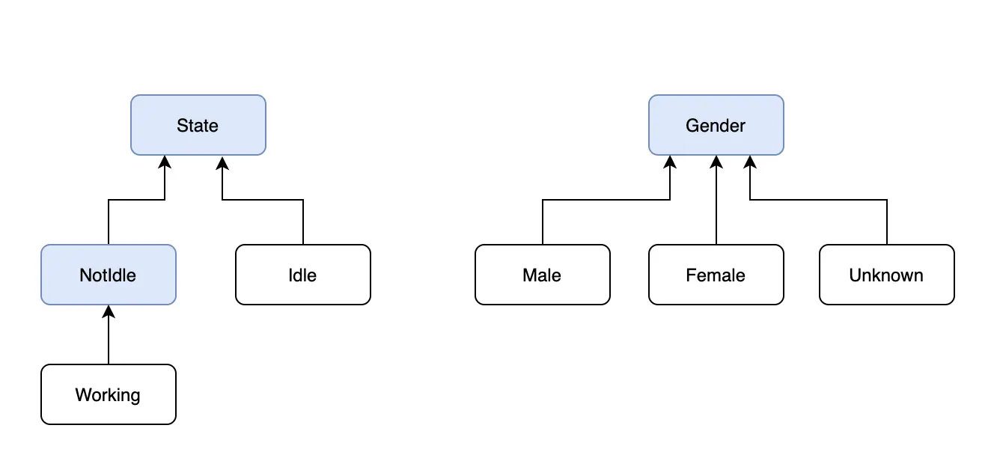

title:: kotlin1.5新特性

- # 内联类
  collapsed:: true
	- 1.5.0版本后开始支持内联类，使用注解@JvmInline配合关键字value定义内联类，例子如下：
	  collapsed:: true
		- ```
		  @JvmInline
		  value class StationaryPhoneNumber(val number: String?){
		      fun addAreaCode(areaCode: String): String{
		          println("addAreaCode($areaCode)")
		          return "$areaCode-$number"
		      }
		  }
		  ```
	- 可以看到它跟数据类比较类似，这里定义一个相似的数据类来看一下区别：
	  collapsed:: true
		- ```
		  data class MobilePhoneNumber(val number: String?){
		      fun addNationCode(nationCode: String): String{
		          println("addAreaCode($nationCode)")
		          return "$nationCode-$number"
		      }
		  }
		  ```
	- 内联类字节码反编译成java代码：
	  collapsed:: true
		- ```
		  @JvmInline
		  @Metadata(元数据略)
		  public final class StationaryPhoneNumber {
		     @Nullable
		     private final String number;
		  
		     @Nullable
		     public final String getNumber() {
		        return this.number;
		     }
		  
		     // $FF: synthetic method
		     private StationaryPhoneNumber(String number) {
		        this.number = number;
		     }
		  
		     @NotNull
		     public static final String addAreaCode_impl/* $FF was: addAreaCode-impl*/(String $this, @NotNull String areaCode) {
		        Intrinsics.checkNotNullParameter(areaCode, "areaCode");
		        String var2 = "addAreaCode(" + areaCode + ')';
		        boolean var3 = false;
		        System.out.println(var2);
		        return areaCode + '-' + $this;
		     }
		  
		     @NotNull
		     public static String constructor_impl/* $FF was: constructor-impl*/(@Nullable String number) {
		        return number;
		     }
		  
		     // $FF: synthetic method
		     public static final StationaryPhoneNumber box_impl/* $FF was: box-impl*/(String v) {
		        return new StationaryPhoneNumber(v);
		     }
		  
		     public static String toString_impl/* $FF was: toString-impl*/(String var0) {
		        return "StationaryPhoneNumber(number=" + var0 + ")";
		     }
		  
		     public static int hashCode_impl/* $FF was: hashCode-impl*/(String var0) {
		        return var0 != null ? var0.hashCode() : 0;
		     }
		  
		     public static boolean equals_impl/* $FF was: equals-impl*/(String var0, Object var1) {
		        if (var1 instanceof StationaryPhoneNumber) {
		           String var2 = ((StationaryPhoneNumber)var1).unbox-impl();
		           if (Intrinsics.areEqual(var0, var2)) {
		              return true;
		           }
		        }
		  
		        return false;
		     }
		  
		     public static final boolean equals_impl0/* $FF was: equals-impl0*/(String p1, String p2) {
		        return Intrinsics.areEqual(p1, p2);
		     }
		  
		     // $FF: synthetic method
		     public final String unbox_impl/* $FF was: unbox-impl*/() {
		        return this.number;
		     }
		  
		     public String toString() {
		        return toString-impl(this.number);
		     }
		  
		     public int hashCode() {
		        return hashCode-impl(this.number);
		     }
		  
		     public boolean equals(Object var1) {
		        return equals-impl(this.number, var1);
		     }
		  }
		  ```
	- 数据类字节码反编译成java代码：
	  collapsed:: true
		- ```
		  @Metadata(元数据略)
		  public final class MobilePhoneNumber {
		     @Nullable
		     private final String number;
		  
		     @NotNull
		     public final String addNationCode(@NotNull String nationCode) {
		        Intrinsics.checkNotNullParameter(nationCode, "nationCode");
		        String var2 = "addAreaCode(" + nationCode + ')';
		        boolean var3 = false;
		        System.out.println(var2);
		        return nationCode + '-' + this.number;
		     }
		  
		     @Nullable
		     public final String getNumber() {
		        return this.number;
		     }
		  
		     public MobilePhoneNumber(@Nullable String number) {
		        this.number = number;
		     }
		  
		     @Nullable
		     public final String component1() {
		        return this.number;
		     }
		  
		     @NotNull
		     public final MobilePhoneNumber copy(@Nullable String number) {
		        return new MobilePhoneNumber(number);
		     }
		  
		     // $FF: synthetic method
		     public static MobilePhoneNumber copy$default(MobilePhoneNumber var0, String var1, int var2, Object var3) {
		        if ((var2 & 1) != 0) {
		           var1 = var0.number;
		        }
		  
		        return var0.copy(var1);
		     }
		  
		     @NotNull
		     public String toString() {
		        return "MobilePhoneNumber(number=" + this.number + ")";
		     }
		  
		     public int hashCode() {
		        String var10000 = this.number;
		        return var10000 != null ? var10000.hashCode() : 0;
		     }
		  
		     public boolean equals(@Nullable Object var1) {
		        if (this != var1) {
		           if (var1 instanceof MobilePhoneNumber) {
		              MobilePhoneNumber var2 = (MobilePhoneNumber)var1;
		              if (Intrinsics.areEqual(this.number, var2.number)) {
		                 return true;
		              }
		           }
		  
		           return false;
		        } else {
		           return true;
		        }
		     }
		  }
		  ```
	- 通过以上对比我们可以发现，编译器会对内联类做一系列优化，在上例中，内联类的实例方法会被编译成静态方法供使用处调用，使用处不会产生内联类的实例。
	- 内联类的用途
		- 主要用来定义替代基本数据类型的VO，很多数据，尤其在作为参数时，直接用基本数据类型并不合适因为其存在一定的规则，比如电子邮件需要满足特定正则表达式，这种情况就应该将这种数据类型和其校验规则一起抽象成一个VO以便最大化内聚性，但不良后果是本来用基本数据类型可以解决的，改用VO会需要创建额外的对象，内联类解决了这一问题。
- # 密封接口
	- kotlin在很早的版本里就已经有密封类的概念，使用关键字sealed定义，
	  密封类的子类只能跟父类定义在同一文件中，1.5.0版本开始出现密封接口的概念，子类可以随处定义，在编译器会自动统计出所有子类以供when语句的闭环判断。下面通过例子熟悉一下密封接口
	- 使用密封接口定义如下结构，蓝色方块为接口：
	  collapsed:: true
		- 
	- 11
	  collapsed:: true
		- ```
		   //when语句未闭合提示warning
		          when(state){
		              is Working -> {
		                  //业务逻辑
		              }
		              is Idle -> {
		                  //业务逻辑
		              }
		          }
		  
		          //when语句枚举出所有子类或包含else则不会出现warning
		          when(gender){
		              is Male -> {}
		              is Female -> {}
		              is Unknown -> {}
		          }
		  
		          when(gender){
		              is Male -> {}
		              is Female -> {}
		              else -> {}
		          }
		  ```
	- 以上例子说明when语句对于分支是否覆盖了全部case的判断并不支持多级，如果包含多级，并不会只判断叶子节点。
	- 下面通过代码了解下密封接口的具体实现方式是什么：
	- kotlin代码
	-