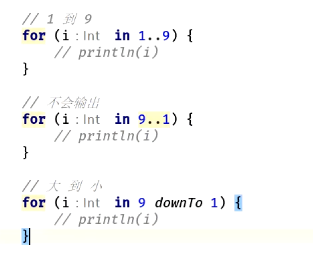
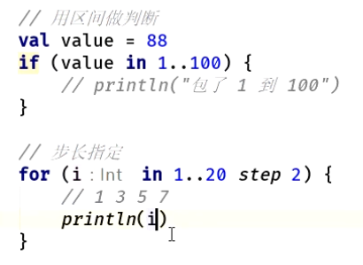
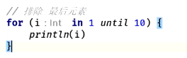

- # 一、区间判断  ： in  数字区间 代替  >= && <
  collapsed:: true
	- ```java
	          var a: Int = 44
	          if (a in 10..69) {    // 代替   if (a >= 10 && a <= 69) {
	         
	          }
	  ```
	- # 区间 in
		- 
		- 
		- 
- # 二、when 对应 java里的switch关键字   但是when可以支持表达式的
  collapsed:: true
	- ```java
	  // java
	  if (a in 10..69) {
	      a = 44
	   } else if (a in 10..69) {
	       a = 55
	   } else if ("a".equals("b")) {
	       a = 66
	   }
	   
	  // kotlin   条件是支持表达式的
	   when {
	      a in 10..69 -> {
	          a = 44
	      }
	      a in 10..69 -> {
	          a = 55
	      }
	      "a".equals("b") -> {
	           a = 66
	      }
	   }
	  ```
- # 三、when 操作符是可以有返回值的  when表达式可以接受返回值，多个分支相同的处理方式可以放在一起，用逗号分隔
  collapsed:: true
	- ```kotlin
	     // when  后提供参数的   
	     val colorRes = when (lesson.state) {
	          Lesson.State.PLAYBACK, null -> R.color.playback
	          Lesson.State.LIVE -> R.color.live
	          Lesson.State.WAIT -> R.color.wait
	      }
	    // when 表达式可以用来取代if-else-if链。如果不提供参数，所有的分支条件都是布尔表达式
	      val colorRes = when {
	          (lesson.state == Lesson.State.PLAYBACK) -> R.color.playback
	          (lesson.state == null) -> R.color.playback
	          (lesson.state == Lesson.State.LIVE) -> R.color.live
	          (lesson.state == Lesson.State.WAIT) -> R.color.wait
	          else -> R.color.playback
	      }
	  ```
- # [[kotlin-for循环]]
- # 五、循环  repeat (循环次数，lambda)
  collapsed:: true
	- ```java
	  repeat(100, { pi: Int -> println(pi) })
	  // 将lambda移到外边  it隐式调用变量
	  repeat(100) { 
	     println(it) 
	  }
	  ```