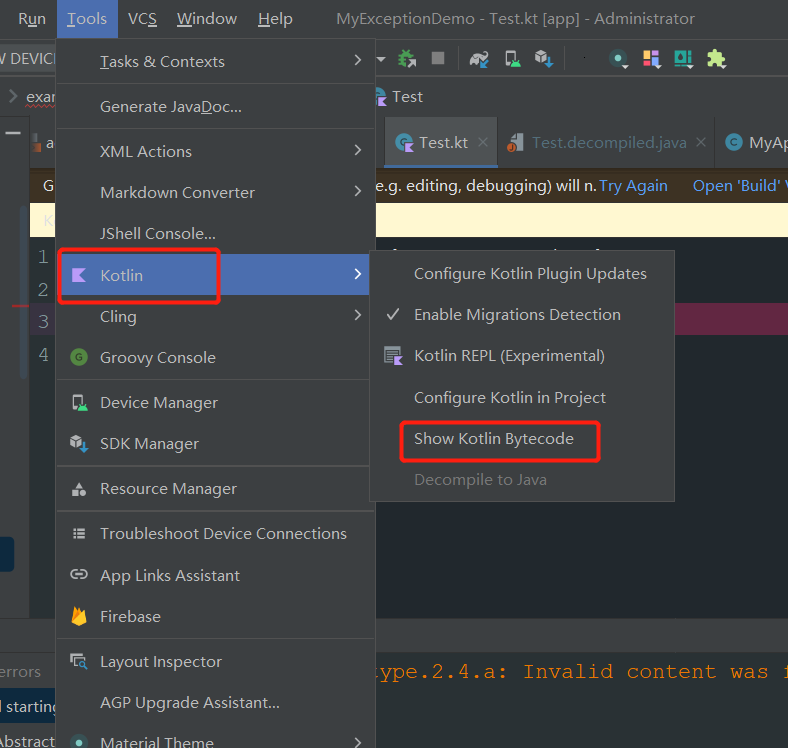
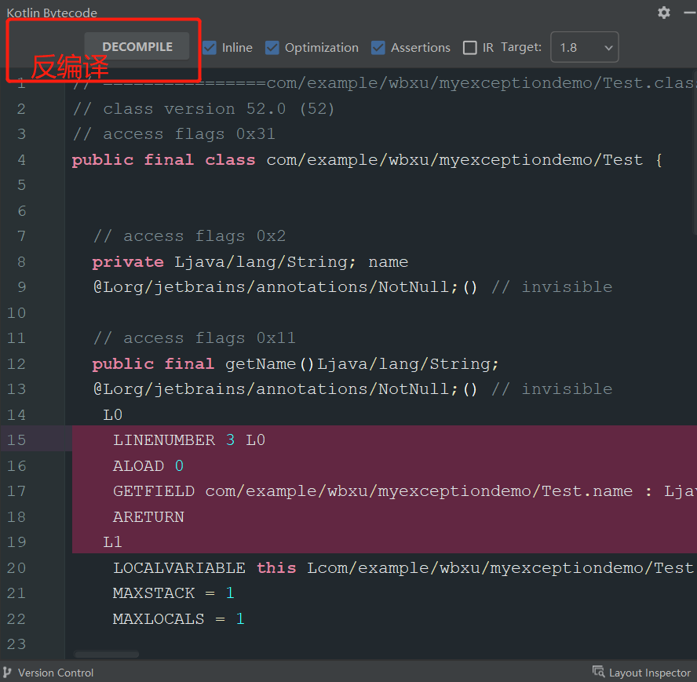
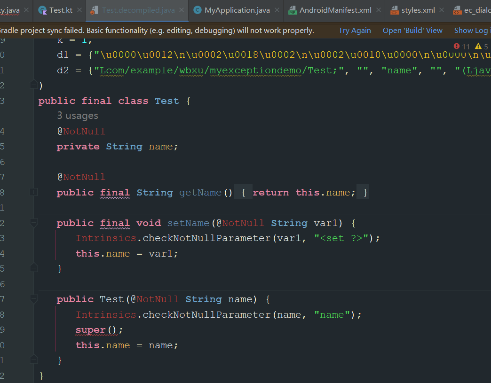

- # 1、使用反汇编，将kotlin代码还原成java
	- kotlin -> 编译 字节码 ->反汇编 java
- # 2、示例
	- ## kotlin 代码
		- ```kotlin
		  class Test (var name:String){
		  }
		  ```
	- ## 使用AS工具查看字节码
	  collapsed:: true
		- 
		- 
	- ## 字节码-》java
	  collapsed:: true
		- 