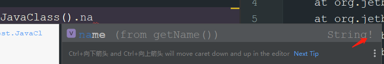

- java
	- ```java
	  public class JavaClass {
	      public String getName(){
	          return "123";
	      }
	  }
	  ```
- kotlin
	- 
	- ```kotlin
	  class MainKotlin {
	  
	      fun test(){
	          var string:String? = JavaClass().name
	      }
	  }
	  ```
	- ## kotlin 调用java带返回值的函数，AS会有提示！就是不确定是否为null。提示你kotlin接受最好为？可空类型的
- ## 原因
	- 如果kotlin这样写
		- ```kotlin
		  class MainKotlin {
		  
		      fun test(){
		          var name:String = JavaClass().name
		          name.length
		      }
		  }
		  ```
	- ## [[#red]]==java 如果返回null。kotlin会报空指针==
		- ```java
		  public class JavaClass {
		      public String getName(){
		          return null;
		      }
		  }
		  ```