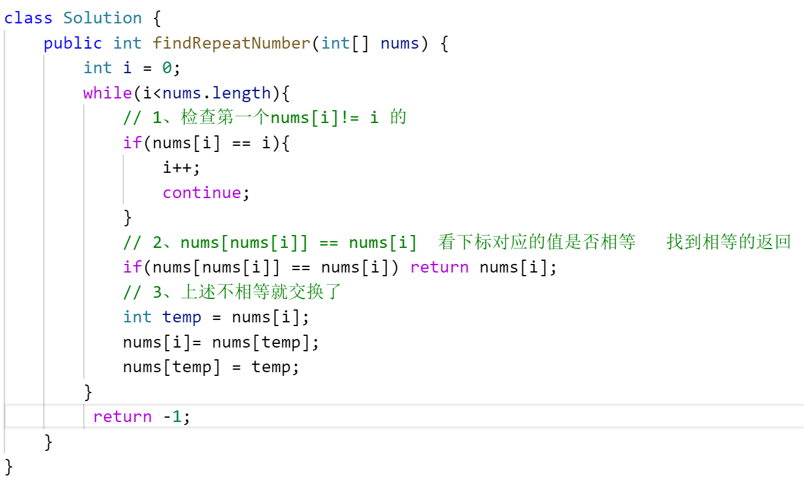

- 1、Given a 32-bit signed integer,reverse digits of an integer.(给定一个32位带有符号的整数，将其反转)。
	- 例如 输入 123  输出321  例如输入-123 输出-321 例如输入 120 输出21
	- 注意：只能处理32位int范围内的整数，超过范围返回0
- # 必须掌握的
	- ## 数组
		- 1、4种排序：选择、冒泡、快排、插入、
		- 2、二分查找
			- 0~n-1缺失的数字
			-
	- ## 字符串
		- 1、翻转字符串
		- 2、
	- ## 链表
		- 1、==**正序遍历-长度、**==
		- 2、==**翻转链表-遍历 ：pre curr 双指针**==遍历翻转
		- 3、倒序打印-借助栈
		- 4、==**快慢指针查找环、入口、长度**==
		-
	- ## 二叉树
		- 1、前序遍历、中序遍历、后续遍历、
		- 2、层序遍历
			- 1、二叉树的深度
			- 2、从上到下打印二叉树
	- ## 栈
		- 1、双栈实现队列：inStack outStack  一个存一个取。取的时候没有的话遍历inStack 全部pop加入out里
		- 2、双队列实现栈
	- ## LRU算法，HashMap存储双向节点（key-value）
		- [[146. LRU 缓存-中等]]
- # 剑指offer
	- # [[#red]]==**第一天**==
		- ## [[数组]]
			- ## 解决问题思路
			  collapsed:: true
				- 1、排序数组中的搜索问题，首先想到[[#red]]==**二分查找**==解决2
				- 2、重复数字问题  hashset、原地交换nums[nums[i]] == nums[i]
				- 3、插入排序，快速排序
				- 4、摩尔投票法
			- ## 1、[[剑指 Offer 53 - II. 0～n-1中缺失的数字-简单]] 二分查找 ==腾讯==
			  collapsed:: true
				- 1、记住有序数组，不缺少肯定nums[i] = i的，这就是二分条件 nums[mid] == mid
				- 2、缺少一个分为左右2块，左侧nums[i] = i 右侧 nums[i] != i
				- 3、找到右侧第一个不等的，就是二分的条件
				- ```java
				  class Solution {
				      public int missingNumber(int[] nums) {
				          int left = 0, right = nums.length - 1;
				          while(left <= right){
				              int mid = (left + right) / 2;
				              // 值和下标相等，说明缺失的位于右侧
				              if(nums[mid] == mid){
				                  left = mid + 1;
				              }else { // 值和下标不等，缺失的位于左侧区间
				                  right = mid - 1;
				              }
				          }
				          return left;
				      }
				  }
				  ```
			- ## 2、[[剑指 Offer 03. 数组中重复的数字-简单]]遍历-值与下标进行交换 ==字节 小米==
			  collapsed:: true
				- 遍历数组 nums ，设索引初始值为 i=0 :
					- 若 nums[i]=i ： 说明此数字已在对应索引位置，无需交换，因此跳过；
					- 若 nums[nums[i]]=nums[i] ： 代表索引nums[i] 处和索引 i 处的元素值都为 nums[i] ，即找到一组重复值，返回此值 nums[i] ；
					- 否则： 交换索引为 i 和 nums[i] 的元素值，将此数字交换至对应索引位置。
				- 若遍历完毕尚未返回，则返回 −1 。
				- 
			- ## 3、[[剑指 Offer 21. 调整数组顺序使奇数位于偶数前面-简单]]双指针模2遍历 ==字节 美团 小米==
			  collapsed:: true
				- 1、以旧数组个数定义新数组
				- 2、定义数组左右两端 双指针
				- 3、遍历数组一遍
				- 4、%2取余 遍历数组奇数存左，否则存右
				- ```java
				  class Solution {
				      public int[] exchange(int[] nums) {
				          int n = nums.length;
				          // 1、定义新数组
				          int[] res = new int[n];
				          // 2、定义数组左右两端 双指针
				          int left = 0,right = n-1;
				          for(int num:nums){
				              // 3、%2取余 遍历数组奇数存左
				              if(num%2 ==1){
				                  res[left++] = num;
				              }else{
				                   res[right--] = num;
				              }
				          }
				          return res;
				      }
				  }
				  ```
			- ## 4、[[如何在未排序整数数组中找到最大值和最小值?]] 直接遍历，2个变量存 ==字节==
			- ## 5、[[剑指 Offer 40. 最小的k个数-简单]]-[[#red]]==**快速排序 真题**==
			- ## 6、[[删除有序数组中的重复项-简单]] 快慢指针，快指针找不同，慢指针负责存==字节 小米==
			- ## 7、[[2023百度一面2441. 与对应负数同时存在的最大正整数]]
			- [[一个巨大无序数组中，查找一个不连续的自然数的节点]]  插入排序 ==喜马拉雅==
			- [[剑指 Offer 39. 数组中出现次数超过一半的数字-简单]]-摩尔投票法
			  collapsed:: true
				- 1、初始众数和票数变量
				- 2、foreach遍历
					- 1、当票数为0 初始当前值为假定的众数
					- 2、当前值num 和 众数相等 则票数+1
				- 3、返回众数x
				- ```java
				  public int majorityElement(int[] nums) {
				          // 1、初始众数和票数变量
				          int x = 0, votes = 0;
				          for(int num : nums){
				              // 2、票数为0 初始当前值为假定的众数
				              if(votes == 0) x = num;
				              // 3、当前值num 和 众数相等 则票数+1 
				              votes += num == x ? 1 : -1;
				          }
				          // 返回众数
				          return x;
				      }
				  ```
			- [[剑指 Offer 11. 旋转数组的最小数字-简单]] 查找用二分，中位值和最右侧对比 再决定缩小范围，字节
			- [[剑指 Offer 57. 和为s的两个数字-简单]] 对撞双指针，字节 百度
			- [[剑指 Offer 61. 扑克牌中的顺子-简单]]遍历数组hashset去重  ==字节百度==
			- [[剑指 Offer 53 - I. 在排序数组中查找数字 I-简单]]-二分查找右边界
	- # [[#red]]==第二天==
	  collapsed:: true
		- ## 字符串
			- ## [[String算法-翻转字符串]] 碰撞指针交换
			- [[557. 反转字符串中的单词]]
			  collapsed:: true
				- 1、按空格分组
				- 2、每个字符串旋转
				- 3、拼接
			- [[剑指 Offer 58 - I. 翻转单词顺序-简单]] split+sb倒序拼接
			  collapsed:: true
				- 1、split+倒序
				- ```java
				  public String reverseWords(String s) {
				         // 删除首尾空格，分割字符串
				          String[] strs = s.trim().split(" ");
				          StringBuilder res = new StringBuilder();
				          // 倒序遍历单词列表
				          for(int i = strs.length - 1; i >= 0; i--) { 
				              if(strs[i].equals("")) continue; // 遇到空单词则跳过
				              res.append(strs[i] + " "); // 将单词拼接至 StringBuilder
				          }
				          return res.toString().trim(); // 转化为字符串，删除尾部空格，并返回
				      }
				  ```
			- [[20.有效括号]]-hashmap+辅助栈linkedList
			  collapsed:: true
				- 1、hashmap存储 成对括号
				- 2、遍历字符
				- 3、左括号为map里指定的key，则加入栈
				- 4、否则肯定为右括号。直接从栈弹出key map[key] = 右括号 看是否成对
			- [[剑指 Offer 50. 第一个只出现一次的字符-简单]] hashmap 统计char 个数
			  collapsed:: true
				- 1、第一次遍历字符串  统计个数
				- 2、第二次遍历字符串  map 按字符查找个数为1的
			- [[剑指 Offer 58 - II. 左旋转字符串-简单]] sb或者 string遍历拼接
			  collapsed:: true
				- 遍历拼接
			- [[125. 验证回文串-简单]] 左右碰撞指针 对比对应字符
			  collapsed:: true
				- 1、定义左右碰撞指针
				- 2、从左右分别找到 是字母或者 数字的下标
				- 3、转小写 对比 是否一样，不一样直接return false
				- 4、left  right 向中间移动
			- [[242.有效的字母异位词]] hashmap 存储个数 两个串字符个数抵消
			  collapsed:: true
				- 1、foreach s map字符+1
				- 2、foreach t map字符-1
				- 3、foreach map.values  看值是否正负抵消 都为0
			- [[剑指 Offer 05. 替换空格-简单]]  sb拼接
			  collapsed:: true
				- 1、遍历字符
				- 2、sb拼接 遇到空格就拼接别的
		- ## 斐波那契数列
			- [[剑指 Offer 10- I. 斐波那契数列-简单]]
			- [[剑指 Offer 10- II. 青蛙跳台阶问题-简单]]
		- ## 数学/动态规划
		  collapsed:: true
			- [[剑指 Offer 42. 连续子数组的最大和-简单]] 动态规划-  原数组修改值。 判断前一个是否大于0 才叠加
			  collapsed:: true
				- 1、默认0位置为最大值
				- 2、从index = 1开始遍历，看是否可以和前一个值叠加  并赋值
				- 3、对比叠加后的nums[i] 和 max  更新 max
				- ```java
				      public int maxSubArray(int[] nums) {
				          if(nums.length == 0 ){
				              return 0;
				          }
				          // 1、默认0位置为最大值
				          int max = nums[0];
				          // 2、从index = 1 开始遍历
				          for (int i = 1; i < nums.length; i++) {
				              // 1、看前一个是否 可以赋值叠加
				              nums[i] += Math.max(nums[i-1],0);
				              // 2、
				              max = Math.max(nums[i],max);
				          }
				          return max;
				      }
				  ```
	- # [[#red]]==第三天==
	  collapsed:: true
		- ## 链表（while遍历/递归）
		  collapsed:: true
			- 1、一个数组插入删除查找和链表的效率对比？如果一个数组要反复插入删除怎么优化降低时间复杂度？==腾讯==
				- 面试官提示其实就是垃圾回收的算法 原理就是“标记-查找”。
				- 每次删除的时候元素不是真的被删除了，而是先标记，最后统一移动数组元素，减少移动次数）
			- 2、ArrayList查询第一个跟最后一个复杂度一样么？（一样，下标取值）==腾讯==
				- 那LinkedList查询第一个跟最后一个复杂度一样么？（一样，linkedlist是双向链表 一样的）
			- ## 1、[[如何得到单链表的长度?-单链表遍历while循环]]360
				- 获取头节点遍历 同时计数
			- ## 2、[[206.反转链表（剑指 Offer II 024. 反转链表）-简单]]遍历双指针+递归
			  collapsed:: true
				- ### 遍历-双指针
					- 1、初始化双指针：prev = null、curr = head   。
					- 2、while 迭代终止条件 curr != null
					- 3、迭代遍历链表，每次迭代中执行以下操作：
						- 1、翻转前暂存后继节点 next。等翻转完更新curr继续后续翻转用
						- 2、执行curr节点翻转，指向pre,完成翻转一次
						- 3、向后更新双指针，等下次循环再翻转， prev = curr，curr = next
					- 4、当 curr 变为 null 时，表示已经遍历完整个链表，反转完成。
					- 5、返回 prev，作为反转后的新头节点。
					- ```java
					  public ListNode reverseList(ListNode head) {
					      // 1、定义双指针 pre  curr
					      ListNode prev = null;
					      ListNode curr = head;
					  	
					    	// 终止条件 更新current 后 为最后节点
					      while (curr != null) {
					           // 1、翻转前存 next
					          ListNode next = curr.next; 
					          // 2、执行当前节点翻转 
					          curr.next = prev; 
					        
					          // 3、向后更新双指针
					          prev = curr;  // 更新 prev 指针
					          curr = next;  // 更新 curr 指针
					      }
					  
					      return prev;  // 返回反转后的新头节点
					  }
					  ```
			- ## 3、[[剑指 Offer 06. 从尾到头打印链表-简单]]遍历+栈stack（后进先出）
			  collapsed:: true
				- 1、遍历链表 存Stack
				- 2、遍历Stack 存数组
			- ## 4、[[剑指 Offer 22. 链表中倒数第k个节点-简单]][[#red]]==**快慢指针，快指针先走k，再一起走**==
			  collapsed:: true
				- 1、定义快慢指针初始指向head
				- 2、while 循环 快指针先走k步，指向k+1节点
				- 3、终止条件fast = null 快慢一起走
				- ```java
				  class Solution {
				      public ListNode getKthFromEnd(ListNode head, int k) {
				          ListNode fast = head,slow = head;
				          
				         // 将fast先走 k步，指针指向链表的k+1节点
				          while (fast != null && k > 0) {
				              fast = fast.next;
				              k--;
				          }
				          // 同时向后走，fast到达末尾，slow就是倒数第k个
				          while (fast != null) {
				              fast = fast.next;
				              slow = slow.next;
				          }
				  
				          return slow;
				      }
				  }
				  ```
			- ## 5、[[141.环形链表]]判断是否有环-[[#red]]==**快慢指针,看是否相遇**==
			  collapsed:: true
				- 1、定义快慢指针fast slow 指向 head
				- 2、遍历链表：循环条件  fast = null && fast.next != null 退出循环
				- 3、快指针走2步，慢指针走1步，看是否相遇
				- ```java
				    public boolean hasCycle(ListNode head) {
				          // 1、快慢指针 指向head
				          ListNode slow = head,fast = head;
				          // 2、fast走到头为终止
				          while (fast != null && fast.next != null){
				              // 3、慢走1  快走2 判断是否相遇
				              slow = slow.next;
				              fast = fast.next.next;
				              if(slow == fast){
				                  return true;
				              }
				          }
				          return false;
				      }
				  ```
			- ## 6、[[如果链表有环，查找环的起始点]]快慢指针判断环，slow= head 双指针一起走再相遇就是环点
			  collapsed:: true
				- 1、定义快慢指针，查找有环用
				- 2、定义变量标记是否有环，有环才找起始点，没环返回null
				- 3、有环，将其中一个指针回到head,再和另一个指针一起走，==**终止条件再次相遇**==，就是环起始点
				- ```java
				   public ListNode detectCycle(ListNode head) {
				        
				          ListNode slow = head,fast = head;
				          boolean hasCycle = false;
				  
				          // 检测是否存在环
				          while (fast != null && fast.next != null) {
				              slow = slow.next;
				              fast = fast.next.next;
				              if (slow == fast) {
				                  hasCycle = true;
				                  break;
				              }
				          }
				  
				          // 如果存在环，则找到环的起始点
				          if (hasCycle) {
				              slow = head;
				              while (slow != fast) {
				                  slow = slow.next;
				                  fast = fast.next;
				              }
				              return slow; // 返回环的起始点
				          }
				  
				          return null; // 如果没有环，返回null
				      }
				  ```
			- ## 7、[[如果链表存在环，如何判断环的长度？]] 先快慢指针判断有环，有环，快慢指针再继续走从此计数。到再次相遇
			- ## 8、[[剑指 Offer 25. 合并两个排序的链表-简单]] 引入伪节点-[[#red]]==**2023快手**==
			  collapsed:: true
				- 1、定义伪节点，作为合并后的head，最终返回伪节点.next()
				- 2、维护一个移动指针，遍历赋值用
				- 2、同时遍历两个链表，终止条件当有一个遍历到底就退出循环
				- 3、伪节点拼接剩余不为空的链表
				- 4、返回伪节点.next
			- ## 9、[[23. 合并 K 个升序链表]] ==**优先级队列**==-[[#red]]==**2023快手**==
			- ## 9、[[剑指 Offer 18. 删除链表的节点-简单]] pre curr双指针+遍历找值
			  collapsed:: true
				- 1、判断是不是删除首个节点
				- 2、定义指针 第一步head已经判断过了  此curr从 head.next开始，寻找删除的那个值点
				- 3、while 循环判断curr 找和删除同样的值
				- 3、找到删除
				- 4、返回原head
				- ```java
				  public Node deleteNode(Node head,int value){
				          // 1、首先判断是不是删除首个
				          if(head.value == value){
				              return head.next;
				          }
				          // 2、定义指针 第一步head已经判断过了  此curr从 head.next开始，寻找删除的那个值
				          Node pre = head,curr = head.next;
				          while (curr != null && curr.value != value){
				              pre = curr;
				              curr = curr.next;
				          }
				          // 3、找到删除
				          if(curr != null){
				              pre.next = curr.next;
				          }
				          // 4、返回原head
				          return head;
				      }
				  ```
			- ## 10、[[剑指 Offer 52. 两个链表的第一个公共节点-简单]]先遍历A再遍历B,
			  collapsed:: true
				- 1、拿到两个链表头结点，定义双指针
				- 2、循环遍历，终止条件就是 节点相等
				- 3、A节点，先遍历A 后遍历B
				- 4、B节点，先遍历B后遍历A
				- ```java
				      public ListNode getIntersectionNode(ListNode headA, ListNode headB) {
				          ListNode A = headA, B = headB;
				          // 指针A 遍历完A 后遍历B 
				          // 指针B  遍历完B 后遍历A
				          // 直到2个相遇
				          while (A != B) {
				              A = A != null ? A.next : headB;
				              B = B != null ? B.next : headA;
				          }
				          return A;
				      }
				  ```
		- ## 栈
		  collapsed:: true
			- 栈是一种后进先出的数据结构，元素从顶端入栈，然后从顶端出栈。
			- 队列是一种先进先出的数据结构，元素从后端入队，然后从前端出队
			- ## 1、[[使用LinkedList模拟堆栈和队列]]
			- ## 2、[[剑指 Offer 09. 用两个栈实现队列-简单]] inStack outStack
			  collapsed:: true
				- 1、inStack 负责 push
				- 2、outStack 负责 pop。outStack 为空 从inStack取出加入
			- ## 3、[[232. 用栈实现队列]]要求双栈实现队列 inStack outStack
			  collapsed:: true
				- 1、定义 只存只取 Stack
				- 2、inStack只负责 push
				- 3、outStack 只负责 pop peek  如果为空 全把in  pop 取出 加入 outStack
			- ## 4、[[225. 用队列实现栈]] 要求双队列实现栈，也是 2个LinkedList
			  collapsed:: true
				- 主要实现存入，存入元素使得新存入的位于栈顶。
				- 1、声明2个队列 1个存值  1个辅助
				- 2、新值存入，先存辅助队列里，再将有值的所有取出加入辅助队列
				- 3、交换队列
			- ## 5、[[剑指 Offer 30. 包含min函数的栈-简单]]双LinkedList，同等数量存元素，min是存当时个数中最小值，xStack存压入的元素
		- ## Hashmap
			- [[380.O(1) 时间插入、删除和获取随机元素]] HashMap+ArrayList
			  collapsed:: true
				- 1、在`HashMap`中存储`<key, value>`，那么`key`可以存储为当前的值，而`value`为当前值在`ArrayList`的下标。
				  在`ArrayList`中存储的元素是具体的值。
				- 2、插入一个数时，直接放到`ArrayList`最后
				- 3、删除一个数时，让`ArrayList`最后一个数字去替换当前待删除元素
				- ```java
				  public class RandomizedSet {
				      ArrayList<Integer> valueList;
				      HashMap<Integer, Integer> indexMap;
				      Random random;
				  
				      public RandomizedSet() {
				          valueList = new ArrayList<Integer>();
				          indexMap = new HashMap<Integer, Integer>();
				          random = new Random();
				      }
				  
				      // 插入
				      public boolean insert(int val) {
				          // map判断是否存在 key  存在直接返回 false
				          if (indexMap.containsKey(val)) {
				              return false;
				          }
				          // 不存在 直接存 list最后
				          int index = valueList.size();
				          valueList.add(val);
				          indexMap.put(val, index);
				          return true;
				      }
				  
				      // 删除值
				      public boolean remove(int val) {
				          if (!indexMap.containsKey(val)) {
				              return false;
				          }
				          // 1、map获取list的下标
				          int index = indexMap.get(val);
				          // 2、获取list最后一个元素
				          int last = valueList.get(valueList.size() - 1);
				          // 3、最后一个元素替换指定下标值。可以不移动内部数组
				          valueList.set(index, last);
				          // 4、同时更新map的值
				          indexMap.put(last, index);
				          // 5、删除list最后一个，
				          valueList.remove(valueList.size() - 1);
				          // 6、删除map指定value
				          indexMap.remove(val);
				          return true;
				      }
				  
				      /**
				       *  随机获取list个数内的随机下标 去取值
				       * @return
				       */
				      public int getRandom() {
				          int randomIndex = random.nextInt(valueList.size());
				          return valueList.get(randomIndex);
				      }
				  }
				  ```
	-
	- # [[#red]]==第四天==
		- ## [[二叉树]]
		  collapsed:: true
			- ## 遍历
				- ## 深度优先
					- [[二叉树的前序遍历]]:根左右
					- [[94. 二叉树的中序遍历]]：左根右
					- [[二叉树的后序遍历]]：左右根
				- ## 广度优先：层序遍历借助队列queue
				  collapsed:: true
					- ```java
					  public List<List<Integer>> levelOrder(TreeNode root) {
					          // 1、声明存储集合
					          List<List<Integer>> ret = new ArrayList<List<Integer>>();
					          if (root == null) {
					              return ret;
					          }
					  
					          // 2、借助队列 先进先出，首先 压入root
					          Queue<TreeNode> queue = new LinkedList<TreeNode>();
					          queue.offer(root);
					  
					          // 3、循环队列 逐层压入 取出
					          while (!queue.isEmpty()) {
					              // 4、定义存储一层的集合
					              List<Integer> level = new ArrayList<Integer>();
					              // 5、本层循环个数 一层有几个节点 循环几次
					              int currentLevelSize = queue.size();
					              for (int i = 0; i < currentLevelSize; i++) {
					                  // 6、按个取出根 
					                  TreeNode node = queue.poll();
					                  level.add(node.val);
					                  // 7、加入左 右
					                  if (node.left != null) {
					                      queue.offer(node.left);
					                  }
					                  if (node.right != null) {
					                      queue.offer(node.right);
					                  }
					              }
					              // 8、遍历完 一层 添加到结果上
					              ret.add(level);
					          }
					  
					          return ret;
					      }
					  ```
			- ## 考点：查找
				- [[剑指 Offer 54. 二叉搜索树的第k大节点-简单]]
					- 二叉搜索树的中序遍历为 **递增序列**
					- 反向遍历就是递减序列，再根据k--控制递归个数提前返回
					- 1、定义返回结果result  循环k
					- 2、反向中序遍历，直到k = 0
			- ## 考点：层序遍历（广度优先，借助队列queue）
				- [[剑指 Offer 32 - II. 从上到下打印二叉树 II-简单]]
					- ```java
					  1、声明存储集合
					  2、借助队列 先进先出，首先 压入root
					  3、循环队列是否为空 逐层压入 取出
					  	4、定义存储一层的集合
					      5、当前队列个数就是一层有几个节点 循环几次取出根，压左右
					  ```
			- ## 考点：深度(层序遍历)
				- [[剑指 Offer 55 - I. 二叉树的深度-简单]] 广度优先、层序遍历 每遍历一层就 计数++
					-
			- [[剑指 Offer 27. 二叉树的镜像-简单]]  递归翻转左右
				- ```java
				      public TreeNode mirrorTree(TreeNode root) {
				          if(root == null) return null;
				          // 1、定义辅助  递归翻转左右
				          TreeNode tmp = root.left;
				          root.left = mirrorTree(root.right);
				          root.right = mirrorTree(tmp);
				          return root;
				      }
				  ```
			-
			-
			- ## 考点：递归
				- [[剑指 Offer 28. 对称的二叉树-简单]] 递归
					- 递归判断左右
					- 1、左右都为null  true
					- 2、有一个为null || 值不等
					- 3、递归 isDui(l.left, R.right) && isDui(l.right, R.left);
					- ```java
					  class Solution {
					      public boolean isSymmetric(TreeNode root) {
					          return root == null ? true : recur(root.left, root.right);
					      }
					      
					     // 递归判断  L.left, R.right  L.right, R.left   相等
					      boolean recur(TreeNode L, TreeNode R) {
					          // 1、左右都为null  true
					          if(L == null && R == null) return true;
					          // 有一个为null 或者 值不等 false
					          if(L == null || R == null || L.val != R.val) return false;
					          // 递归
					          return recur(L.left, R.right) && recur(L.right, R.left);
					      }
					  }
					  ```
			- [[剑指 Offer 68 - II. 二叉树的最近公共祖先-简单]]
				- 1、root == null || root = p || root = q  return root;
				- 2、递归左 找左 递归右找右
				- 3、左 null 返回 右
					- 右 null 返回 左
					- 否则 返回root
				- ```java
				      public TreeNode lowestCommonAncestor(TreeNode root, TreeNode p, TreeNode q) {
				          if(root == null || root == p || root == q){
				              return root;
				          }
				          
				          TreeNode left = lowestCommonAncestor(root.left,p,q);
				          TreeNode right= lowestCommonAncestor(root.right,p,q);
				          
				          if(left == null){
				              return right;
				          } else if(right == null){
				              return left;
				          } else {
				              return root;
				          }
				      }
				  ```
			- [[剑指 Offer 68 - I. 二叉搜索树的最近公共祖先-简单]]  2个if root和pq对比值 递归
				- ```java
				      public TreeNode lowestCommonAncestor(TreeNode root, TreeNode p, TreeNode q) {
				         // 1、root值 小于 pq,递归right  开口向谁  递归谁 
				         if(root.val < p.val && root.val < q.val)
				              return lowestCommonAncestor(root.right, p, q);
				          if(root.val > p.val && root.val > q.val)
				              return lowestCommonAncestor(root.left, p, q);
				          return root;
				      }
				  ```
			- [[剑指 Offer 55 - II. 平衡二叉树-简单]]
				- 1、定义求root高度函数  递归求左高度  递归求右高度
				- 2、看是否 -1 || 差> 1   返回 -1
				- 3、返回 最大高度+1
	-
	-
	- # 放弃
	  collapsed:: true
		- ## [[位运算]]
			- [[剑指 Offer 65. 不用加减乘除做加法-简单]]
			- [[剑指 Offer 15. 二进制中1的个数-简单]]
		- ## 数组
			- ## 放弃
				- [[剑指 Offer 17. 打印从1到最大的n位数-简单]]
				- [[无序数组中第k个最大元素-中等]] 快速排序-字节腾讯 放弃
				- [[剑指 Offer 57 - II. 和为s的连续正数序列-简单]]
		- ## [[滑动窗口]]
			- [[剑指 Offer 57 - II. 和为s的连续正数序列-简单]]
-