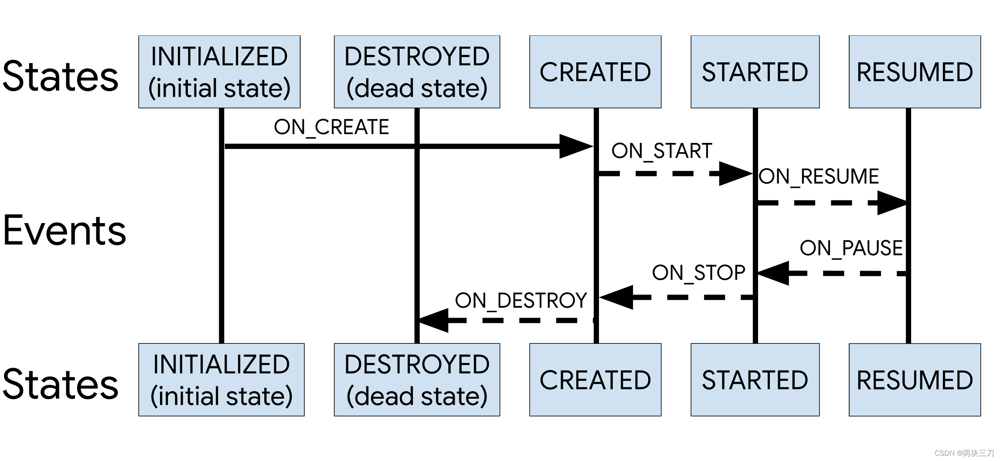

title:: lifeCycle源码详细说-2.5.1版本

- 
- ## 状态解读
	- 
	- mState,取值就是取最上层五个，Initialized,Destroyed,created,started,resumed
	- 不过是根据Events事件来决定分别取哪个。详细见
		- 代码
			- ```java
			   @NonNull
			          public State getTargetState() {
			              switch (this) {
			                  case ON_CREATE:
			                  case ON_STOP:
			                      return State.CREATED;
			                  case ON_START:
			                  case ON_PAUSE:
			                      return State.STARTED;
			                  case ON_RESUME:
			                      return State.RESUMED;
			                  case ON_DESTROY:
			                      return State.DESTROYED;
			                  case ON_ANY:
			                      break;
			              }
			              throw new IllegalArgumentException(this + " has no target state");
			          }
			  ```
		- 比如事件正向onCteate，反向onStop,就取Create。
		- 依次类推
- # 1、**那么[[Lifecycle抽象类]]是如何跟Activity/Fragment生命周期关联的呢？**
	- 看ComponentActivity
	  collapsed:: true
		- ```java
		  public class ComponentActivity extends androidx.core.app.ComponentActivity implements
		          LifecycleOwner,
		          ViewModelStoreOwner,
		          HasDefaultViewModelProviderFactory,
		          SavedStateRegistryOwner,
		          OnBackPressedDispatcherOwner {
		        // 1、自动创建了  LifecycleRegistry 实例   
		        private final LifecycleRegistry mLifecycleRegistry = new LifecycleRegistry(this);
		        
		            
		        @Override
		        protected void onCreate(@Nullable Bundle savedInstanceState) {
		            super.onCreate(savedInstanceState);
		            // 2、注册了 无页面ReportFragment
		            ReportFragment.injectIfNeededIn(this);
		            if (mContentLayoutId != 0) {
		                setContentView(mContentLayoutId);
		            }
		        }    
		  		
		      @CallSuper
		      @Override
		      protected void onSaveInstanceState(@NonNull Bundle outState) {
		          Lifecycle lifecycle = getLifecycle();
		          // 关联生命周期状态
		          if (lifecycle instanceof LifecycleRegistry) {
		              ((LifecycleRegistry) lifecycle).setCurrentState(Lifecycle.State.CREATED);
		          }
		          super.onSaveInstanceState(outState);
		          mSavedStateRegistryController.performSave(outState);
		      }     
		      	@NonNull
		      @Override
		      public Lifecycle getLifecycle() {
		          return mLifecycleRegistry;// [4]
		      }      
		  }
		  ```
	- 1、创建了 Lifecycle 的实现类，[[LifecycleRegistry]]，并对外提供获取方法getLifecycle（）
	- 2、onSaveInstanceState设置Lifecycle状态为CREATED。并没有在各个生命周期方法中来改变 Lifecycle 的 State。
- # 2、状态怎么改变的：其实是交给了[[ReportFragment]]来处理。
	- 1、首先在ComponentActivity的onCreate 方法注入了 无页面ReportFragment
	  collapsed:: true
		- ```java
		        @Override
		        protected void onCreate(@Nullable Bundle savedInstanceState) {
		            super.onCreate(savedInstanceState);
		            // 2、注册了 无页面ReportFragment
		            ReportFragment.injectIfNeededIn(this);
		            if (mContentLayoutId != 0) {
		                setContentView(mContentLayoutId);
		            }
		        }   
		  ```
		- 看其注入方法injectIfNeededIn
			- injectIfNeededIn
			  collapsed:: true
				- ```java
				      public static void injectIfNeededIn(Activity activity) {
				          // 1、大于api29 注册 LifecycleCallbacks
				          if (Build.VERSION.SDK_INT >= 29) {
				              LifecycleCallbacks.registerIn(activity);
				          }
				          // Prior to API 29 and to maintain compatibility with older versions of
				          // ProcessLifecycleOwner (which may not be updated when lifecycle-runtime is updated and
				          // need to support activities that don't extend from FragmentActivity from support lib),
				          // use a framework fragment to get the correct timing of Lifecycle events
				          // 2、无页面Fragment 没有初始化，就通过事务添加
				          android.app.FragmentManager manager = activity.getFragmentManager();
				          if (manager.findFragmentByTag(REPORT_FRAGMENT_TAG) == null) {
				              manager.beginTransaction().add(new ReportFragment(), REPORT_FRAGMENT_TAG).commit();
				              // Hopefully, we are the first to make a transaction.
				              manager.executePendingTransactions();
				          }
				      }
				  ```
			- 1、大于api29 注册 LifecycleCallbacks。在其他地方可以只能使用[[LifecycleCallbacks]]，获取Activity生命周期方法
				- ```java
				          if (Build.VERSION.SDK_INT >= 29) {
				              LifecycleCallbacks.registerIn(activity);
				          }
				  ```
			- 2、无页面Fragment 没有初始化，就通过事务添加
	- 2、可以看到各个生命周期方法中都调用了dispatch方法，并传递了Event事件
	  collapsed:: true
		- 生命周期调用dispatch
		  collapsed:: true
			- ```java
			      @Override
			      public void onActivityCreated(Bundle savedInstanceState) {
			          super.onActivityCreated(savedInstanceState);
			          dispatchCreate(mProcessListener);
			          dispatch(Lifecycle.Event.ON_CREATE);
			      }
			  
			      @Override
			      public void onStart() {
			          super.onStart();
			          dispatchStart(mProcessListener);
			          dispatch(Lifecycle.Event.ON_START);
			      }
			  
			      @Override
			      public void onResume() {
			          super.onResume();
			          dispatchResume(mProcessListener);
			          dispatch(Lifecycle.Event.ON_RESUME);
			      }
			  
			      @Override
			      public void onPause() {
			          super.onPause();
			          dispatch(Lifecycle.Event.ON_PAUSE);
			      }
			  
			      @Override
			      public void onStop() {
			          super.onStop();
			          dispatch(Lifecycle.Event.ON_STOP);
			      }
			  
			      @Override
			      public void onDestroy() {
			          super.onDestroy();
			          dispatch(Lifecycle.Event.ON_DESTROY);
			          // just want to be sure that we won't leak reference to an activity
			          mProcessListener = null;
			      }
			  ```
	- 3、dispatch：仅在API级别之前从ReportFragment调度事件，API29及API 29+上，这由ActivityLifecycleCallbacks处理
		- dispatch
		  collapsed:: true
			- ```java
			      private void dispatch(@NonNull Lifecycle.Event event) {
			          if (Build.VERSION.SDK_INT < 29) {
			        	//仅在API级别之前从ReportFragment调度事件
			  
			  		//API第29条。在API 29+上，这由ActivityLifecycleCallbacks处理
			              dispatch(getActivity(), event);
			          }
			      }
			  
			      static void dispatch(@NonNull Activity activity, @NonNull Lifecycle.Event event) {
			        if (activity instanceof LifecycleRegistryOwner) {
			          ((LifecycleRegistryOwner) activity).getLifecycle().handleLifecycleEvent(event);
			          return;
			        }
			  
			        if (activity instanceof LifecycleOwner) {
			          Lifecycle lifecycle = ((LifecycleOwner) activity).getLifecycle();
			          if (lifecycle instanceof LifecycleRegistry) {
			            ((LifecycleRegistry) lifecycle).handleLifecycleEvent(event);
			          }
			        }
			      }
			  ```
		- 主要负责获取Lifecycle，调用**handleLifecycleEvent方法**来处理生命周期Event事件。
- # 3、ReportFragment在生命周期方法回调dispatch方法，交由[[LifecycleRegistry-handleLifecycleEvent]]处理
- # 4、[[ObserverWithState]]的dispacth分发给观察者
  collapsed:: true
	- ObserverWithState是LifecycleRegistry的内部类
-
- # 总结
	- 利用Fragment来分发状态，并计算出下一状态和事件后，经过适配器转换找到观察者的生命周期回调方法
-