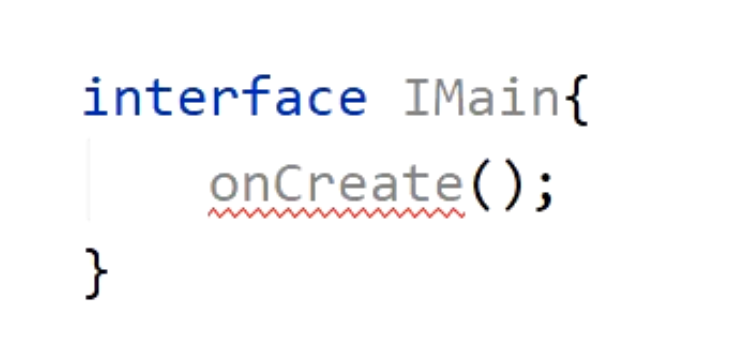

# 作用与对比：
	- ## 作用
		- ### Lifecycle可以有效的避免内存泄漏和解决android生命周期的常见难题
		- ### 监听Activity和Fragment的生命周期
	- ## 对比
		- ### 传统方式，生命周期接口回调：耦合度高
		  collapsed:: true
			- 
		- ### lifecycle基于观察者模式
		  collapsed:: true
			-
- # [[lifecycle的基本使用]]
	- 除了Activity和Fragment外，还**可以绑定Service和Application**的生命周期。只要引入支持相关的可选库即可
- # 应用场景
	- 开始和停止网络连接：
		- 应用位于前台时可能需要实时传输数据，并在应用进入后台时自动暂停。
	- 控制页面动画的启动与停止：
		- 动画在页面可见时进行播放，不可见时停止
- # 源码分析
	- ## 原理
		- 基于观察者模式
	- ## 简单说：
		- 就是会向当前界面添加一个**隐藏的fragment**，由这个fragment**来触发生命周期通知**，然后观察者再做出具体的响应处理。
	- ## [[lifeCycle源码详细说-2.5.1版本]]：
- # [[Lifecycle-面试题]]
- # 参考
	- ## [[lifecycle源码分析]]
-