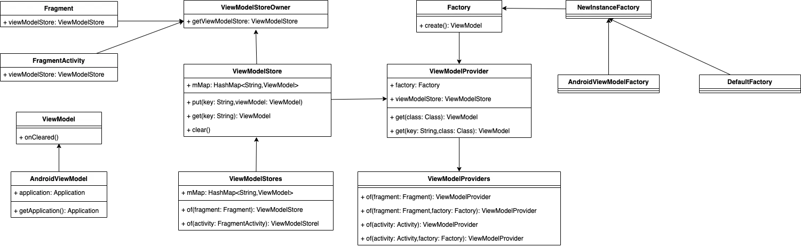

- 序言
	- 之前对于lifecycle三件套的理解只存在与CV使用和看了几篇文章的层面上。这次在开发达人版app的时候尝试使用了下，发下的确好用，所以在此从源码角度上总结学习一下。
- 为什么用Lifecycle组件
	- Lifecycle生命周期可感知，可以大大降低开发成本和内存泄漏的风险。试想MVP那套框架，你需要把Activity或fragment的生命周期一步步的注入到你的框架里是多么痛苦。
	- LiveData替换Rxbus的利器。LiveData也可以进行事件传递，在结合了Lifecycle的生命周期感知之后，你的开发难度将大大降低。你将不用考虑事件接收方已经被销毁这种边界问题。
	- viewModel数据存储共享好帮手。如果没有viewModel要实现数据共享无非以下几种方式，写全局静态类静态方法、搞SP存储。这些方法各有优缺，但是都有一个蛋疼的问题就是内存的管理。而使用viewModel则会帮你解决这些烦恼。
- # 用法与源码分析
	- ## ViewModel解析
	  collapsed:: true
		- 对于activty或fragment很简单，直接用ViewModelProviders就可以构造出来。看参数大概可以知道传入activity那么就跟activity生命周期绑定，传入fragment就跟fragment绑定。
		- ```
		   MyViewModel model = ViewModelProviders.of(activity).get(MyViewModel.class);
		  或
		   MyViewModel model = ViewModelProviders.of(fragment).get(MyViewModel.class);
		  ```
		- 我们点进去看下源码这几个方法做了什么。
		- ```
		  @MainThread
		  public static ViewModelProvider of(@NonNull FragmentActivity activity,@Nullable Factory factory) {
		    Application application = checkApplication(activity);
		    if (factory == null) {
		        factory = ViewModelProvider.AndroidViewModelFactory.getInstance(application);
		    }
		    return new ViewModelProvider(activity.getViewModelStore(), factory);
		  }
		  ```
		  可以看到构造ViewModelProvider的时候传递了activity/fragment的ViewModelStore和factory两个东西。
		- 那ViewModelStore是如何实现的，activity又是如何管理的呢？查看ViewModelStore的源码，发现内部只是创建了一个map集合构造了，用于存储和管理。所以逻辑很简单。
		- ```
		  public class ViewModelStore {
		  
		      private final HashMap<String, ViewModel> mMap = new HashMap<>();
		  
		      final void put(String key, ViewModel viewModel) {
		          ViewModel oldViewModel = mMap.put(key, viewModel);
		          if (oldViewModel != null) {
		              oldViewModel.onCleared();
		          }
		      }
		  
		      final ViewModel get(String key) {
		          return mMap.get(key);
		      }
		  
		      /**
		       *  Clears internal storage and notifies ViewModels that they are no longer used.
		       */
		      public final void clear() {
		          for (ViewModel vm : mMap.values()) {
		              vm.onCleared();
		          }
		          mMap.clear();
		      }
		  }
		  ```
		  在接着在activty里查看ViewModelStore的调用，一共有三处。我们先从最简单的来。
		  
		  第一处：
		  
		  ```
		      @Override
		      protected void onDestroy() {
		          super.onDestroy();
		  
		          if (mViewModelStore != null && !isChangingConfigurations()) {
		              mViewModelStore.clear();
		          }
		  
		          mFragments.dispatchDestroy();
		      }
		  ```
		  是不是很简单，对应上边ViewModelStore源码，我们知道activity销毁的时候会先调用持有的ViewModel的clear，然后在将持有的viewModel释放掉。也就是说我们只用关心在自己ViewModel的clear方法调用的时候释放掉自己其他的内存引用，但不用关心在activty销毁的时候释自己的ViewModel。
		  
		  接下来两处是个相关联的我们放一起看：
		  
		  ```
		      @Override
		      public final Object onRetainNonConfigurationInstance() {
		          Object custom = onRetainCustomNonConfigurationInstance();
		  
		          FragmentManagerNonConfig fragments = mFragments.retainNestedNonConfig();
		  
		          if (fragments == null && mViewModelStore == null && custom == null) {
		              return null;
		          }
		  
		          NonConfigurationInstances nci = new NonConfigurationInstances();
		          nci.custom = custom;
		          nci.viewModelStore = mViewModelStore;
		          nci.fragments = fragments;
		          return nci;
		      }
		  
		      @Override
		      protected void onCreate(@Nullable Bundle savedInstanceState) {
		          mFragments.attachHost(null /*parent*/);
		  
		          super.onCreate(savedInstanceState);
		  
		          NonConfigurationInstances nc =
		                  (NonConfigurationInstances) getLastNonConfigurationInstance();
		          if (nc != null && nc.viewModelStore != null && mViewModelStore == null) {
		              mViewModelStore = nc.viewModelStore;
		          }
		      }
		  ```
		  看代码我们可以知道这是一个状态存储和恢复的过程。在activity重建的时候会拿出上次的viewModelStore进行赋值。
		  
		  这就有另一个知识点了onRetainNonConfigurationInstance是什么鬼，和另一个状态存储方法onSaveInstanceState是什么关系？
		  
		  NonConfigurationInstance可以保存实例对象，甚至之前的activity，onSaveInstanceState只能保存数据Bundle
		  
		  我们接着看构造ViewModelProvider的另一个东西factory。
		  ```
		  /**
		   * Simple factory, which calls empty constructor on the give class.
		   */
		  public static class NewInstanceFactory implements Factory {
		  
		      @SuppressWarnings("ClassNewInstance")
		      @NonNull
		      @Override
		      public <T extends ViewModel> T create(@NonNull Class<T> modelClass) {
		          //noinspection TryWithIdenticalCatches
		          try {
		              return modelClass.newInstance();
		          } catch (InstantiationException e) {
		              throw new RuntimeException("Cannot create an instance of " + modelClass, e);
		          } catch (IllegalAccessException e) {
		              throw new RuntimeException("Cannot create an instance of " + modelClass, e);
		          }
		      }
		  }
		  
		  public static class AndroidViewModelFactory extends ViewModelProvider.NewInstanceFactory {
		  
		      private static AndroidViewModelFactory sInstance;
		  
		      /**
		       * Retrieve a singleton instance of AndroidViewModelFactory.
		       *
		       * @param application an application to pass in {@link AndroidViewModel}
		       * @return A valid {@link AndroidViewModelFactory}
		       */
		      @NonNull
		      public static AndroidViewModelFactory getInstance(@NonNull Application application) {
		          if (sInstance == null) {
		              sInstance = new AndroidViewModelFactory(application);
		          }
		          return sInstance;
		      }
		  
		      private Application mApplication;
		  
		      /**
		       * Creates a {@code AndroidViewModelFactory}
		       *
		       * @param application an application to pass in {@link AndroidViewModel}
		       */
		      public AndroidViewModelFactory(@NonNull Application application) {
		          mApplication = application;
		      }
		  
		      @NonNull
		      @Override
		      public <T extends ViewModel> T create(@NonNull Class<T> modelClass) {
		          if (AndroidViewModel.class.isAssignableFrom(modelClass)) {
		              //noinspection TryWithIdenticalCatches
		              try {
		                  return modelClass.getConstructor(Application.class).newInstance(mApplication);
		              } catch (NoSuchMethodException e) {
		                  throw new RuntimeException("Cannot create an instance of " + modelClass, e);
		              } catch (IllegalAccessException e) {
		                  throw new RuntimeException("Cannot create an instance of " + modelClass, e);
		              } catch (InstantiationException e) {
		                  throw new RuntimeException("Cannot create an instance of " + modelClass, e);
		              } catch (InvocationTargetException e) {
		                  throw new RuntimeException("Cannot create an instance of " + modelClass, e);
		              }
		          }
		          return super.create(modelClass);
		      }
		  }
		  ```
		  看代码我们可以知道这是对传入的字节码进行实例化构造。如果是AndroidViewModel，那么会调用带application的构造方法进行实例化，否则就用默认的构造函数实例化。
		  
		  那么问题又来了
		  
		  1. AndroidViewModel和ViewModel有什么区别，什么时候用AndroidViewModel什么时候用AndroidViewModel?
		  
		  由于 ViewModel 生命周期可能长与 activity 生命周期，所以为了避免内存泄漏 Google 禁止在 ViewModel 中持有 Context 或 activity 或 view 的引用。
		  
		  
		  2. 思考下，如果我想要个跟application生命周期绑定的viewModel怎么办？
		  
		  能不能直接new一个全局的ViewModel
		  
		  下边来张图我们总结下刚才学到的这些。
			- 
	- ## LiveData解析
		- LiveData事件分发
		  先看我们一个我们使用LiveData发送事件和接收事件的例子。
		- ```
		  //创建LiveData实例
		  val mHomeRootDataLiveData: NonStickyLiveData<HomeRootBean> = NonStickyLiveData<HomeRootBean>()
		  //发送事件
		   mHomeRootDataLiveData.postValue(homeRootBean.result)
		   //事件监听观察
		   mStarHomeModel.mHomeRootDataLiveData.observe(activity!!, Observer<HomeRootBean> { homeRootBean: HomeRootBean ->
		           //do something
		        })
		  ```
		  以上就是liveData使用的一个基本例子。可以看到它也是基于观察者模式设计的。我们接下来就从源码角度来分析下事件发送接收是怎么处理的
		- ```
		  protected void postValue(T value) {
		        boolean postTask;
		        synchronized (mDataLock) {
		            postTask = mPendingData == NOT_SET;
		            mPendingData = value;
		        }
		        if (!postTask) {
		            return;
		        }
		        ArchTaskExecutor.getInstance().postToMainThread(mPostValueRunnable);
		    }
		  ```
		  首先跟着postValue方法我们先找到了这里，这里可以看到转了下主线程的Runnable，也就是说如果我们外边即使在子线程发送的事件到这里也会转在主线程里
		- 思考下为啥这里要转主线程？因为liveData要做生命周期可感知，如果你在子线程里，主线程的生命周期事件发生时，如何控制子线程的事件？
		- ```
		  @MainThread
		    protected void setValue(T value) {
		        assertMainThread("setValue");
		        mVersion++;
		        mData = value;
		        dispatchingValue(null);
		    }
		  ```
		- 接下来继续往下看，这里做了一个 mVersion++的操作和value赋值的操作，mVersion的作用我们暂时先不看，我们继续看dispatchingValue这个分发逻辑。
		- ```
		   void dispatchingValue(@Nullable ObserverWrapper initiator) {
		          if (mDispatchingValue) {
		              mDispatchInvalidated = true;
		              return;
		          }
		          mDispatchingValue = true;
		          do {
		              mDispatchInvalidated = false;
		              if (initiator != null) {
		                  considerNotify(initiator);
		                  initiator = null;
		              } else {
		                  for (Iterator<Map.Entry<Observer<? super T>, ObserverWrapper>> iterator =
		                          mObservers.iteratorWithAdditions(); iterator.hasNext(); ) {
		                      considerNotify(iterator.next().getValue());
		                      if (mDispatchInvalidated) {
		                          break;
		                      }
		                  }
		              }
		          } while (mDispatchInvalidated);
		          mDispatchingValue = false;
		      }
		  ```
		- 首先有个开关mDispatchingValue，如果正在分发那么就return掉。
		  接下来看do while里的内容，如果initiator变量不为空就直接调用considerNotify，如果为空就从mObservers的iteratorWithAdditions()里取出来观察者对象进行分发;
		- ```
		  private void considerNotify(ObserverWrapper observer) {
		          if (!observer.mActive) {
		              return;
		          }
		          // Check latest state b4 dispatch. Maybe it changed state but we didn\'t get the event yet.
		          //
		          // we still first check observer.active to keep it as the entrance for events. So even if
		          // the observer moved to an active state, if we\'ve not received that event, we better not
		          // notify for a more predictable notification order.
		          if (!observer.shouldBeActive()) {
		              observer.activeStateChanged(false);
		              return;
		          }
		          if (observer.mLastVersion >= mVersion) {
		              return;
		          }
		          observer.mLastVersion = mVersion;
		          //noinspection unchecked
		          observer.mObserver.onChanged((T) mData);
		      }
		  ```
		- 首先先判断observer对象是否是活跃的，不是的话就return。
		- ```
		      // Check latest state b4 dispatch. Maybe it changed state but we didn\'t get the event yet.
		          //
		          // we still first check observer.active to keep it as the entrance for events. So even if
		          // the observer moved to an active state, if we\'ve not received that event, we better not
		          // notify for a more predictable notification order.
		          if (!observer.shouldBeActive()) {
		              observer.activeStateChanged(false);
		              return;
		          }
		  ```
		- 接下来这段，根据翻译就是我们仍需要确认observer是激活的且能收到消息，如果observer移动到了active激活队列里但是收不到消息，那么我们最好不要去通知事件。当然shouldBeActive是一个抽象方法，所以子类是可以复写处理的。
		- ```
		   if (observer.mLastVersion >= mVersion) {
		              return;
		          }
		          observer.mLastVersion = mVersion;
		          //noinspection unchecked
		          observer.mObserver.onChanged((T) mData);
		  ```
		- 在接下来就是判断version然后拿出observer进行onChanged操作了。
		- LiveData是如何做到生命周期感知的
		  这个要从Livedata添加观察者的方法 observe 开始，即以下这个调用方法。
		- ```
		  mStarHomeModel.mHomeRootDataLiveData.observe(activity!!, Observer<HomeRootBean> { homeRootBean: HomeRootBean ->
		              //doSomething
		          })
		  ```
		- 我们点进去看下observe源码
		- ```
		   @MainThread
		      public void observe(@NonNull LifecycleOwner owner, @NonNull Observer<? super T> observer) {
		          assertMainThread("observe");
		          if (owner.getLifecycle().getCurrentState() == DESTROYED) {
		              // ignore
		              return;
		          }
		          LifecycleBoundObserver wrapper = new LifecycleBoundObserver(owner, observer);
		          ObserverWrapper existing = mObservers.putIfAbsent(observer, wrapper);
		          if (existing != null && !existing.isAttachedTo(owner)) {
		              throw new IllegalArgumentException("Cannot add the same observer"
		                      + " with different lifecycles");
		          }
		          if (existing != null) {
		              return;
		          }
		          owner.getLifecycle().addObserver(wrapper);
		      }
		  
		  ```
		- 首先看了断言了下主线程，接下来判断了下Lifecycle的生命周期，如果是已经销毁状态就不在添加。
		- 注意这的LifecycleOwner是一个接口，而我们传递的是activity/fragmnet，所以即activity/fragmnet已经是一个LifecycleOwner对象了。
		  关于activity/fragmnet是如何与Lifecycle相关联的可以自行查看源码。看完之后将会对Lifecycle生命周期感知理解会有比较深的了解。
		- 接下来校验是否已经存在，且有相同的则抛出异常
		- ```
		  ObserverWrapper existing = mObservers.putIfAbsent(observer, wrapper);
		  ```
		- 如果不存在就调用
		- ```
		  owner.getLifecycle().addObserver(wrapper);
		  
		  ```
		- 然后我们在看下LifecycleBoundObserver这个东西，他继承ObserverWrapper类实现了GenericLifecycleObserver接口。
		- ```
		  class LifecycleBoundObserver extends ObserverWrapper implements GenericLifecycleObserver {
		          @NonNull
		          final LifecycleOwner mOwner;
		  
		          LifecycleBoundObserver(@NonNull LifecycleOwner owner, Observer<? super T> observer) {
		              super(observer);
		              mOwner = owner;
		          }
		  
		          @Override
		          boolean shouldBeActive() {
		              return mOwner.getLifecycle().getCurrentState().isAtLeast(STARTED);
		          }
		  
		          @Override
		          public void onStateChanged(LifecycleOwner source, Lifecycle.Event event) {
		              if (mOwner.getLifecycle().getCurrentState() == DESTROYED) {
		                  removeObserver(mObserver);
		                  return;
		              }
		              activeStateChanged(shouldBeActive());
		          }
		  
		          @Override
		          boolean isAttachedTo(LifecycleOwner owner) {
		              return mOwner == owner;
		          }
		  
		          @Override
		          void detachObserver() {
		              mOwner.getLifecycle().removeObserver(this);
		          }
		      }
		  
		  ```
		- 首先看shouldBeActive这个方法，我们在上节知识点提到过，在分发事件的时候会调用这个方法判断，如果observer是在激活状态，但是接收不到事件了，那就不分发了。
		- ```
		  mOwner.getLifecycle().getCurrentState().isAtLeast(STARTED)
		  
		  public enum State {
		    DESTROYED,
		    INITIALIZED,
		    CREATED,
		    STARTED,
		    RESUMED;
		    public boolean isAtLeast(@NonNull State state) {
		           return compareTo(state) >= 0;
		    }
		  }
		  ```
		- 看下这里的条件，就是说当前状态是在STARTED或者RESUMED之后才能为ture。也就是说DESTROYED，INITIALIZED，CREATED这几个阶段，即使post了事件，你的observer也是收不到事件的。
		- 接下来看onStateChanged方法，这个方法在事件分发的时候也提到过。首先判断下owner的生命周期状态，如果DESTROYED那就直接移除Observer。也就是说不用我们考虑注册的Observer的生命周期。在owner的生命周期触发destory的时候会自动触发接触注册。
		- 接下来看activeStateChanged方法
		- ```
		  void activeStateChanged(boolean newActive) {
		              if (newActive == mActive) {
		                  return;
		              }
		              // immediately set active state, so we\'d never dispatch anything to inactive
		              // owner
		              mActive = newActive;
		              boolean wasInactive = LiveData.this.mActiveCount == 0;
		              LiveData.this.mActiveCount += mActive ? 1 : -1;
		              if (wasInactive && mActive) {
		                  onActive();
		              }
		              if (LiveData.this.mActiveCount == 0 && !mActive) {
		                  onInactive();
		              }
		              if (mActive) {
		                  dispatchingValue(this);
		              }
		          }
		  ```
		- 首先状态没有变化，什么也不做。
		  接下来如果被激活（active）就是调用onActive()，不是的话（inactive）就调用onInactive().
		  然后如果变为活的话就调用dispatchingValue方法，这个方法我们在事件分发的时候做了说明这里不再赘述。
		- LiveData粘性问题及解决
		  何为粘性事件？
		  即发射的事件如果早于注册，那么注册之后依然可以接收到的事件称为粘性事件。通俗点说就是你先发送了一个事件，但是你还没有注册监听，当下次注册监听的时候会回调你上次的事件。
		- 首先第一个知识点，activity/fragment在自己create的时候会调用自己注册的liveData执行setValue操作。
-