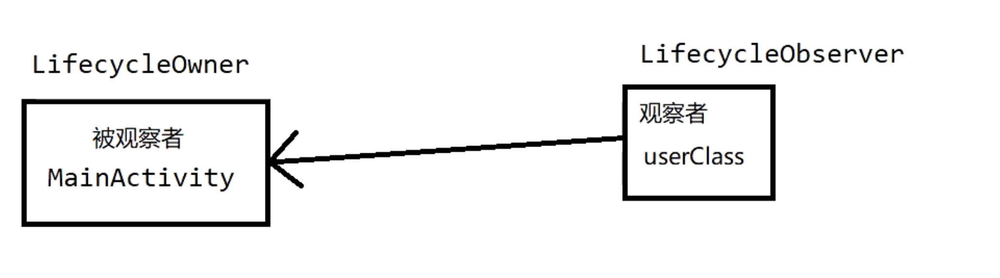

# 常用类关系图
	- 
	-
	- Livecycle   是一个表示android生命周期及状态的对象
	- LivecycleOwner  用于连接有生命周期的对象，如activity,fragment
	- LivecycleObserver  用于观察查LifecycleOwner
- # 一、引入
	- ```java
	      dependencies {
	          def lifecycle_version = "2.5.0-rc01"
	          def arch_version = "2.1.0"
	  
	          // ViewModel
	          // ViewModel模块（普通版），用在普通xml写的页面上的，以生命周期的方式管理界面相关的数据。
	          implementation "androidx.lifecycle:lifecycle-viewmodel-ktx:$lifecycle_version"
	          // ViewModel utilities for Compose
	          // 这个也是ViewModel模块（Compose版），只不过它是用在Compose页面的。
	          implementation "androidx.lifecycle:lifecycle-viewmodel-compose:$lifecycle_version"
	          // LiveData
	          // livedata与lifecycle 有啥关系？
	          // LiveData是在lifecycle基础上出来的，用于观察数据的变化，来及时更新UI界面，也就是“观察者模式”，它与“Observable”区别是，LiveData是会感知生命周期的；
	          implementation "androidx.lifecycle:lifecycle-livedata-ktx:$lifecycle_version"
	          // Lifecycles only (without ViewModel or LiveData)
	          // 只有Lifecycle,不包含VM 和 LiveData
	          implementation "androidx.lifecycle:lifecycle-runtime-ktx:$lifecycle_version"
	  
	          // Saved state module for ViewModel
	          // 使ViewModel支持保存状态。无论配置变化时，还是程序意外关闭时，当用到onSaveInstanceState()保存数据和恢复数据时，就可引入下面库，让这些操作在ViewModel内完成。
	          implementation "androidx.lifecycle:lifecycle-viewmodel-savedstate:$lifecycle_version"
	  
	          // Annotation processor
	          // 注解处理器
	          kapt "androidx.lifecycle:lifecycle-compiler:$lifecycle_version"
	          // alternately - if using Java8, use the following instead of lifecycle-compiler
	          // 替代——如果使用Java8，请使用以下替代生命周期编译器
	          // 最新版的Android Studio 2021.2.1 默认是用Java 11了，这条可不用。
	          implementation "androidx.lifecycle:lifecycle-common-java8:$lifecycle_version"
	  
	          // optional - helpers for implementing LifecycleOwner in a Service
	          // 可选-用于在Service中实现LifecycleOwner
	          implementation "androidx.lifecycle:lifecycle-service:$lifecycle_version"
	  
	          // optional - ProcessLifecycleOwner provides a lifecycle for the whole application process
	          // 可选-ProcessLifecycleOwner为整个应用程序进程提供生命周期
	          implementation "androidx.lifecycle:lifecycle-process:$lifecycle_version"
	  
	          // optional - ReactiveStreams support for LiveData
	          // 可选-使LiveData支持ReactiveStreams, ReactiveStreams是什么？？
	          // ReactiveStreams(反应式流) 本质上是对数据流或某种变化所作出的反应，但是这个变化什么时候发生是未知的，所以他是一种基于异步、回调的方式在处理问题。
	          implementation "androidx.lifecycle:lifecycle-reactivestreams-ktx:$lifecycle_version"
	  
	          // optional - Test helpers for LiveData
	          // 可选-LiveData的测试帮助程序。
	          testImplementation "androidx.arch.core:core-testing:$arch_version"
	      }
	      
	  
	  ```
- # 二、自定义观察者DefaultLifecycleObserver，重写相关生命周期方法
	- ```java
	  class MyObserver : DefaultLifecycleObserver {
	      override fun onResume(owner: LifecycleOwner) {
	          // 执行业务逻辑
	      }
	  
	      override fun onPause(owner: LifecycleOwner) {
	          // 执行业务逻辑
	      }
	      ...
	  }
	  
	  ```
	- 重写相关方法
	  collapsed:: true
		- ```java
		  注：以下方法都会在被观察者生命周期变化时调用
		  @OnLifecycleEvent(Lifecycle.Event.ON_CREATE)
		      void onCreateX(LifecycleOwner owner) {
		  
		      }
		  
		  
		      @OnLifecycleEvent(Lifecycle.Event.ON_START)
		      void onStartX(LifecycleOwner owner) {
		      }
		  
		  
		      @OnLifecycleEvent(Lifecycle.Event.ON_STOP)
		      void onStop(LifecycleOwner owner) {
		      }
		  
		  
		      @OnLifecycleEvent(Lifecycle.Event.ON_RESUME)
		      void onResume(LifecycleOwner owner) {
		      }
		  
		  
		      @OnLifecycleEvent(Lifecycle.Event.ON_PAUSE)
		      void onPause(LifecycleOwner owner) {
		      }
		  
		  
		      @OnLifecycleEvent(Lifecycle.Event.ON_DESTROY)
		      void onDestory(LifecycleOwner owner) {
		      }
		  
		  
		      @OnLifecycleEvent(Lifecycle.Event.ON_ANY)
		      void onAny(LifecycleOwner owner) {
		      }
		  ```
- # 三、在Activity（被观察者）中注册自定义观察者
	- ```kotlin
	  class MainActivity: AppCompatActivity{
	  	@Override
	  	fun onCreate(){
	  		getLifecycle().addObserver(MyObserver())
	  	}
	  }
	  
	  ```
- # 四、LifecycleOwner接口
	-
	- LifecycleOwner接口只有一个方法getLifecycle()，返回的是Lifecycle对象。实现了这个接口，就表示这个类是具有生命周期的。
	- [[#red]]==**Activity和Fragment，已经默认实现了该接口，成为被观察者**==
	- > 你如果想管理整个APP进程的生命周期，则需要用ProcessLifecycleOwner类
	- ## 4.1. 自定义类实现LifecycleOwner接口
	  collapsed:: true
		- 除了Activity和Fragment组件已经默认实现了此接口外，我们也可以自定义一个类让它具有生命周期，需要使用Lifecycle的实现类**LifecycleRegistry**来记录状态。
		- ```kotlin
		  class MyObject : LifecycleOwner {
		      private lateinit var mLR: LifecycleRegistry
		  
		      fun onCreate {
		          mLR = LifecycleRegistry(this)
		          // 设置此时状态
		          mLR.markState(Lifecycle.State.CREATED)
		      }
		  
		      fun onStart() {
		      	// 设置此时状态
		          mLR.markState(Lifecycle.State.STARTED)
		      }
		  
		  	/** 返回生命周期实例 */
		      override fun getLifecycle(): Lifecycle = mLR
		  }
		  
		  ```