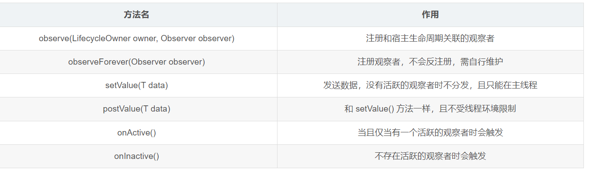

# [[深入理解LiveData]]
- # [[LivedataBus封装]]
- # 引入配置
  collapsed:: true
	- 正常情况下无需单独引入 LiveData 相关库，因为androidx.appcompat:appcompat:1.4.1会自带 Lifecycle、LiveData、ViewModel 等依赖库。
	- ```xml
	  // 模块的 build.gradle
	  // LiveData
	  implementation 'androidx.lifecycle:lifecycle-livedata-ktx:2.4.1'
	  // 可选：对 LiveData 的 ReactiveStreams 支持
	  implementation 'androidx.lifecycle:lifecycle-reactivestreams-ktx:2.4.1'
	  // 可选 - LiveData 的测试助手
	  testImplementation 'androidx.arch.core:core-testing:2.1.0'
	  
	  // 只有 Lifecycles（不带 ViewModel 或 LiveData）
	  implementation 'androidx.lifecycle:lifecycle-runtime-ktx:2.4.1'
	  // 注释处理器
	  kapt 'androidx.lifecycle:lifecycle-compiler:2.4.1'
	  // 替换 - 如果使用 Java8，请使用此注释处理器，而不是 lifecycle-compiler 注释处理器
	  implementation 'androidx.lifecycle:lifecycle-common-java8:2.4.1'
	  // 可选 - 在 Service 中实现 LifecycleOwner 的助手
	  implementation 'androidx.lifecycle:lifecycle-service:2.4.1'
	  // 可选 - ProcessLifecycleOwner 给整个 App 前后台切换提供生命周期监听
	  implementation 'androidx.lifecycle:lifecycle-process:2.4.1'
	  
	  // ViewModel
	  implementation 'androidx.lifecycle:lifecycle-viewmodel-ktx:2.4.1'
	  // 用于 Compose 的 ViewModel 实用程序
	  implementation 'androidx.lifecycle:lifecycle-viewmodel-compose:2.4.1'
	  // ViewModel 的已保存状态模块
	  implementation 'androidx.lifecycle:lifecycle-viewmodel-savedstate:2.4.1'
	  
	  ```
- # 核心方法
	- 
- # [[LiveData源码阅读]]
- # 参考
	- [livedata-官网](https://developer.android.google.cn/topic/libraries/architecture/livedata?hl=zh_cn)
-
-
- # [[Livedata-面试题]]