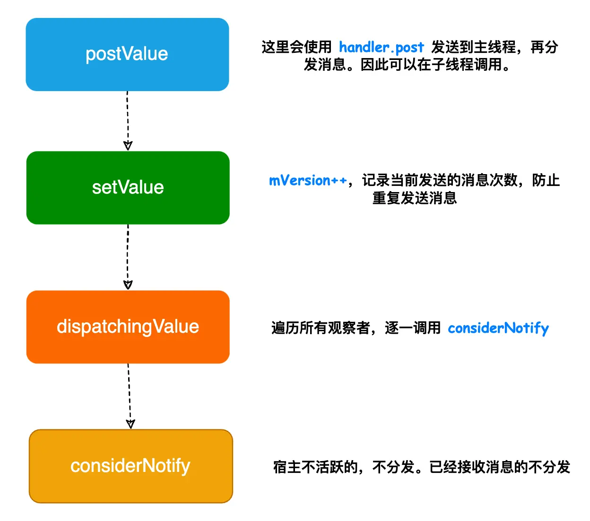

- 1、postValue发送消息，会通过handler.post切换到主线程，再执行setValue
- 2、setValue会把version标识++，这个标识是防止重复分发事件 和 粘性事件的关键
	- [[#red]]==**同时将发送的数据 保存到 livedata中了**==
- 3、然后走dispatchingValue 分发消息，遍历所有观察者进行消息分发，宿主不活跃的不分发，分发过的version标识和LiveData里的大等不分发
- collapsed:: true
  > 此时正常数据分发走完
	- 
- > 下边有可能有粘性事件通过宿主生命周期变换，感知分发的
- 4、如果dispatchingValue 分发消息时遍历观察者，没有处于活跃状态的。数据就只保留在livedata。等待生命周期变换分发消息的触发
- 5、当跳转到新Activity，liveData.observe注册观察者时。observer内部会生成一个边界观察者LifecycleBoundObserver注册到lifecycle。感知宿主的生命周期
- 6、当宿主生命周期变化时，回调边界观察者的onStateChanged，进行livedata的数据分发：
- 7、首先判断宿主是否处于活跃状态，Livedata.state.onStart 或者 onResume。处于活跃状态才激活数据观察者
- 8、最终会调用到livedata DispatchingValue进行数据分发。
- 9、判断observer的version 大于 等于 livedata 的mVersion。说明数据分发过。这里肯定小于。因为observer刚注册 为-1  而livedata 执行过setValue 执行++ 变0 了。则执行分发。这就产生了粘性事件
- 后注册的监听者，收到了注册前的数据
- {:height 326, :width 657}