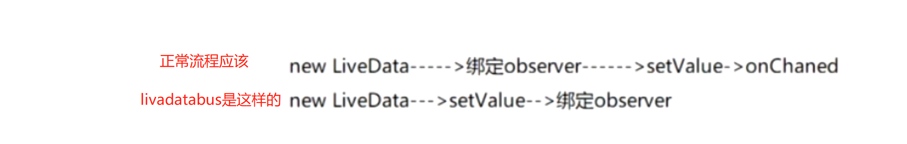
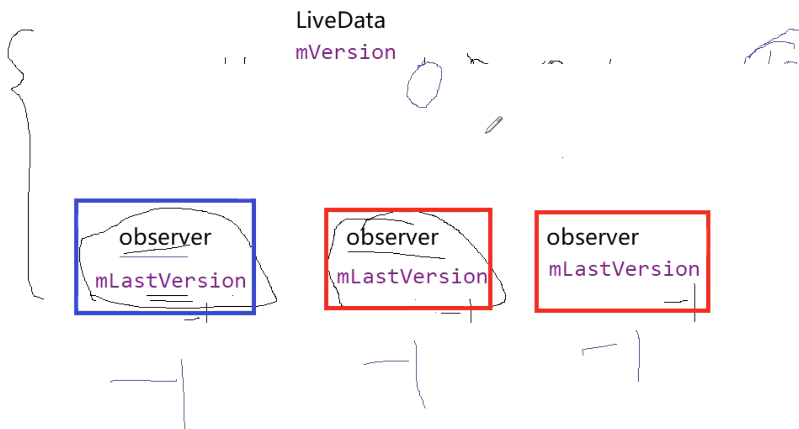

- > 小弊端，livedatabus的粘性问题。先发送消息，后bind订阅关系，也能收到之前发的消息
- 
	-
- ## livedataBus的粘性问题
	- 通过livedataBus，在Activity1创建Livedata 直接就setValue了。然后我跳转Activity2，再注册数据观察者能收到最后一次SetValue的消息
- ## 问题原因
  collapsed:: true
	- ## 第一次发消息
	- Livedata.setValue先执行了,那么mVersion++了，假如是第一次 ++后为0,其他observer初始值为-1
	  collapsed:: true
		- ```java
		      @MainThread
		      protected void setValue(T value) {
		          assertMainThread("setValue");
		          mVersion++;
		          mData = value;
		          dispatchingValue(null);
		      }
		  
		  ```
	- 
	- 内部执行dispatchingValue时,传入null
	  collapsed:: true
		- 源码
			- ```java
			      @SuppressWarnings("WeakerAccess") /* synthetic access */
			      void dispatchingValue(@Nullable ObserverWrapper initiator) {
			          if (mDispatchingValue) {
			              mDispatchInvalidated = true;
			              return;
			          }
			          mDispatchingValue = true;
			          do {
			              mDispatchInvalidated = false;
			              if (initiator != null) {
			                  considerNotify(initiator);
			                  initiator = null;
			              } else {
			                  for (Iterator<Map.Entry<Observer<? super T>, ObserverWrapper>> iterator =
			                          mObservers.iteratorWithAdditions(); iterator.hasNext(); ) {
			                      considerNotify(iterator.next().getValue());
			                      if (mDispatchInvalidated) {
			                          break;
			                      }
			                  }
			              }
			          } while (mDispatchInvalidated);
			          mDispatchingValue = false;
			      }
			  ```
		- do while 循环里，入参为空会走 for循环
			- ```java
			  for (Iterator<Map.Entry<Observer<? super T>, ObserverWrapper>> iterator =
			                          mObservers.iteratorWithAdditions(); iterator.hasNext(); ) {
			                      considerNotify(iterator.next().getValue());
			                      if (mDispatchInvalidated) {
			                          break;
			                      }
			                  }
			  ```
		- 如果我们没有设置addObserver之前。没有设置数据观察者，遍历是拿不到数据的，do while 一直循环。
		-
	- 当跳到Activity2时，添加了observer，但是这里还是在循环。则会拿到新注册的observer则进入这个方法considerNotify
	  collapsed:: true
		- ```java
		      @SuppressWarnings("unchecked")
		      private void considerNotify(ObserverWrapper observer) {
		          if (!observer.mActive) {
		              return;
		          }
		          // Check latest state b4 dispatch. Maybe it changed state but we didn't get the event yet.
		          //
		          // we still first check observer.active to keep it as the entrance for events. So even if
		          // the observer moved to an active state, if we've not received that event, we better not
		          // notify for a more predictable notification order.
		          if (!observer.shouldBeActive()) {
		              observer.activeStateChanged(false);
		              return;
		          }
		          if (observer.mLastVersion >= mVersion) {
		              return;
		          }
		          observer.mLastVersion = mVersion;
		          observer.mObserver.onChanged((T) mData);
		      }
		  ```
		- 判断livedata的mVersion 大于observer.mLastVersion 的 -1。则不会return。走onChanged，就会收到事件了
- ## [[粘性事件产生的执行流程]]
- ## 解决方式
  collapsed:: true
	- 看这个方法considerNotify
		- ```java
		      @SuppressWarnings("unchecked")
		      private void considerNotify(ObserverWrapper observer) {
		          if (!observer.mActive) {
		              return;
		          }
		          // Check latest state b4 dispatch. Maybe it changed state but we didn't get the event yet.
		          //
		          // we still first check observer.active to keep it as the entrance for events. So even if
		          // the observer moved to an active state, if we've not received that event, we better not
		          // notify for a more predictable notification order.
		          if (!observer.shouldBeActive()) {
		              observer.activeStateChanged(false);
		              return;
		          }
		          if (observer.mLastVersion >= mVersion) {
		              return;
		          }
		          observer.mLastVersion = mVersion;
		          observer.mObserver.onChanged((T) mData);
		      }
		  ```
	- 反射observer.mLastVersion  和 livedata  mVersion 让他们两相等，第一次那个粘性事件就会被return。不会接收到
-
- ## 使用场景
	- 订阅发生前 发送的消息，订阅后也能收到