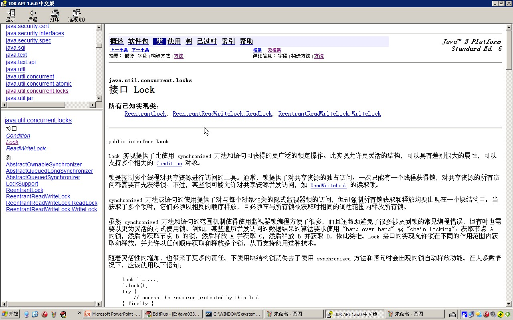
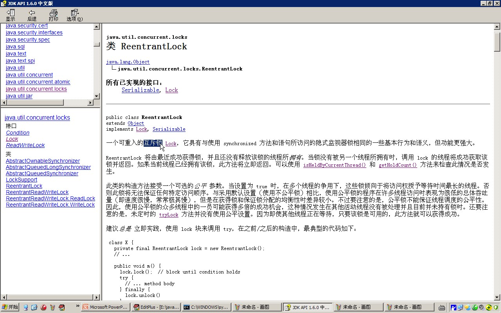
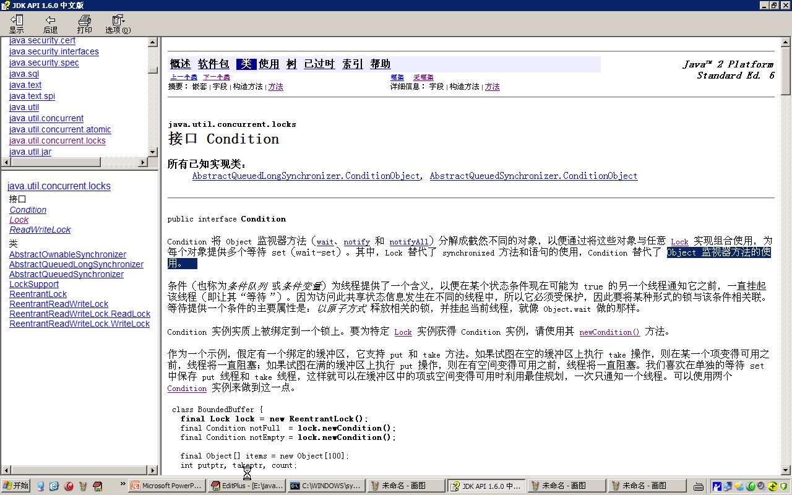
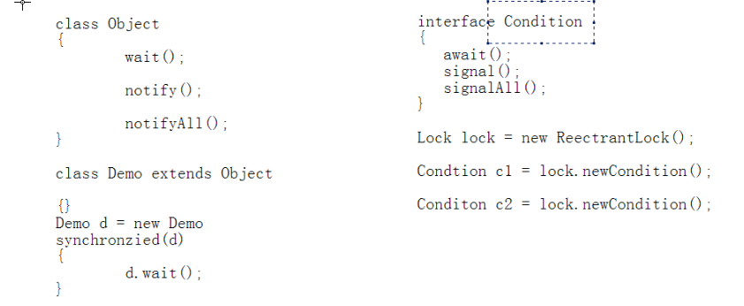

- # 一、介绍
	- # lock
		- 出现替代了同步代码块或者同步函数。将同步的隐式锁操作变成现实锁操作。
		  同时更为灵活。可以一个锁上加上多组监视器。
		- lock():获取锁。
		  unlock():释放锁，通常需要定义finally代码块中。
		- 定义：
			- 
	- # 子类ReentrantLock:可重入的互斥锁
		- 
		- 
	- # lock替换了synchronized，Condition替换了object的wait notify
		- 出现替代了Object中的wait notify notifyAll方法。
		  			将这些监视器方法单独进行了封装，变成Condition监视器对象。
		  			可以任意锁进行组合。
		- await();
		  signal();唤醒一个
		  signalAll();
		- 
		- 一个lock可以多个condition，变成lock的前后对比
			- 