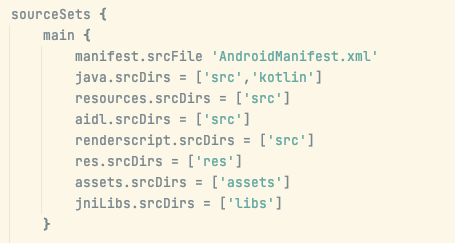
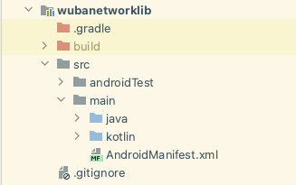
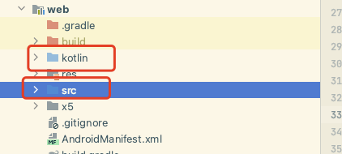

- [发布aar包到maven仓库](https://blog.csdn.net/wangsen927/article/details/120720932)
- 发布脚本：
  collapsed:: true
	- ```
	  
	  import org.gradle.api.publish.internal.DefaultPublishingExtension
	  import org.gradle.api.publish.maven.internal.artifact.FileBasedMavenArtifact
	  import org.gradle.api.publish.maven.internal.artifact.DefaultMavenArtifactSet
	  import org.gradle.api.publish.maven.internal.publication.DefaultMavenPublication
	  
	  apply plugin: 'maven-publish'
	  
	  task wubaPublish(group:"wuba") << {
	      //定义一个自己的发布aar的任务
	      println "发布aar完成"
	  }
	  
	  publishing {
	      repositories {
	          maven {
	              def releasesRepoUrl = "http://artifactory.58corp.com:8081/artifactory/android-local"
	              def snapshotsRepoUrl = "http://artifactory.58corp.com:8081/artifactory/android-local"
	              url Boolean.parseBoolean(project.isDebug)?snapshotsRepoUrl : releasesRepoUrl
	              credentials {
	                  username MAVEN_USERNAME
	                  password MAVEN_PASSWORD
	              }
	  
	          }
	      }
	      publications {
	          aar(MavenPublication){
	              groupId GROUP_ID
	              artifactId ARTIFACT_ID
	              version "${project.publish_version}"
	              pom.withXml {
	                  if(Boolean.parseBoolean(project.needPom)){
	                      // 拿到 
	                      ConfigurationContainer configuration = project.configurations;
	                      def dependenciesNode = asNode().appendNode('dependencies')
	                      if(configuration.implementation) {
	                          configuration.implementation.allDependencies.each {
	                              println "****************implementation groupId=${it.group}|${it.name}|${it.version}***********"
	                              if (it.group == "com.huawei") {
	                                  genPomXml(dependenciesNode,it,"implementation")
	                              }
	                          }
	                      }
	                  }
	              }
	          }
	  
	      }
	  }
	  
	  def genPomXml(dependenciesNode,dependency,scope){
	      if(dependenciesNode != null && dependency != null && scope != null){
	          if (dependency.group != null && !'unspecified'.equals(dependency.group)&& !'58ClientProject'.equals(dependency.group)
	                  && dependency.name != null && !'unspecified'.equals(dependency.name)
	                  && dependency.version != null && !'unspecified'.equals(dependency.version)) {
	              def dependencyNode = dependenciesNode.appendNode('dependency')
	              dependencyNode.appendNode('groupId', dependency.group)
	              dependencyNode.appendNode('artifactId', dependency.name)
	              dependencyNode.appendNode('version', dependency.version)
	              dependencyNode.appendNode('scope', "${scope}")
	  
	          }
	      }
	  }
	  
	  def ASSEMBLE_FLAVOR = Boolean.parseBoolean(project.isDebug) ? "Debug" : "Release"
	  
	  //配置任务依赖，发布前先完成构建，并指定发布的aar文件
	  afterEvaluate{
	      DefaultPublishingExtension publishing = project.extensions.findByName("publishing")
	      PublicationContainer publications = publishing.publications
	      DefaultMavenPublication aarPublication = publications.findByName("aar")
	  
	      def aarFile = "${project.getProjectDir()}/libs/pay58sdk-release.aar"
	      changeMavenArtifact(aarPublication,aarFile)//修改要发布的aar路径
	      addPublishAARTask()
	  }
	  
	  
	  
	  /**
	   * 配置发布aar的任务依赖
	   * @param project
	   * @return
	   */
	  def addPublishAARTask(){
	      def ASSEMBLE_FLAVOR = Boolean.parseBoolean(project.isDebug)? "Debug" : "Release"
	      println "ASSEMBLE_FLAVOR : ${ASSEMBLE_FLAVOR} ,project.isDebug = ${project.isDebug}"
	      Task publishTask = project.getTasksByName("publish",false).getAt(0)
	      Task assembleTask = project.getTasksByName("assemble${ASSEMBLE_FLAVOR}",false).getAt(0)
	      Task aarTask = project.getTasksByName("wubaPublish",false).getAt(0)
	  
	      aarTask.dependsOn assembleTask
	      aarTask.dependsOn publishTask
	      publishTask.mustRunAfter assembleTask
	  }
	  
	  /**
	   * 动态改变发布文件的地址
	   * @param publication
	   * @param artifactPath
	   * @return
	   */
	  def changeMavenArtifact(publication, artifactPath){
	      DefaultMavenArtifactSet artifactSet = publication.getArtifacts()
	      artifactSet.clear()
	      MavenArtifact artifact = new FileBasedMavenArtifact(new File(artifactPath))
	      artifactSet.add(artifact)
	  }
	  ```
- gradle.properties
	- ```
	  # 发布aar的版本号
	  publish_version=3.10.2
	  GROUP_ID =mis-mobile
	  ARTIFACT_ID = pay58sdk
	  MAVEN_USERNAME = wuxiandeploy
	  MAVEN_PASSWORD = wuxiandeploy
	  isDebug = false
	  needPom = true
	  ```
- # 一、gradle 发布插件“maven”和“maven-publish”的区别
	- [发布aar包到maven仓库](https://blog.csdn.net/wangsen927/article/details/120720932)
-
- # maven发布插件源码上传
	- # 一、发布插件“maven”打开源码上传
		- gradle低版本：4.10.1-all  采用maven  发布插件。
		  collapsed:: true
			- 1、只增加打开源码，，不能下载
				- ```groovy
				  apply plugin: 'maven'
				  
				  task uploadSourceJar(type: Jar) {
				      classifier = 'sources'
				      // 指定源码文件路径
				      if(project.hasProperty("android")){
				          from project.android.sourceSets.main.java.sourceFiles
				      } else {
				          from sourceSets.main.allSource
				      }
				  
				  }
				  
				  // 指定发包的时候，需要执行的task任务
				  artifacts {
				      archives uploadSourceJar
				  }
				  
				  uploadArchives {
				      configuration = configurations.archives
				      repositories.mavenDeployer {
				          repository(url: uri(getReleaseRepositoryUrl())) {
				              authentication(userName: MAVEN_USER_NAME, password: MAVEN_PASSWORD)
				          }
				          snapshotRepository(url: uri(getSnapshotRepositoryUrl())) {
				              authentication(userName: MAVEN_USER_NAME, password: MAVEN_PASSWORD)
				          }
				  
				          pom.project {
				              groupId MAVEN_GROUP_ID
				              artifactId ARTIFACT_ID
				              version MAVEN_VERSION
				              packaging PACKAGING
				          }
				          pom.whenConfigured { pom ->
				              pom.dependencies.forEach { dep ->
				                  if (dep.getVersion() == "unspecified" && rootProject.name == dep.groupId) {
				                      println "***** [${dep.getArtifactId()}] dependency is local module, rewrite to maven dependency *****"
				                      dep.setGroupId(MAVEN_GROUP_ID)
				                      dep.setVersion(MAVEN_VERSION)
				                  }
				              }
				          }
				      }
				  }
				  
				  def getReleaseRepositoryUrl() {
				      String releaseRepositoryUrl = readPropertyFromLocalProperties("MAVEN_RELEASE_PATH")
				      if (releaseRepositoryUrl == null || releaseRepositoryUrl == '') {
				          releaseRepositoryUrl = MAVEN_RELEASE_PATH
				      }
				      println("releaseRepositoryUrl = ${releaseRepositoryUrl}")
				      return releaseRepositoryUrl
				  }
				  
				  def getSnapshotRepositoryUrl() {
				      String snapshotRepositoryUrl = readPropertyFromLocalProperties("MAVEN_SNAPSHOT_PATH")
				      if (snapshotRepositoryUrl == null || snapshotRepositoryUrl == '') {
				          snapshotRepositoryUrl = MAVEN_SNAPSHOT_PATH
				      }
				      println("snapshotRepositoryUrl = ${snapshotRepositoryUrl}")
				      return snapshotRepositoryUrl
				  }
				  
				  def readPropertyFromLocalProperties(String key) {
				      Properties properties = new Properties()
				      try {
				          properties.load(rootProject.file('local.properties').newDataInputStream())
				      } catch (Exception e) {
				          println("load local properties failed msg:${e.message}")
				      }
				      return properties.getProperty(key)
				  }
				  
				  ```
			- 2、升级版本6.1.1-all  也不管用，不能下载
	- # 二、发布插件“maven-publish”打开源码上传
	  collapsed:: true
		- ```
		  ```
	- # 三、源码上传task 路径配置规则
		- ```
		  task androidSourcesJar(type: Jar) {
		      classifier = 'sources'
		      // 指定源码文件路径
		      if(project.hasProperty("android")){
		          from project.android.sourceSets.main.kotlin.srcDirs
		      } else {
		          from sourceSets.main.allSource
		      }
		  }
		  ```
		- case 1、android.sourceSets.main.java.sourceFiles
			- 打印路径：file collection
			- 含义：gradle筛选了.java类型的文件进行打包
			- 注：不会打入kotlin代码
		- case 2、android.sourceSets.main.java.getSrcDirs()
			- 含义：使用.getSrcDirs()把整个目录作为参数时，gradle不再排查文件后缀，把所有目录下所有文件都打包进来了。
			- 打印路径：[/Users/xuwenbin/AndroidStudioProjects/WubaHybridSDK/web/src/main/java]
			- 注意：main.java.getSrcDirs  和 module 中配置的sourceSet不是一码事
			  collapsed:: true
				- 
		- case 3、sourceSets.main.allSource
			- 非Android module 使用 比如 java module
		- case 4、android.sourceSets.main.kotlin.getSrcDirs()
		  collapsed:: true
			- main下多路径，kotlin代码和java代码分包存放
			- 
			- 打印路径：[/Users/xuwenbin/AndroidStudioProjects/WubaNetWorkSDK/wubanetworklib/src/main/kotlin, /Users/xuwenbin/AndroidStudioProjects/WubaNetWorkSDK/wubanetworklib/src/main/java]
		- case 5、非标准路径配置，自定义配置
			- from rootDir.getPath()+"/"+project.name+"/kotlin",rootDir.getPath()+"/"+project.name+"/src"
			- 
			-
- # 参考资料
	- [自定义打包任务](https://blog.csdn.net/shulianghan/article/details/127307043)
-