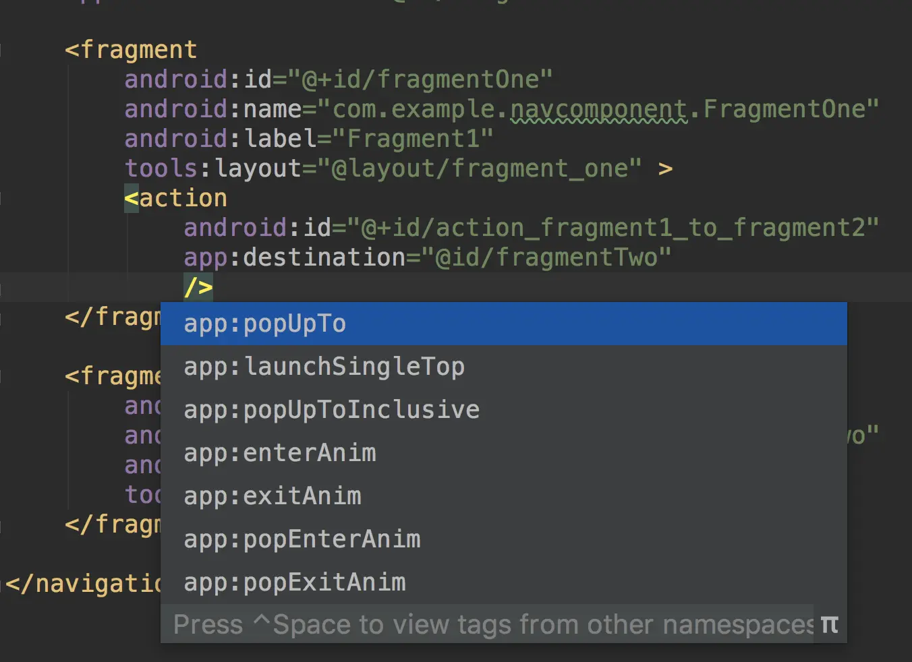

- 对于每个导航操作，都会将一个目的地添加到返回堆栈中。
- 在前面的实现中，当我们从 FragmentOne 移动到 FragmentTwo 并单击返回按钮时，返回到了 FragmentOne。
- 假如从 FragmentTwo 点击返回不希望切换回 FragmentOne，这时需要在 nav_graph 中为 action 添加其他属性，或者我们可以选择使用 NavOptions 以代码的方式添加这些属性。NavOptions 存储了用于导航操作的特殊选项。
- 在 XML 中可以设置如下属性：
	- 
- 对于上面的情况，我们需要使用两个不同的属性：
	- ```
	  app:popUpTo="@id/fragmentOne"
	  app:popUpToInclusive="true"
	  ```
- 完整的 nav_graph 如下：
	- ```xml
	  <?xml version="1.0" encoding="utf-8"?>
	  <navigation xmlns:android="http://schemas.android.com/apk/res/android"
	      xmlns:app="http://schemas.android.com/apk/res-auto"
	      xmlns:tools="http://schemas.android.com/tools"
	      android:id="@+id/nav_graph"
	      app:startDestination="@id/fragmentOne">
	  
	      <fragment
	          android:id="@+id/fragmentOne"
	          android:name="com.example.navcomponent.FragmentOne"
	          android:label="Fragment1"
	          tools:layout="@layout/fragment_one" >
	          <action
	              android:id="@+id/action_fragment1_to_fragment2"
	              app:destination="@id/fragmentTwo"
	              app:popUpTo="@id/fragmentOne"
	              app:popUpToInclusive="true"
	              />
	      </fragment>
	  
	      <fragment
	          android:id="@+id/fragmentTwo"
	          android:name="com.example.navcomponent.FragmentTwo"
	          android:label="Fragment2"
	          tools:layout="@layout/fragment_two">
	      </fragment>
	  </navigation>
	  
	  ```
- 最后结果如下：
	- 
- ### action
	- action 示例如下：
		- ```
		  <action android:id="@+id/next_action"
		          app:destination="@+id/flow_step_one"
		          app:enterAnim="@anim/slide_in_right"
		          app:exitAnim="@anim/slide_out_left"
		          app:popEnterAnim="@anim/slide_in_left"
		          app:popExitAnim="@anim/slide_out_right"
		          app:popUpTo="@id/fragmentOne"
		          app:popUpToInclusive="true" />
		  ```
	- 各属性含义如下：
		- id：操作的 ID，NavHost 通过该 ID 进行导航
		- app:enterAnim, app:exitAnim, app:popEnterAnim, app:popExitAnim：四种动画，指定添加和删除 Fragment 时执行的动画
	- app:popUpToInclusive：指定返回堆栈中是否包含当前实例
	- app:launchSingleTop：用于指定此导航操作是否应作为单顶启动（即返回堆栈顶部最多有一个指定的目的地的副本），与 Intent.FLAG_ACTIVITY_SINGLE_TOP 类似
	- 注意：当不使用 app:popUpToInclusive 时频繁在两个 Fragment 之间导航，后台堆栈中将包含 Fragment 的多个实例。
	- 接下来再看下使用代码实现的方法：
		- ```kotlin
		  btn_next.setOnClickListener {
		      val navOptions = NavOptions.Builder()
		              .setPopUpTo(R.id.fragmentOne, true)
		              .build()
		      view.findNavController()
		          .navigate(R.id.action_fragment1_to_fragment2, null, navOptions)
		  }
		  ```
	- 了解有关 [NavOptions](https://developer.android.google.cn/reference/androidx/navigation/NavOptions) 的更多信息。