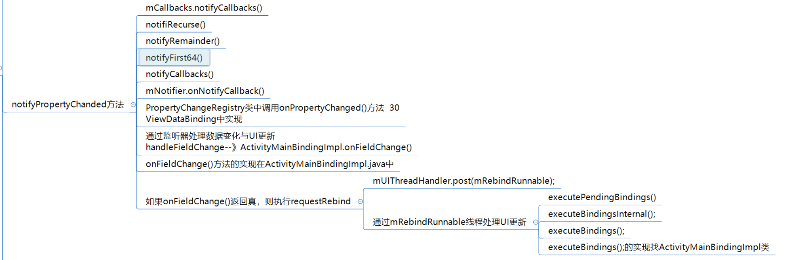

- {:height 243, :width 719}
- BaseObservable的notifyPropertyChanged
	- ```java
	      public void notifyPropertyChanged(int fieldId) {
	          synchronized (this) {
	              if (mCallbacks == null) {
	                  return;
	              }
	          }
	          mCallbacks.notifyCallbacks(this, fieldId, null);
	      }
	  ```
- CallbackRegistry
	- ```java
	      public synchronized void notifyCallbacks(T sender, int arg, A arg2) {
	          mNotificationLevel++;
	          notifyRecurse(sender, arg, arg2);
	          mNotificationLevel--;
	          if (mNotificationLevel == 0) {
	              if (mRemainderRemoved != null) {
	                  for (int i = mRemainderRemoved.length - 1; i >= 0; i--) {
	                      final long removedBits = mRemainderRemoved[i];
	                      if (removedBits != 0) {
	                          removeRemovedCallbacks((i + 1) * Long.SIZE, removedBits);
	                          mRemainderRemoved[i] = 0;
	                      }
	                  }
	              }
	              if (mFirst64Removed != 0) {
	                  removeRemovedCallbacks(0, mFirst64Removed);
	                  mFirst64Removed = 0;
	              }
	          }
	      }
	  ```
	- notifyRecurse->notifyRemainder
		- ```java
		      private void notifyRemainder(T sender, int arg, A arg2, int remainderIndex) {
		          if (remainderIndex < 0) {
		              notifyFirst64(sender, arg, arg2);
		          } else {
		              final long bits = mRemainderRemoved[remainderIndex];
		              final int startIndex = (remainderIndex + 1) * Long.SIZE;
		              final int endIndex = Math.min(mCallbacks.size(), startIndex + Long.SIZE);
		              notifyRemainder(sender, arg, arg2, remainderIndex - 1);
		              notifyCallbacks(sender, arg, arg2, startIndex, endIndex, bits);
		          }
		      }
		  ```
	- notifyFirst64
		- ```java
		      private void notifyFirst64(T sender, int arg, A arg2) {
		          final int maxNotified = Math.min(Long.SIZE, mCallbacks.size());
		          notifyCallbacks(sender, arg, arg2, 0, maxNotified, mFirst64Removed);
		      }
		  ```
	- notifyCallbacks 为 NotifierCallback抽象类的。看其实现类 PropertyChangeRegistry
		- ```java
		      private static final CallbackRegistry.NotifierCallback<Observable.OnPropertyChangedCallback, Observable, Void> NOTIFIER_CALLBACK = new CallbackRegistry.NotifierCallback<Observable.OnPropertyChangedCallback, Observable, Void>() {
		          public void onNotifyCallback(Observable.OnPropertyChangedCallback callback, Observable sender, int arg, Void notUsed) {
		              callback.onPropertyChanged(sender, arg);
		          }
		      };
		  ```
	- onPropertyChanged 为OnPropertyChangedCallback 接口的。看其实现类WeakPropertyListener
		- ```java
		          @Override
		          public void onPropertyChanged(Observable sender, int propertyId) {
		              ViewDataBinding binder = mListener.getBinder();
		              if (binder == null) {
		                  return;
		              }
		              Observable obj = mListener.getTarget();
		              if (obj != sender) {
		                  return; // notification from the wrong object?
		              }
		              // 处理字段的修改。binder 是VIewDataBinding
		              binder.handleFieldChange(mListener.mLocalFieldId, sender, propertyId);
		          }
		  ```
	- viewDatabInding的 handleFieldChange
		- ```java
		      private void handleFieldChange(int mLocalFieldId, Object object, int fieldId) {
		          if (mInLiveDataRegisterObserver) {
		              // We're in LiveData registration, which always results in a field change
		              // that we can ignore. The value will be read immediately after anyway, so
		              // there is no need to be dirty.
		              return;
		          }
		          boolean result = onFieldChange(mLocalFieldId, object, fieldId);
		          if (result) {
		              requestRebind();
		          }
		      }
		  ```
		- onFieldChange 点不到。看viewDatabInding的实现类APT 生成的那个ActivityMainBindingImpl
		- ActivityMainBindingImpl的onFieldChange
			- ```java
			      protected boolean onFieldChange(int localFieldId, Object object, int fieldId) {
			          switch (localFieldId) {
			              case 0 :
			                  return onChangeUser((com.example.databindingdemo_20210117.User) object, fieldId);
			          }
			          return false;
			      }
			  ```
		- onChangeUser,修改属性都返回true
			- ```java
			   private boolean onChangeUser(com.example.databindingdemo_20210117.User User, int fieldId) {
			          if (fieldId == BR._all) {
			              synchronized(this) {
			                      mDirtyFlags |= 0x1L;
			              }
			              return true;
			          }
			          else if (fieldId == BR.name) {
			              synchronized(this) {
			                      mDirtyFlags |= 0x2L;
			              }
			              return true;
			          }
			          else if (fieldId == BR.pwd) {
			              synchronized(this) {
			                      mDirtyFlags |= 0x4L;
			              }
			              return true;
			          }
			          return false;
			      }
			  
			  ```
		- > result 返回true.继续看requestRebind
	- ViewDataBinding的requestRebind
		- ```java
		  protected void requestRebind() {
		          if (mContainingBinding != null) {
		              mContainingBinding.requestRebind();
		          } else {
		              final LifecycleOwner owner = this.mLifecycleOwner;
		              if (owner != null) {
		                  Lifecycle.State state = owner.getLifecycle().getCurrentState();
		                  if (!state.isAtLeast(Lifecycle.State.STARTED)) {
		                      return; // wait until lifecycle owner is started
		                  }
		              }
		              synchronized (this) {
		                  if (mPendingRebind) {
		                      return;
		                  }
		                  mPendingRebind = true;
		              }
		              if (USE_CHOREOGRAPHER) {
		                  mChoreographer.postFrameCallback(mFrameCallback);
		              } else {
		                  mUIThreadHandler.post(mRebindRunnable);
		              }
		          }
		      }
		  ```
	- mUIThreadHandler.post(mRebindRunnable);--->通过mRebindRunnable线程处理UI更新
	- executePendingBindings();
		- ```java
		      public void executePendingBindings() {
		          if (mContainingBinding == null) {
		              executeBindingsInternal();
		          } else {
		              mContainingBinding.executePendingBindings();
		          }
		      }
		  ```
	- executeBindingsInternal
		- ```java
		  private void executeBindingsInternal() {
		          if (mIsExecutingPendingBindings) {
		              requestRebind();
		              return;
		          }
		          if (!hasPendingBindings()) {
		              return;
		          }
		          mIsExecutingPendingBindings = true;
		          mRebindHalted = false;
		          if (mRebindCallbacks != null) {
		              mRebindCallbacks.notifyCallbacks(this, REBIND, null);
		  
		              // The onRebindListeners will change mPendingHalted
		              if (mRebindHalted) {
		                  mRebindCallbacks.notifyCallbacks(this, HALTED, null);
		              }
		          }
		          if (!mRebindHalted) {
		              executeBindings();
		              if (mRebindCallbacks != null) {
		                  mRebindCallbacks.notifyCallbacks(this, REBOUND, null);
		              }
		          }
		          mIsExecutingPendingBindings = false;
		      }
		  ```
	- executeBindings.抽象方法，还是找子类ActivityMainBindingImpl
	- ActivityMainBindingImpl的executeBindings
		- ```java
		      protected void executeBindings() {
		          long dirtyFlags = 0;
		          synchronized(this) {
		              dirtyFlags = mDirtyFlags;
		              mDirtyFlags = 0;
		          }
		          java.lang.String userName = null;
		          // 先拿到传入的User 类 
		          com.example.databindingdemo_20210117.User user = mUser;
		          java.lang.String userPwd = null;
		  
		          if ((dirtyFlags & 0xfL) != 0) {
		  
		  
		              if ((dirtyFlags & 0xbL) != 0) {
		  
		                      if (user != null) {
		                          // read user.name
		                          userName = user.getName();
		                      }
		              }
		              if ((dirtyFlags & 0xdL) != 0) {
		  
		                      if (user != null) {
		                          // read user.pwd
		                          userPwd = user.getPwd();
		                      }
		              }
		          }
		          // batch finished
		          if ((dirtyFlags & 0xbL) != 0) {
		              // api target 1
		             // setText 
		              androidx.databinding.adapters.TextViewBindingAdapter.setText(this.tv1, userName);
		          }
		          if ((dirtyFlags & 0xdL) != 0) {
		              // api target 1
		  
		              androidx.databinding.adapters.TextViewBindingAdapter.setText(this.tv2, userPwd);
		          }
		      }
		  ```
	- TextViewBindingAdapter.setText
		- ```java
		      public static void setText(TextView view, CharSequence text) {
		          final CharSequence oldText = view.getText();
		          if (text == oldText || (text == null && oldText.length() == 0)) {
		              return;
		          }
		          if (text instanceof Spanned) {
		              if (text.equals(oldText)) {
		                  return; // No change in the spans, so don't set anything.
		              }
		          } else if (!haveContentsChanged(text, oldText)) {
		              return; // No content changes, so don't set anything.
		          }
		          view.setText(text);
		      }
		  ```
	- 所以：数据属性变换。映射到了ui上
	- ```
	  user.setName(user.getName()+"1");// view.setText(text);
	  因为
	      public void setName(String name) {
	          this.name = name;
	          notifyPropertyChanged(BR.name);
	      }
	  ```