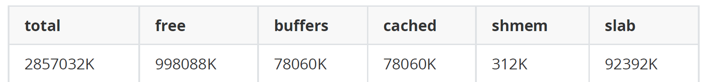

- 功能： 获取所有进程的内存使用的排行榜，排行是以Pss 的大小而排序。procrank 命令比dumpsys
  meminfo 命令，能输出更详细的VSS/RSS/PSS/USS内存指标。
- 最后一行输出下面6个指标：
	- 
- 执行结果：
	- ```java
	  root@Phone:/# procrank
	  PID Vss Rss Pss Uss cmdline
	  4395 2270020K 202312K 136099K 121964K com.android.systemui
	  1192 2280404K 147048K 89883K 84144K system_server
	  29256 2145676K 97880K 44328K 40676K com.android.settings
	  501 1458332K 61876K 23609K 9736K zygote
	  4239 2105784K 68056K 21665K 19592K com.android.phone
	  479 164392K 24068K 17970K 15364K /system/bin/mediaserver
	  391 200892K 27272K 15930K 11664K /system/bin/surfaceflinger
	  ...
	  RAM: 2857032K total, 998088K free, 78060K buffers, c cached, 312K shmem,
	  92392K slab
	  ```