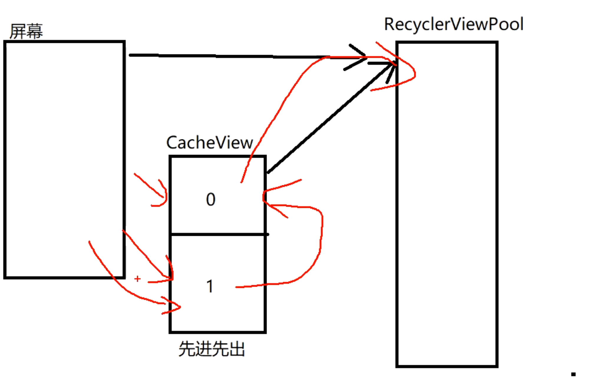

## 源码
collapsed:: true
	- ```java
	    void recycleViewHolderInternal(ViewHolder holder) {
	              if (holder.isScrap() || holder.itemView.getParent() != null) {
	                  throw new IllegalArgumentException(
	                          "Scrapped or attached views may not be recycled. isScrap:"
	                                  + holder.isScrap() + " isAttached:"
	                                  + (holder.itemView.getParent() != null) + exceptionLabel());
	              }
	  
	              if (holder.isTmpDetached()) {
	                  throw new IllegalArgumentException("Tmp detached view should be removed "
	                          + "from RecyclerView before it can be recycled: " + holder
	                          + exceptionLabel());
	              }
	  
	              if (holder.shouldIgnore()) {
	                  throw new IllegalArgumentException("Trying to recycle an ignored view holder. You"
	                          + " should first call stopIgnoringView(view) before calling recycle."
	                          + exceptionLabel());
	              }
	              final boolean transientStatePreventsRecycling = holder
	                      .doesTransientStatePreventRecycling();
	              @SuppressWarnings("unchecked")
	              final boolean forceRecycle = mAdapter != null
	                      && transientStatePreventsRecycling
	                      && mAdapter.onFailedToRecycleView(holder);
	              boolean cached = false;
	              boolean recycled = false;
	              if (DEBUG && mCachedViews.contains(holder)) {
	                  throw new IllegalArgumentException("cached view received recycle internal? "
	                          + holder + exceptionLabel());
	              }
	              if (forceRecycle || holder.isRecyclable()) {
	                  if (mViewCacheMax > 0
	                          && !holder.hasAnyOfTheFlags(ViewHolder.FLAG_INVALID
	                          | ViewHolder.FLAG_REMOVED
	                          | ViewHolder.FLAG_UPDATE
	                          | ViewHolder.FLAG_ADAPTER_POSITION_UNKNOWN)) {
	                      // Retire oldest cached view
	                      int cachedViewSize = mCachedViews.size();
	                      if (cachedViewSize >= mViewCacheMax && cachedViewSize > 0) {
	                          recycleCachedViewAt(0);
	                          cachedViewSize--;
	                      }
	  
	                      int targetCacheIndex = cachedViewSize;
	                      if (ALLOW_THREAD_GAP_WORK
	                              && cachedViewSize > 0
	                              && !mPrefetchRegistry.lastPrefetchIncludedPosition(holder.mPosition)) {
	                          // when adding the view, skip past most recently prefetched views
	                          int cacheIndex = cachedViewSize - 1;
	                          while (cacheIndex >= 0) {
	                              int cachedPos = mCachedViews.get(cacheIndex).mPosition;
	                              if (!mPrefetchRegistry.lastPrefetchIncludedPosition(cachedPos)) {
	                                  break;
	                              }
	                              cacheIndex--;
	                          }
	                          targetCacheIndex = cacheIndex + 1;
	                      }
	                      mCachedViews.add(targetCacheIndex, holder);
	                      cached = true;
	                  }
	                  if (!cached) {
	                      addViewHolderToRecycledViewPool(holder, true);
	                      recycled = true;
	                  }
	              } else {
	                  // NOTE: A view can fail to be recycled when it is scrolled off while an animation
	                  // runs. In this case, the item is eventually recycled by
	                  // ItemAnimatorRestoreListener#onAnimationFinished.
	  
	                  // TODO: consider cancelling an animation when an item is removed scrollBy,
	                  // to return it to the pool faster
	                  if (DEBUG) {
	                      Log.d(TAG, "trying to recycle a non-recycleable holder. Hopefully, it will "
	                              + "re-visit here. We are still removing it from animation lists"
	                              + exceptionLabel());
	                  }
	              }
	              // even if the holder is not removed, we still call this method so that it is removed
	              // from view holder lists.
	              mViewInfoStore.removeViewHolder(holder);
	              if (!cached && !recycled && transientStatePreventsRecycling) {
	                  holder.mOwnerRecyclerView = null;
	              }
	          }
	   
	  ```
- ## 1、先看CacheView回收机制
	- if代码:条件当我们的 [[#red]]==**VIewHolder不变的情况下**==,才进入判断
	  collapsed:: true
		- ```java
		  if (mViewCacheMax > 0
		                          && !holder.hasAnyOfTheFlags(ViewHolder.FLAG_INVALID
		                          | ViewHolder.FLAG_REMOVED
		                          | ViewHolder.FLAG_UPDATE
		                          | ViewHolder.FLAG_ADAPTER_POSITION_UNKNOWN)) {
		                      // Retire oldest cached view
		                      int cachedViewSize = mCachedViews.size();
		                      if (cachedViewSize >= mViewCacheMax && cachedViewSize > 0) {
		                          recycleCachedViewAt(0);
		                          cachedViewSize--;
		                      }
		  
		                      int targetCacheIndex = cachedViewSize;
		                      if (ALLOW_THREAD_GAP_WORK
		                              && cachedViewSize > 0
		                              && !mPrefetchRegistry.lastPrefetchIncludedPosition(holder.mPosition)) {
		                          // when adding the view, skip past most recently prefetched views
		                          int cacheIndex = cachedViewSize - 1;
		                          while (cacheIndex >= 0) {
		                              int cachedPos = mCachedViews.get(cacheIndex).mPosition;
		                              if (!mPrefetchRegistry.lastPrefetchIncludedPosition(cachedPos)) {
		                                  break;
		                              }
		                              cacheIndex--;
		                          }
		                          targetCacheIndex = cacheIndex + 1;
		                      }
		                      mCachedViews.add(targetCacheIndex, holder);
		                      cached = true;
		                  }
		  ```
	- 1、首先判断mCachedVIews大小，是否>= 默认的大小（mViewCacheMax）
		- 1-1、存满了,取出第一个 加入缓存池里addViewHolderToRecycledViewPool（先进先出的。默认大小为2）
		  collapsed:: true
			- ```java
			          void recycleCachedViewAt(int cachedViewIndex) {
			              if (DEBUG) {
			                  Log.d(TAG, "Recycling cached view at index " + cachedViewIndex);
			              }
			              ViewHolder viewHolder = mCachedViews.get(cachedViewIndex);
			              if (DEBUG) {
			                  Log.d(TAG, "CachedViewHolder to be recycled: " + viewHolder);
			              }
			              addViewHolderToRecycledViewPool(viewHolder, true);
			              mCachedViews.remove(cachedViewIndex);
			          }
			  ```
		- 图解
		  collapsed:: true
			- 
	- 2、没有满，或者满了移除出去了。执行添加的逻辑
		- ```
		  mCachedViews.add(targetCacheIndex, holder);
		  
		  ```
	- ## 结论：
		- 1、RecyclerViewPool里的大部分来源于mCachedVIews，小部分直接屏幕加入的
		- 2、CacheView 存的是带有数据的viewHolder。经过bind 的viewHolder
- ## 2、上边不满足则进入，RecyclerViewPool缓存
	- addViewHolderToRecycledViewPool
	  collapsed:: true
		- ```java
		          void addViewHolderToRecycledViewPool(@NonNull ViewHolder holder, boolean dispatchRecycled) {
		              clearNestedRecyclerViewIfNotNested(holder);
		              View itemView = holder.itemView;
		              if (mAccessibilityDelegate != null) {
		                  AccessibilityDelegateCompat itemDelegate = mAccessibilityDelegate.getItemDelegate();
		                  AccessibilityDelegateCompat originalDelegate = null;
		                  if (itemDelegate instanceof RecyclerViewAccessibilityDelegate.ItemDelegate) {
		                      originalDelegate =
		                              ((RecyclerViewAccessibilityDelegate.ItemDelegate) itemDelegate)
		                                      .getAndRemoveOriginalDelegateForItem(itemView);
		                  }
		                  // Set the a11y delegate back to whatever the original delegate was.
		                  ViewCompat.setAccessibilityDelegate(itemView, originalDelegate);
		              }
		              if (dispatchRecycled) {
		                  dispatchViewRecycled(holder);
		              }
		              holder.mOwnerRecyclerView = null;
		              getRecycledViewPool().putRecycledView(holder);
		          }
		  ```
	- putRecycledView真正的存数据
	  collapsed:: true
		- ```java
		         public void putRecycledView(ViewHolder scrap) {
		              // 先获取 itemType
		              final int viewType = scrap.getItemViewType();
		              final ArrayList<ViewHolder> scrapHeap = getScrapDataForType(viewType).mScrapHeap;
		              // 是否大于5个  超过的话直接return。不保存
		              if (mScrap.get(viewType).mMaxScrap <= scrapHeap.size()) {
		                  return;
		              }
		              if (DEBUG && scrapHeap.contains(scrap)) {
		                  throw new IllegalArgumentException("this scrap item already exists");
		              }
		              // 没有满的话：
		              scrap.resetInternal();
		              scrapHeap.add(scrap);
		          }
		  ```
		-
	- 1、根据itemType取viewHolder的集合
		- getScrapDataForType,返回ScrapData这个类的，它才是存viewHolder的
		  collapsed:: true
			- ```java
			          static class ScrapData {
			              final ArrayList<ViewHolder> mScrapHeap = new ArrayList<>();
			              int mMaxScrap = DEFAULT_MAX_SCRAP;
			              long mCreateRunningAverageNs = 0;
			              long mBindRunningAverageNs = 0;
			          }       
			  
			  		private ScrapData getScrapDataForType(int viewType) {
			              ScrapData scrapData = mScrap.get(viewType);
			              if (scrapData == null) {
			                  scrapData = new ScrapData();
			                  mScrap.put(viewType, scrapData);
			              }
			              return scrapData;
			          }
			  ```
	- ### [[RecyclerViewPool的图解]]
	- 2、判断集合是否大于5个  超过的话直接return。不保存
	- 3、没有超过则resetInternal。把viewHolder 清空
	- 4、再进行保存scrapHeap.add
	- ## 结论
		- 缓存池RecyclerViewPool里保存的只是viewHolder  的类型，没有数据。所有 list 的 存满了之后存5个。没数据的就够了