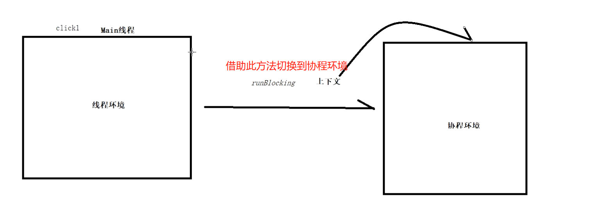

- # 1、函数源码
	- ```kotlin
	  public actual fun <T> runBlocking(
	      context: CoroutineContext, 
	      block: suspend CoroutineScope.() -> T
	  ): T {
	  }
	  ```
- # 1、介绍
	- 
	- runBlocking是一个函数，它可以创建一个[[#red]]==**新的CoroutineScope并在当前线程中运行**==。
	- 它启动的协程特点就是**会阻塞线程执行**
	- ## 阻塞的含义
		- 一个是阻塞线程，比如Android程序在主线程调用`runBlocking`函数，**这时线程将进入等待状态，等待runBlocking函数执行完成**，假如该函数执行太久，就会导致ANR。
		- 另一个方式是，在`runBlocking`启动的协程中，我们使用`launch`再启动子协程，这时`runBlocking`会等待子协程执行完成。
- # 2、使用场景
	- runBlocking通常用于测试或在main函数中使用协程。
	- `runBlocking`的主要作用是连接协程和线程，我们要少用。一方面是会阻塞线程执行，另一方面是它会等待它的子协程执行完成。
- # 3、[[runBlocking使用示例]]