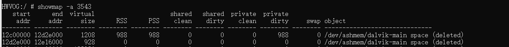

- 主功能：用于查看虚拟地址区域的内存情况
- ```java
  用1 法： showmap -a [pid]
  ```
- 该命令的输出每一行代表一个虚拟地址区域(vm area)
- 
- start addr和end addr:分别代表进程空间的起止虚拟地址；
  virtual size/ RSS /PSS这些前面介绍过；
  shared clean：代表多个进程的虚拟地址可指向这块物理空间，即有多少个进程共享这个库；
  shared: 共享数据
  private: 该进程私有数据
  clean: 干净数据，是指该内存数据与disk数据一致，当内存紧张时，可直接释放内存，不需要回写
  到disk
  dirty: 脏数据，与disk数据不一致，需要先回写到disk，才能被释放。