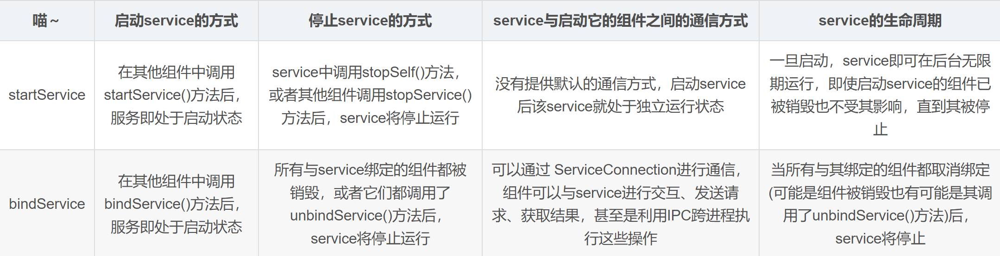

- 
- # startService和bindService区别#card
  id:: 653d05ec-631e-4968-8820-8ae7de176a07
	- # 1、停止Service方式不同
	  collapsed:: true
		- ## startService
			- 自身调用stopSelf   或者  其他组件调用stopService可以停止
		- ## bindService
			- case1、所有与Service绑定的组件销毁
			- case2、他们都调用了unBindService
		- ## 注意：同时使用startService和 bindService 启动。停止时需要unBindService 和 stopService都调用
	- # 2、生命周期不同
		- ## startService
			- onCreate -> onStartCommand -> onDestory ，在多次调用startService的时候，onCreate不重复执行，但是onStartCommand会执行。startService调用了这后，会一直存在，直到其调用了stopService。
		- ## bindService :
			- onCreate -> onBind -> onUnbind -> onDestory，
			- 多次调用bindService，onCreate及onBind都只执行一次。
			- 它生命周期跟随其调用者，调用者释放的时候，必须对该Service解绑，当所有绑定全部取消后，系统即会销毁该服务。
	- # 3、通信方式
		- ## startService
			- 没有提供默认的通信方式，启动Service后就处于独立运行状态
		- ## bindService
			- bindService 的方式通过onServiceConnected方法，获取到Service对象，通过该对象可以直接操作到Service内部的方法，从而实现的Service 与调用者之间的交互。
	- # 4、使用场景不同
		- 如果想要启动一个后台服务长期进行某项任务，那么使用startService
		- 如果只是短暂的使用，那么使用bindService。
		- AIDL也是需要使用BindService