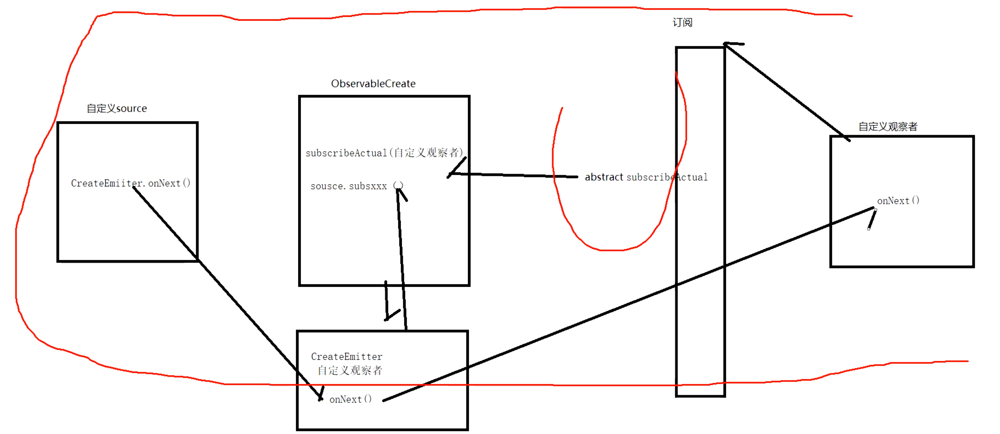
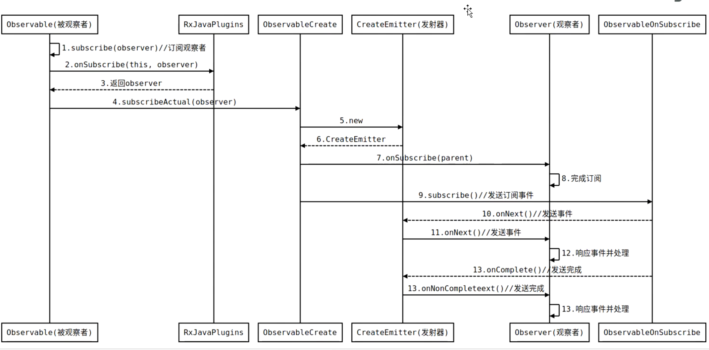

- ## 1、方法调用
  collapsed:: true
	- ```java
	  .subscribe( // 自定义观察者
	                  // 1：Observer 源码看看
	                  new Observer<String>() {
	                      @Override
	                      public void onSubscribe(Disposable d) {
	  
	                      }
	  
	                      @Override
	                      public void onNext(String s) {
	  
	                      }
	  
	                      @Override
	                      public void onError(Throwable e) {
	  
	                      }
	  
	                      @Override
	                      public void onComplete() {
	  
	                      }
	                  });)
	  ```
	- ## 1、Observable.create返回了 ObservableCreate
- ## 2、则Observable.create（).subscribe为ObservableCreate.subscribe,传入自定义观察者Observer
  collapsed:: true
	- ObservableCreate.subscribe没定义subscribe，是在父类定义的
	  id:: 64bf9367-4f36-4a36-83cc-879429326b08
	- Observable.subscribe：
	  collapsed:: true
		- ```java
		   @SchedulerSupport(SchedulerSupport.NONE)
		      @Override
		      public final void subscribe(Observer<? super T> observer) {
		          ObjectHelper.requireNonNull(observer, "observer is null");
		          try {
		              observer = RxJavaPlugins.onSubscribe(this, observer);
		  
		              ObjectHelper.requireNonNull(observer, "Plugin returned null Observer");
		           
		              // 这里为 ObservableCreate的方法
		              subscribeActual(observer);
		          } catch (NullPointerException e) { // NOPMD
		              throw e;
		          } catch (Throwable e) {
		              Exceptions.throwIfFatal(e);
		              // can't call onError because no way to know if a Disposable has been set or not
		              // can't call onSubscribe because the call might have set a Subscription already
		              RxJavaPlugins.onError(e);
		  
		              NullPointerException npe = new NullPointerException("Actually not, but can't throw other exceptions due to RS");
		              npe.initCause(e);
		              throw npe;
		          }
		      }
		  ```
- ## 3、ObservableCreate.subscribeActual,传入了自定义观察者
  collapsed:: true
	- ```java
	      @Override
	      protected void subscribeActual(Observer<? super T> observer) {
	          CreateEmitter<T> parent = new CreateEmitter<T>(observer);
	          observer.onSubscribe(parent);
	  
	          try {
	              // source为 第二步observable创建时 传入的自定义source
	              source.subscribe(parent);
	          } catch (Throwable ex) {
	              Exceptions.throwIfFatal(ex);
	              parent.onError(ex);
	          }
	      }
	  ```
	- 1、创建CreateEmitter 发射器，传入自定义观察者observer
	  id:: 64bf94ba-27b9-4895-a040-56213ed72836
	- 2、调用自定义观察者的onSubscribe 函数。即第一个被调用的函数，传入发射器
	- 3、调用创建observable创建时 传入的自定义source的subscribe方法订阅发射器
	  id:: 64bf9512-f412-4be8-bee9-d8ba5d412314
		- 会调用到自定义source的subscribe方法：参数是这里的发射器
			- > 发射器里持有了自定义的observer,而自定义source持有了发射器
			     则自定义source间接持有 自定义的observer
			- ```java
			          Observable.create(
			  
			                  // 自定义source
			                  new ObservableOnSubscribe<String>() {
			                      @Override
			                      public void subscribe(ObservableEmitter<String> emitter) throws Exception {
			                          // 发射器.onNext
			                          emitter.onNext("A");
			                      }
			          })
			  ```
	- 内部会调用发射器的onNext方法发射数据。上边传入的是CreateEmitter 则看其onNext
- ## 4、CreateEmitter.onNext
  collapsed:: true
	- ```java
	          @Override
	          public void onNext(T t) {
	              if (t == null) {
	                  onError(new NullPointerException("onNext called with null. Null values are generally not allowed in 2.x operators and sources."));
	                  return;
	              }
	              if (!isDisposed()) {
	                  observer.onNext(t);
	              }
	          }
	  ```
	- 因为内部持有了订阅时传入的 自定义观察者 ，则调用自定义观察者的observer.onNext(t);
- ## 5、自定义的观察者回调onNext（）完成数据接受
- ## 总结
	- 
	- 