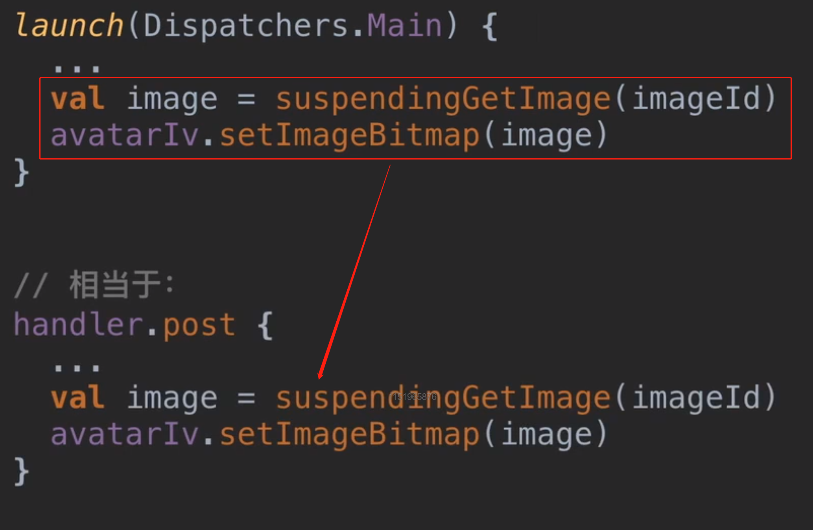
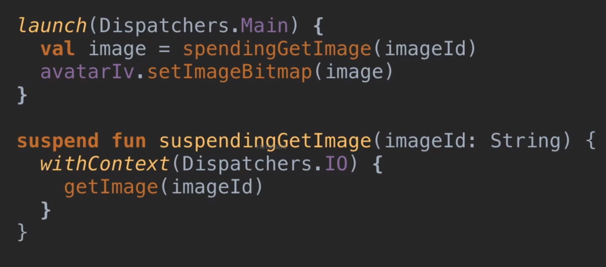
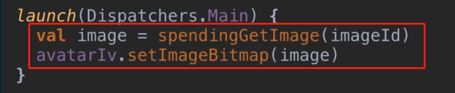

- # 1、[[挂起函数流程梳理]]
	- ## 示例代码：
	  collapsed:: true
		- 1、launch函数在主线程（Dispatchers.Main）开启了一个协程,
		  collapsed:: true
			- 在主线程里开启协程相当于（这么理解）实质上往主线程post一个新任务，任务就是你协程的代码，例如：
				- {:height 437, :width 658}
		- 2、这个协程里有个挂起函数suspendingGetImage,里边执行耗时任务
		- {:height 312, :width 688}
	- ## 代码执行流程
		- 1、主线程执行到这个开启的协程，进入函数里，执行到第一行发现是个挂起函数，上边讲了主线程开启协程，相当于协程里的代码放入post发起一个任务到主线程。
		  collapsed:: true
			- 
		- 2、执行到第一行代码发现是挂起函数，相当于主线程执行的这个post任务，提前结束了。协程下边的代码不归它执行了，
		- 3、兵分两路
			- [[#red]]==主线程：==继续执行其他代码，比如更新ui，
				- 如果是在子线程开启的协程，那这个子线程跟线程池里执行完任务的线程一样，有可能空闲，有可能继续执行任务
			- [[#red]]==**被挂起的这个函数 suspendingGetImage**==，则会在指定的线程withContext(Dispatchers.IO)里执行里边的代码。当挂起函数执行完毕后，[[协程会自动帮我们把线程切回来]]。继续执行下边的代码
	-
- # 2、概念梳理
	- 1、执行带有suspend标记的挂起函数时，[[#red]]==**这个协程会被挂起，非阻塞式挂起**==，不会阻挡你的线程
	- 2、这里说的挂起，[[#red]]==**是挂起协程**==，从当前执行它的线程挂起，说白了这个协程从正在执行它的线程上脱离了
	- 3、这[[#red]]==**个挂起，并不是说这个协程暂停了**==。而是当前这个线程从这挂起函数这行代码开始不再运行这个协程了
	- 4、挂起后，启动协程的那个线程和 协程会兵分两路分别去执行 见上边1的分析
- # 总结
	- ## [[挂起函数+挂起面试题]]
		-