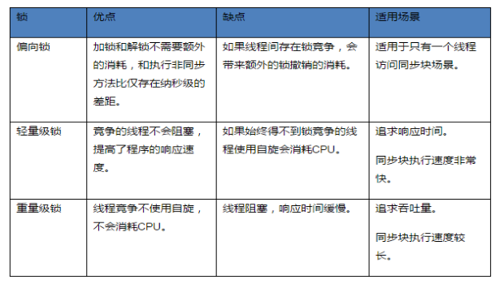

- 进入了偏向锁和轻量级锁的机制详细见[[锁的状态]]
- 
- 1、当前线程没有竞争，并且总是同一个线程获取锁的时候，synchronized 会走这种[[#red]]==**偏向锁**==的机制
- 2、一旦发生竞争，偏向锁被撤销，改为[[#red]]==**轻量级锁**==，内部使用适应性自旋锁，进行 CAS操作，比较耗费CPU资源，有个最大自旋阈值（线程一次上下文切换的时间）
- 3、达到阈值，变成重量级锁，停止自旋释放cpu，进入阻塞